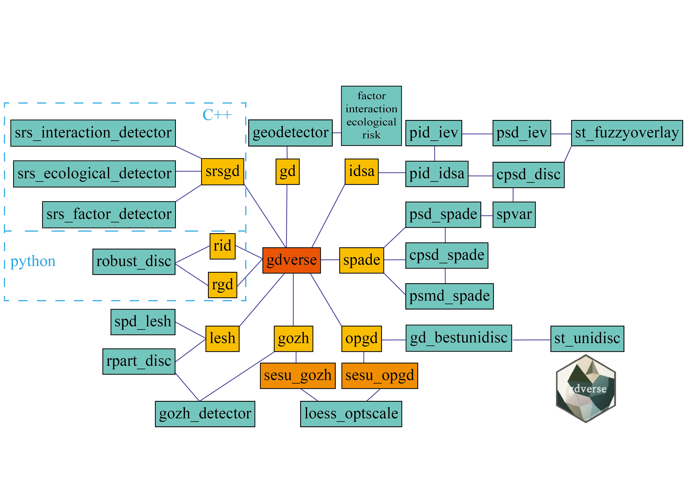

<!-- README.md is generated from README.Rmd. Please edit that file -->

```{r, include = FALSE}
knitr::opts_chunk$set(
  collapse = TRUE,
  comment = "##",
  fig.path = "man/figures/README-",
  out.width = "100%",
  warning = FALSE,
  message = FALSE
)
```

# gdverse 

<!-- badges: start -->

[](https://CRAN.R-project.org/package=gdverse) [](https://ausgis.r-universe.dev/gdverse)

<!-- badges: end -->

The goal of **gdverse** is to *support the geodetector model and its variants*.

## Overview

Full document of the most recent release of **gdverse** is online: <https://ausgis.github.io/gdverse/>

Current models and functions provided by **gdverse** are:

| *geodetector model* | *gdverse function* | *support status* |
|---------------------|--------------------|------------------|
| **GD**              | `gd()`             | ✔️               |
| **OPGD**            | `opgd()`           | ✔️               |
| **GOZH**            | `gozh()`           | ✔️               |
| **LESH**            | `lesh()`           | ✔️               |
| **SPADE**           | `spade()`          | ✔️               |
| **IDSA**            | `idsa()`           | ✔️               |
| **RGD**             | `rgd()`            | ✔️               |
| **RID**             | `rid()`            | ✔️               |
| **SRSGD**           | `srsgd()`          | ✔️               |

```{r echo=FALSE, out.width='100%', fig.align="center",fig.cap="Development of Geographical Detector Models"}
knitr::include_graphics('./man/figures/gdm.png')
```

```{r echo=FALSE, out.width='75%', fig.align="center",fig.cap="Functions in gdverse"}

```

## Installation

- Install from [CRAN](https://CRAN.R-project.org/package=gdverse) with:

``` r
install.packages("gdverse", dep = TRUE)
```

- Install development binary version from [r-universe](https://ausgis.r-universe.dev/gdverse) with:

``` r
install.packages('gdverse',
                 repos = c("https://ausgis.r-universe.dev",
                           "https://cran.rstudio.com/"),
                 dep = TRUE)
```

- Install development source version from [GitHub](https://github.com/ausgis/gdverse) with:

``` r
# install.packages("devtools")
devtools::install_github("ausgis/gdverse",
                         build_vignettes = TRUE,
                         dep = TRUE)
```

Please ensure that **Rcpp** is properly installed and the appropriate **C++** compilation environment is configured in advance if you want to install **gdverse** from github.

## Example

```{r example_gdverse}
library(terra)
library(tidyverse)
library(gdverse)
fvcpath = "https://github.com/SpatLyu/rdevdata/raw/main/FVC.tif"
fvc = terra::rast(paste0("/vsicurl/",fvcpath))
fvc = terra::aggregate(fvc,fact = 5)
fvc = as_tibble(terra::as.data.frame(fvc,na.rm = T))
head(fvc)
```

### OPGD model

```{r}
tictoc::tic()
fvc_opgd = opgd(fvc ~ ., data = fvc, 
                discvar = names(select(fvc,-c(fvc,lulc))),
                cores = 6, type = 'factor')
tictoc::toc()
fvc_opgd
```

### GOZH model

```{r}
g = gozh(fvc ~ ., data = fvc, cores = 6, type = 'factor')
g
```
