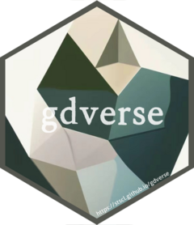

<!-- README.md is generated from README.Rmd. Please edit that file -->

```{r, include = FALSE}
knitr::opts_chunk$set(
  collapse = TRUE,
  comment = "##",
  fig.path = "man/figures/README-",
  out.width = "100%",
  warning = FALSE,
  message = FALSE
)
```

# gdverse 

<!-- badges: start -->
[](https://CRAN.R-project.org/package=gdverse)
[](https://spatlyu.r-universe.dev/gdverse)
<!-- badges: end -->

The goal of **gdverse** is to *support the geodetector model and its variants*.

## Overview

Full document of the most recent release of **gdverse** is online:
<https://spatlyu.github.io/gdverse/>

Current models and functions provided by **gdverse** are:

|   geodetector model   |   *gdverse* function   |   support status   |
|------------------------|-----------------------|--------------------|
|  **GeoDetector**  |        `gd()`         |          ✔️        |
|  **OPGD**  |        `opgd()`         |          ✔️        |
|  **GOZH**  |        `gozh()`         |          ✔️        |
|  **LESH**  |        `lesh()`         |          ✔️        |
|  **SPADE**  |        `spade()`         |          ✔️        |
|  **IDSA**  |        `idsa()`         |          ❌        |
|  **RGD**  |        `rgd()`         |          ✔️        |
|  **RID**  |        `rid()`         |          ❌        |

## Installation

You can install the development version of **gdverse** from [github](https://github.com/SpatLyu/gdverse) with:

``` r
# install.packages("devtools")
devtools::install_github("SpatLyu/gdverse",build_vignettes = T,dep = T)
```

or install **gdverse** from [r-universe](https://spatlyu.r-universe.dev/gdverse):

```r
install.packages('gdverse', repos='https://spatlyu.r-universe.dev')
```

## Example

```{r example_gdverse}
library(terra)
library(tidyverse)
library(gdverse)
fvcpath = "https://github.com/SpatLyu/rdevdata/raw/main/FVC.tif"
fvc = terra::rast(paste0("/vsicurl/",fvcpath))
fvc = terra::aggregate(fvc,fact = 5)
fvc = as_tibble(terra::as.data.frame(fvc,na.rm = T))
head(fvc)
```

### OPGD model

```{r}
tictoc::tic()
fvc_opgd = opgd(fvc ~ ., data = fvc, discnum = 3:15,
                discvar = names(select(fvc,-c(fvc,lulc))),
                cores = 6, type = 'factor')
tictoc::toc()
fvc_opgd
```

### GOZH model

```{r}
g = gozh(fvc ~ ., data = fvc, cores = 6, type = 'factor')
g
```
