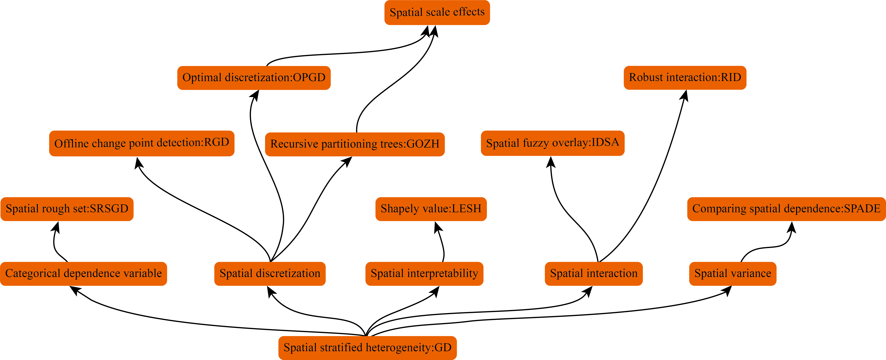
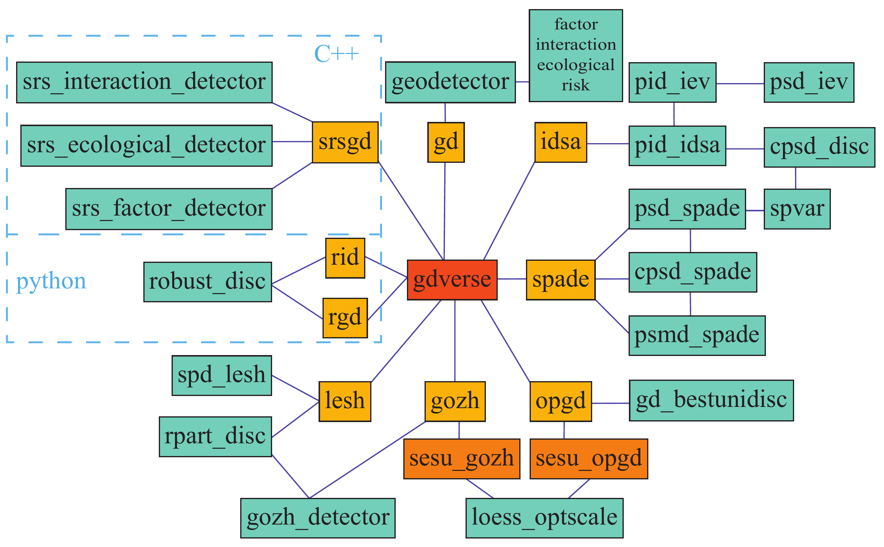

<!-- README.md is generated from README.Rmd. Please edit that file -->

# gdverse 

<!-- badges: start -->

[](https://CRAN.R-project.org/package=gdverse)
[](https://CRAN.R-project.org/package=gdverse)
[](https://ausgis.r-universe.dev/gdverse)

<!-- badges: end -->

**Family of Geographical Detector Models In R**

## Overview

Current models and functions provided by **gdverse** are:

| *geodetector model* | *gdverse function* | *support status* |
|---------------------|--------------------|------------------|
| **GD**              | `gd()`             | ✔️               |
| **OPGD**            | `opgd()`           | ✔️               |
| **GOZH**            | `gozh()`           | ✔️               |
| **LESH**            | `lesh()`           | ✔️               |
| **SPADE**           | `spade()`          | ✔️               |
| **IDSA**            | `idsa()`           | ✔️               |
| **RGD**             | `rgd()`            | ✔️               |
| **RID**             | `rid()`            | ✔️               |
| **SRSGD**           | `srsgd()`          | ✔️               |

<div class="figure" style="text-align: center">


<p class="caption">
Development of Geographical Detector Models
</p>

</div>

<div class="figure" style="text-align: center">


<p class="caption">
Function organization in gdverse package
</p>

</div>

## Installation

- Install from [CRAN](https://CRAN.R-project.org/package=gdverse) with:

``` r
install.packages("gdverse", dep = TRUE)
```

- Install development binary version from
  [r-universe](https://ausgis.r-universe.dev/gdverse) with:

``` r
install.packages('gdverse',
                 repos = c("https://ausgis.r-universe.dev",
                           "https://cloud.r-project.org"),
                 dep = TRUE)
```

- Install development source version from
  [GitHub](https://github.com/ausgis/gdverse) with:

``` r
# install.packages("devtools")
devtools::install_github("ausgis/gdverse",
                         build_vignettes = TRUE,
                         dep = TRUE)
```

Please ensure that **Rcpp** is properly installed and the appropriate
**C++** compilation environment is configured in advance if you want to
install **gdverse** from github.

## Example

``` r
library(gdverse)
data("ndvi")
ndvi
## # A tibble: 713 × 7
##    NDVIchange Climatezone Mining Tempchange Precipitation    GDP Popdensity
##         <dbl> <chr>       <fct>       <dbl>         <dbl>  <dbl>      <dbl>
##  1    0.116   Bwk         low         0.256          237.  12.6      1.45  
##  2    0.0178  Bwk         low         0.273          214.   2.69     0.801 
##  3    0.138   Bsk         low         0.302          449.  20.1     11.5   
##  4    0.00439 Bwk         low         0.383          213.   0        0.0462
##  5    0.00316 Bwk         low         0.357          205.   0        0.0748
##  6    0.00838 Bwk         low         0.338          201.   0        0.549 
##  7    0.0335  Bwk         low         0.296          210.  11.9      1.63  
##  8    0.0387  Bwk         low         0.230          236.  30.2      4.99  
##  9    0.0882  Bsk         low         0.214          342. 241       20.0   
## 10    0.0690  Bsk         low         0.245          379.  42.0      7.50  
## # ℹ 703 more rows
```

### OPGD model

``` r
ndvi_opgd = opgd(NDVIchange ~ ., data = ndvi, 
                 discvar = names(ndvi)[-1:-3],
                 cores = 6, type ='factor')
ndvi_opgd
##                 OPGD Model                  
## ***          Factor Detector            
## 
## |   variable    | Q-statistic | P-value  |
## |:-------------:|:-----------:|:--------:|
## | Precipitation |  0.8842705  | 8.58e-10 |
## |  Climatezone  |  0.8218335  | 7.34e-10 |
## |  Tempchange   |  0.3681294  | 3.56e-10 |
## |  Popdensity   |  0.2203510  | 9.65e-10 |
## |    Mining     |  0.1411154  | 6.73e-10 |
## |      GDP      |  0.1155403  | 9.91e-10 |
```

### GOZH model

``` r
g = gozh(NDVIchange ~ ., data = ndvi)
g
##                 GOZH Model                  
## ***          Factor Detector            
## 
## |   variable    | Q-statistic | P-value  |
## |:-------------:|:-----------:|:--------:|
## | Precipitation | 0.87255056  | 4.52e-10 |
## |  Climatezone  | 0.82129550  | 2.50e-10 |
## |  Tempchange   | 0.33324945  | 1.12e-10 |
## |  Popdensity   | 0.22321863  | 3.00e-10 |
## |    Mining     | 0.13982859  | 6.00e-11 |
## |      GDP      | 0.09170153  | 3.96e-10 |
```
