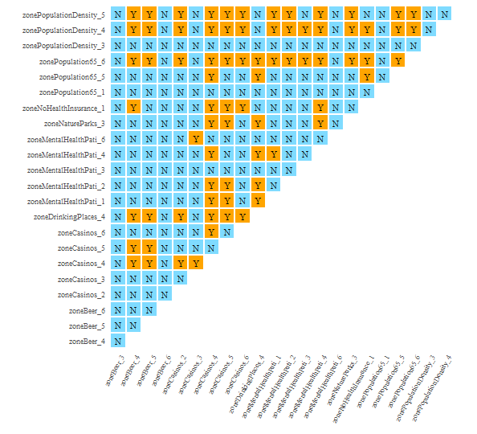

The IDSA model is based on the SPADE model, which extends the power of spatial determinant of the SPADE model to multivariable interaction and takes spatial fuzzy overlay into account.

In this vignette, we used the same data as SPADE vignette to demonstrate the use of the IDSA model.

### Load data and package


``` r
library(sf)
library(gdverse)
library(magrittr)
library(tidyverse)
usfi = read_sf(system.file('extdata/USFI_Xian.gpkg',package = 'gdverse'))
usfi
## Simple feature collection with 1037 features and 19 fields
## Geometry type: POLYGON
## Dimension:     XY
## Bounding box:  xmin: 295713 ymin: 3784916 xmax: 324202.2 ymax: 3804669
## Projected CRS: WGS 84 / UTM zone 49N
## # A tibble: 1,037 × 20
##      LPI   LSI   GAR    DAR      WAR   TER  NDVI   NDWI   DTH   DTP    DTR   DTW    BH    BD
##    <dbl> <dbl> <dbl>  <dbl>    <dbl> <dbl> <dbl>  <dbl> <dbl> <dbl>  <dbl> <dbl> <dbl> <dbl>
##  1  57.2 10.5  0.630 0.273  0.00219  0.979 0.497 -0.356  5.66 1.08  0.934   1.16 3.16  0.635
##  2  85.7  2.35 0.905 0.0952 0        0.977 0.514 -0.288  5.66 1.41  0.0807  1.57 0.310 0.139
##  3  41.2  7.85 0.436 0.449  0.000672 0.972 0.365 -0.296  4.38 1.88  0.516   2.37 3.99  0.671
##  4  39.1  5.40 0.534 0.377  0        0.966 0.395 -0.299  4.25 1.97  0.442   2.81 4.63  0.634
##  5  32.0  8.04 0.405 0.437  0        0.968 0.354 -0.302  3.65 1.34  0.615   2.55 4.07  0.642
##  6  58.3  7.91 0.332 0.615  0.000377 0.966 0.312 -0.271  3.69 0.700 0.592   2.25 7.91  0.777
##  7  98.4  3.34 0.984 0.0161 0        0.948 0.451 -0.248  5.39 1.36  0.124   3.64 0.216 0.111
##  8  44.6 17.6  0.416 0.502  0.000672 0.949 0.365 -0.295  5.11 1.20  0.926   2.50 6.49  0.747
##  9  35.9  9.81 0.464 0.467  0.00134  0.936 0.379 -0.309  7.10 2.01  1.03    2.75 5.49  0.692
## 10  44.3  9.49 0.403 0.504  0.000547 0.926 0.310 -0.278  8.51 2.68  0.658   3.20 3.27  0.601
## # ℹ 1,027 more rows
## # ℹ 6 more variables: RL <dbl>, RFD <dbl>, SVF <dbl>, FAR <dbl>, SUHI <dbl>,
## #   geom <POLYGON [m]>
```

### Data precessing

There are originally 18 explanatory variables in the `usfi` tibble. If these 18 variables are used together, IDSA needs to be calculated about 2.62143 &times; 10<sup>5</sup> times, which is very time-consuming, and we need to reduce the dimension of the data or select appropriate variables.

Here we combine the understanding of the data and the diffusion maps method to generate the data after dimensionality reduction.Specifically, we combine data of the same class into one class using diffusion maps based on the classification of explanatory variables.

In SPADE vignette we proved the invalidity of `WAR` to explain `SUHI`, which is removed here.


``` r
landscape = c("LPI","LSI","GAR","DAR")
dist_cold_heat = c("DTH","DTP","DTR","DTW")
urbanbuilt_form = c("TER","NDVI","NDWI","BH","BD","RL","RFD","SVF","FAR")

dm_n21 = \(xvecname){
  return(
    usfi %>%
      sf::st_drop_geometry() %>%
      dplyr::select(dplyr::all_of(xvecname)) %>%
      {Rdimtools::do.dm(as.data.frame(.),1)} %>%
      {.$Y} %>%
      {.[,1]} %>%
      gdverse::rescale_vector(0,1)
  )
}

newdata = tibble::tibble(
  SUHI = usfi$SUHI,
  landscape = dm_n21(landscape),
  dist_cold_heat = dm_n21(dist_cold_heat),
  urbanbuilt_form = dm_n21(urbanbuilt_form),
)
newdata
## # A tibble: 1,037 × 4
##     SUHI landscape dist_cold_heat urbanbuilt_form
##    <dbl>     <dbl>          <dbl>           <dbl>
##  1 1.76       1.00          0.726         0.200  
##  2 0.519      1.00          0.722         0.00319
##  3 3.04       1.00          0.392         0.272  
##  4 3.22       1.00          0.344         0.345  
##  5 3.47       1.00          0.216         0.273  
##  6 4.71       1.00          0.225         0.644  
##  7 1.24       1.00          0.508         0.00117
##  8 4.30       1             0.554         0.544  
##  9 3.76       1.00          0.860         0.443  
## 10 4.23       1.00          0.928         0.197  
## # ℹ 1,027 more rows
```

### Construct spatial Weight

We use the same spatial weight matrix as SPADE vignette.


``` r
wt = usfi |>
  dplyr::filter(!if_any(everything(),is.na)) |>
  mutate(nb = sfdep::st_contiguity(geom),
         wt = sfdep::st_weights(nb)) %$%
  sfdep::wt_as_matrix(nb,wt)
```

### IDSA modeling


``` r
idsa.model = idsa(SUHI ~ . ,data = newdata, wt = wt, cores = 6)
idsa.model
## ***     Interactive Detector For Spatial Associations 
## 
## |                   varibale                   |     PID     |
## |:--------------------------------------------:|:-----------:|
## | landscape ∩ dist_cold_heat ∩ urbanbuilt_form | 0.456037749 |
## |       dist_cold_heat ∩ urbanbuilt_form       | 0.409391856 |
## |               urbanbuilt_form                | 0.345502490 |
## |         landscape ∩ urbanbuilt_form          | 0.330585501 |
## |                dist_cold_heat                | 0.123563063 |
## |          landscape ∩ dist_cold_heat          | 0.071627057 |
## |                  landscape                   | 0.004188307 |
## 
##  --------- IDSA model performance evaluation: --------
##  * Number of overlay zones :  11 
##  * Percentage of finely divided zones :  0.0009643202 
##  * Number of individual explanatory variables :  3 
##  
##  ## Different of response variable between a pair of overlay zones:
## 
## |       zone1st        |       zone2nd        | Risk |
## |:--------------------:|:--------------------:|:----:|
## | zonedist_cold_heat_2 | zonedist_cold_heat_3 |  No  |
## | zonedist_cold_heat_2 | zonedist_cold_heat_4 |  No  |
## | zonedist_cold_heat_2 | zonedist_cold_heat_8 | Yes  |
## | zonedist_cold_heat_2 | zonedist_cold_heat_9 |  No  |
## | zonedist_cold_heat_2 |   zonelandscape_1    |  No  |
## 
##  #### Only the first five pairs of overlay zones are displayed! ####
plot(idsa.model)
```



This vignette is a special case because the explanatory variables are dimensionally reduced in advance and is used as a coping strategy when IDSA is executed in the face of many explanatory variables.
