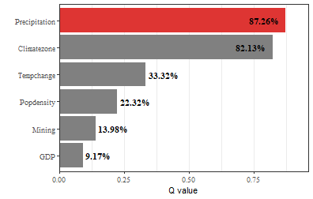
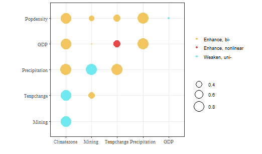
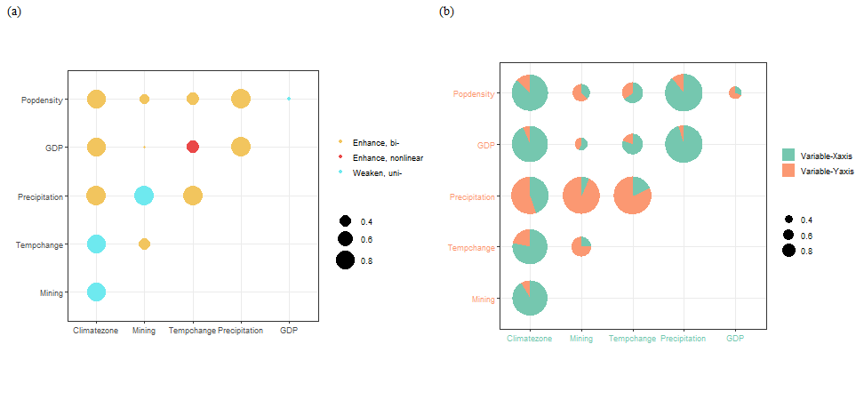
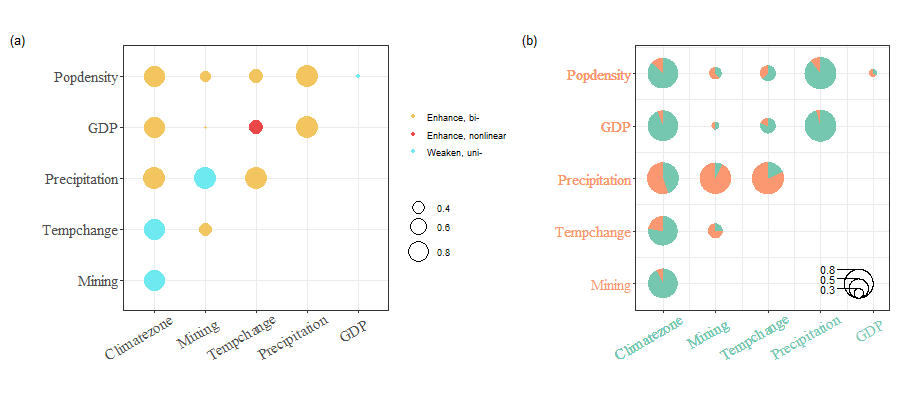
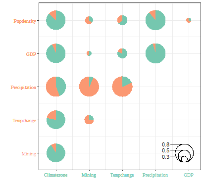

The [**GOZH**(geographically optimal zones-based heterogeneity) model](https://doi.org/10.1016/j.isprsjprs.2022.01.009) generates the optimal spatial zone based on the binary classification of the decision tree and then calculates the power of determinants.The [**LESH**(locally explained heterogeneity model)](https://doi.org/10.1080/17538947.2023.2271883) based on GOZH model and combined with additive shapely theory to reasonably allocate variable interaction's power of determinants.In this vignette ,we use `ndvi` data in `gdverse` package to demonstrate the *spatial heterogeneity explanation* based on **GOZH** and **LESH** model.

### Load data and package


``` r
library(tidyverse)
library(gdverse)

data("ndvi")
head(ndvi)
## # A tibble: 6 × 7
##   NDVIchange Climatezone Mining Tempchange Precipitation   GDP Popdensity
##        <dbl> <chr>       <fct>       <dbl>         <dbl> <dbl>      <dbl>
## 1    0.116   Bwk         low         0.256          237. 12.6      1.45  
## 2    0.0178  Bwk         low         0.273          214.  2.69     0.801 
## 3    0.138   Bsk         low         0.302          449. 20.1     11.5   
## 4    0.00439 Bwk         low         0.383          213.  0        0.0462
## 5    0.00316 Bwk         low         0.357          205.  0        0.0748
## 6    0.00838 Bwk         low         0.338          201.  0        0.549
```

### Univariate power of determinants detection


``` r
gozh.uvi = gozh(NDVIchange ~ ., data = ndvi)
gozh.uvi
##                 GOZH Model                  
## ***          Factor Detector            
## 
## |   variable    | Q-statistic | P-value  |
## |:-------------:|:-----------:|:--------:|
## | Precipitation | 0.87255056  | 4.52e-10 |
## |  Climatezone  | 0.82129550  | 2.50e-10 |
## |  Tempchange   | 0.33324945  | 1.12e-10 |
## |  Popdensity   | 0.22321863  | 3.00e-10 |
## |    Mining     | 0.13982859  | 6.00e-11 |
## |      GDP      | 0.09170153  | 3.96e-10 |
plot(gozh.uvi)
```



### Variable interaction detection


``` r
gozh.bi = gozh(NDVIchange ~ ., data = ndvi, type = 'interaction')
gozh.bi
##                 GOZH Model                  
## ***        Interaction Detector         
## 
## |    Interactive variable     |    Interaction     |
## |:---------------------------:|:------------------:|
## |    Climatezone ∩ Mining     |    Weaken, uni-    |
## |  Climatezone ∩ Tempchange   |    Weaken, uni-    |
## | Climatezone ∩ Precipitation |    Enhance, bi-    |
## |      Climatezone ∩ GDP      |    Enhance, bi-    |
## |  Climatezone ∩ Popdensity   |    Enhance, bi-    |
## |     Mining ∩ Tempchange     |    Enhance, bi-    |
## |   Mining ∩ Precipitation    |    Weaken, uni-    |
## |        Mining ∩ GDP         |    Enhance, bi-    |
## |     Mining ∩ Popdensity     |    Enhance, bi-    |
## | Tempchange ∩ Precipitation  |    Enhance, bi-    |
## |      Tempchange ∩ GDP       | Enhance, nonlinear |
## |   Tempchange ∩ Popdensity   |    Enhance, bi-    |
## |     Precipitation ∩ GDP     |    Enhance, bi-    |
## | Precipitation ∩ Popdensity  |    Enhance, bi-    |
## |      GDP ∩ Popdensity       |    Weaken, uni-    |
plot(gozh.bi)
```



### Variable interaction contribution


``` r
lesh.m = lesh(NDVIchange ~ ., data = ndvi, cores = 6)
lesh.m
## ***    Spatial Interaction Association Detector      
##                      LESH Model                     
## 
## |    Interactive variable     |    Interaction     |
## |:---------------------------:|:------------------:|
## |    Climatezone ∩ Mining     |    Weaken, uni-    |
## |  Climatezone ∩ Tempchange   |    Weaken, uni-    |
## | Climatezone ∩ Precipitation |    Enhance, bi-    |
## |      Climatezone ∩ GDP      |    Enhance, bi-    |
## |  Climatezone ∩ Popdensity   |    Enhance, bi-    |
## |     Mining ∩ Tempchange     |    Enhance, bi-    |
## |   Mining ∩ Precipitation    |    Weaken, uni-    |
## |        Mining ∩ GDP         |    Enhance, bi-    |
## |     Mining ∩ Popdensity     |    Enhance, bi-    |
## | Tempchange ∩ Precipitation  |    Enhance, bi-    |
## |      Tempchange ∩ GDP       | Enhance, nonlinear |
## |   Tempchange ∩ Popdensity   |    Enhance, bi-    |
## |     Precipitation ∩ GDP     |    Enhance, bi-    |
## | Precipitation ∩ Popdensity  |    Enhance, bi-    |
## |      GDP ∩ Popdensity       |    Weaken, uni-    |
plot(lesh.m, pie = TRUE, scatter = TRUE)
```



Compared to **GOZH Interaction Detector** , **LESH** only has a decomposition of the interactive contribution of variables,and the rest remains consistent.

gdverse supports modifications to the default ploting results, such as adding subfigure annotations and adjusting the size of the text on the x-y axis:


``` r
plot(lesh.m, pie = TRUE, scatter = TRUE, pielegend_num = 5) +
  patchwork::plot_annotation(tag_levels = 'a',
                             tag_prefix = '(',
                             tag_suffix = ')',
                             tag_sep = '',
                             theme = theme(plot.tag = element_text(family = "serif"))) &
  ggplot2::theme(axis.text.y = element_text(family = 'serif',size = 15),
                 axis.text.x = element_text(family = 'serif',size = 15,
                                            angle = 30,vjust = 0.85,hjust = 0.75),
                 axis.title = element_text(family = 'serif',size = 15))
```



And you can only look at the contribution part of the variable interaction:


``` r
plot(lesh.m, pie = TRUE, scatter = FALSE)
```



By accessing the concrete result through `lesh.m$interaction`, which returns a `tibble`.


``` r
lesh.m$interaction
## # A tibble: 15 × 8
##    variable1     variable2     Interaction     Variable1 Q-statisti…¹ Variable2 Q-statisti…²
##    <chr>         <chr>         <chr>                            <dbl>                  <dbl>
##  1 Climatezone   Mining        Weaken, uni-                    0.821                  0.140 
##  2 Climatezone   Tempchange    Weaken, uni-                    0.821                  0.333 
##  3 Climatezone   Precipitation Enhance, bi-                    0.821                  0.873 
##  4 Climatezone   GDP           Enhance, bi-                    0.821                  0.0917
##  5 Climatezone   Popdensity    Enhance, bi-                    0.821                  0.223 
##  6 Mining        Tempchange    Enhance, bi-                    0.140                  0.333 
##  7 Mining        Precipitation Weaken, uni-                    0.140                  0.873 
##  8 Mining        GDP           Enhance, bi-                    0.140                  0.0917
##  9 Mining        Popdensity    Enhance, bi-                    0.140                  0.223 
## 10 Tempchange    Precipitation Enhance, bi-                    0.333                  0.873 
## 11 Tempchange    GDP           Enhance, nonli…                 0.333                  0.0917
## 12 Tempchange    Popdensity    Enhance, bi-                    0.333                  0.223 
## 13 Precipitation GDP           Enhance, bi-                    0.873                  0.0917
## 14 Precipitation Popdensity    Enhance, bi-                    0.873                  0.223 
## 15 GDP           Popdensity    Weaken, uni-                    0.0917                 0.223 
## # ℹ abbreviated names: ¹​`Variable1 Q-statistics`, ²​`Variable2 Q-statistics`
## # ℹ 3 more variables: `Variable1 and Variable2 interact Q-statistics` <dbl>,
## #   `Variable1 SPD` <dbl>, `Variable2 SPD` <dbl>
```

Use `lesh.m$spd_lesh` to access the SHAP power of determinants:


``` r
lesh.m$spd_lesh
## # A tibble: 6 × 2
##   varibale      spd_theta
##   <chr>             <dbl>
## 1 Precipitation    0.218 
## 2 Climatezone      0.176 
## 3 Tempchange       0.0482
## 4 Popdensity       0.0262
## 5 Mining           0.0158
## 6 GDP              0.0115
```
