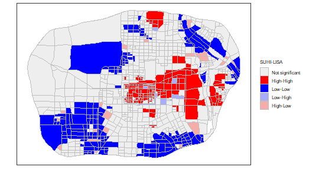
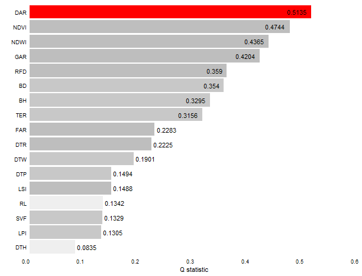

### Load data and package


``` r
library(sf)
library(gdverse)
library(magrittr)
library(tidyverse)
ushi = read_sf(system.file('extdata/USHI.gpkg',package = 'gdverse'))
ushi
## Simple feature collection with 1037 features and 19 fields
## Geometry type: POLYGON
## Dimension:     XY
## Bounding box:  xmin: 295713 ymin: 3784916 xmax: 324202.2 ymax: 3804669
## Projected CRS: WGS 84 / UTM zone 49N
## # A tibble: 1,037 × 20
##      LPI   LSI   GAR    DAR      WAR   TER  NDVI   NDWI   DTH   DTP    DTR   DTW    BH    BD
##    <dbl> <dbl> <dbl>  <dbl>    <dbl> <dbl> <dbl>  <dbl> <dbl> <dbl>  <dbl> <dbl> <dbl> <dbl>
##  1  57.2 10.5  0.630 0.273  0.00219  0.979 0.497 -0.356  5.66 1.08  0.934   1.16 3.16  0.635
##  2  85.7  2.35 0.905 0.0952 0        0.977 0.514 -0.288  5.66 1.41  0.0807  1.57 0.310 0.139
##  3  41.2  7.85 0.436 0.449  0.000672 0.972 0.365 -0.296  4.38 1.88  0.516   2.37 3.99  0.671
##  4  39.1  5.40 0.534 0.377  0        0.966 0.395 -0.299  4.25 1.97  0.442   2.81 4.63  0.634
##  5  32.0  8.04 0.405 0.437  0        0.968 0.354 -0.302  3.65 1.34  0.615   2.55 4.07  0.642
##  6  58.3  7.91 0.332 0.615  0.000377 0.966 0.312 -0.271  3.69 0.700 0.592   2.25 7.91  0.777
##  7  98.4  3.34 0.984 0.0161 0        0.948 0.451 -0.248  5.39 1.36  0.124   3.64 0.216 0.111
##  8  44.6 17.6  0.416 0.502  0.000672 0.949 0.365 -0.295  5.11 1.20  0.926   2.50 6.49  0.747
##  9  35.9  9.81 0.464 0.467  0.00134  0.936 0.379 -0.309  7.10 2.01  1.03    2.75 5.49  0.692
## 10  44.3  9.49 0.403 0.504  0.000547 0.926 0.310 -0.278  8.51 2.68  0.658   3.20 3.27  0.601
## # ℹ 1,027 more rows
## # ℹ 6 more variables: RL <dbl>, RFD <dbl>, SVF <dbl>, FAR <dbl>, SUHI <dbl>,
## #   geom <POLYGON [m]>
```

<div class="figure" style="text-align: center">

<p class="caption">The study area map of USHI data</p>
</div>

The polygon spatial data are the streets divided based on roads within *the Ring expressway of Xi'an City*, and the attribute data are the *SUHI*(surface urban heat island effect) and its influence factors.

The meanings of each explanatory variable are as follows,and can be divided into three categories:

1. Landscape pattern and Land cover characteristic indicators
- `LPI` Largest patch index (Area and Edge metric)(landscape level)
- `LSI` Landscape shape index (Aggregation metric)(landscape level)
- `GAR` The proportion of green space area
- `DAR` The proportion of industrial space area
- `WAR` The proportion of water space area
2. Distances from cold and heat sources indicators
- `DTH`  Distance to the nearest power plant(Heat source)
- `DTP`  Distance to the nearest urban park(Cold source)
- `DTR`  Distance to the nearest urban main road(Heat source)
- `DTW`  Distance to the nearest water body(Cold source)
3. Urban built space form indicators
- `BH` Building height
- `BD` Building density
- `RL` Roughness length
- `NDVI` Normalized Difference Vegetation Index
- `NDWI` Normalized Difference Water Index
- `RFD` Strewn degree (describing the roughness of buildings in three dimensional space)
- `SVF` Sky View Factor (the ratio of the visible sky area at a specific point or area to the total ground area in its surrounding vicinity)
- `FAR` Floor Area Ratio (The ratio of the total floor area of buildings on a site to the net land area of that site)
- `TER` Topographic Relief (The ratio of the average elevation of the unit to
the average elevation of the entire study area)

And the `SUHI` stands for surface urban heat island effect intensity.

### Spatial pattern of SUHI

#### global spatial autocorrelation of SUHI

here I use `sfdep` to calculate the global **Moran's I**:


``` r
global_moranI = \(data,col,nb,wt){
  I = sfdep::global_moran(dplyr::pull(data,{{col}}),
                          dplyr::pull(data,{{nb}}),
                          dplyr::pull(data,{{wt}}),
                          na_ok = T)$I
  PValue = sfdep::global_moran_test(dplyr::pull(data,{{col}}),
                                    dplyr::pull(data,{{nb}}),
                                    dplyr::pull(data,{{wt}}),
                                    na.action = na.omit)$p.value
  moranI = c(I,PValue)
  names(moranI) = c("Moran'I Index","P Value")
  return(moranI)
}

ushi |>
  dplyr::filter(!if_any(everything(),is.na)) |>
  mutate(nb = sfdep::st_contiguity(geom),
         wt = sfdep::st_weights(nb)) |>
  dplyr::select(SUHI,nb,wt) -> new_ushi

new_ushi
## Simple feature collection with 1037 features and 3 fields
## Geometry type: POLYGON
## Dimension:     XY
## Bounding box:  xmin: 295713 ymin: 3784916 xmax: 324202.2 ymax: 3804669
## Projected CRS: WGS 84 / UTM zone 49N
## # A tibble: 1,037 × 4
##     SUHI nb         wt                                                                  geom
##    <dbl> <nb>       <list>                                                     <POLYGON [m]>
##  1 1.76  <int [12]> <dbl [12]> ((297871.4 3787333, 297864.8 3787343, 297852.8 3787362, 2978…
##  2 0.519 <int [2]>  <dbl [2]>  ((297398.6 3788768, 297397.5 3788779, 297395.2 3788804, 2973…
##  3 3.04  <int [9]>  <dbl [9]>  ((297391.4 3789405, 297391 3789429, 297390.5 3789454, 297390…
##  4 3.22  <int [4]>  <dbl [4]>  ((297244.1 3790712, 297240.4 3790729, 297235 3790751, 297229…
##  5 3.47  <int [6]>  <dbl [6]>  ((296806.9 3791969, 296806.7 3791970, 296797.7 3791990, 2967…
##  6 4.71  <int [6]>  <dbl [6]>  ((296484.5 3792805, 296481.4 3792815, 296474.7 3792837, 2964…
##  7 1.24  <int [2]>  <dbl [2]>  ((296356.5 3793294, 296355.5 3793298, 296351.3 3793316, 2963…
##  8 4.30  <int [8]>  <dbl [8]>  ((296154.6 3794673, 296152.3 3794688, 296148.6 3794713, 2961…
##  9 3.76  <int [5]>  <dbl [5]>  ((296261.4 3798947, 296268.7 3798960, 296280.2 3798979, 2962…
## 10 4.23  <int [5]>  <dbl [5]>  ((296996.6 3800017, 297000.9 3800022, 297013.3 3800038, 2970…
## # ℹ 1,027 more rows
set.seed(123456789)

gmi = new_ushi |>
  global_moranI(SUHI,nb,wt)
gmi
## Moran'I Index       P Value 
##  5.359564e-01 5.078059e-217
```

The global Moran's Index is 0.5359564 and the P value is 5.0780594 &times; 10<sup>-217</sup>,which shows that SUHI in the main urban area of Xi'an has significant positive spatial autocorrelation in the global scale.

#### local spatial autocorrelation of SUHI

We will use `tidyrgeoda` to run the `LISA`, more details see [**here**](https://spatlyu.github.io/tidyrgeoda/articles/Local-Indicators-of-Spatial-Association.html)


``` r
library(tidyrgeoda)

new_ushi %>%
  mutate(lisa = st_local_moran(.,'SUHI',
                               wt = st_contiguity_weights(.),
                               significance_cutoff = 0.05)) %>%
  select(lisa) %>%
  ggplot() +
  geom_sf(aes(fill = lisa),lwd = .1,color = 'grey') +
  scale_fill_lisa(name = 'SUHI-LISA') +
  theme_bw() +
  theme(
    axis.text = element_blank(),
    axis.ticks = element_blank(),
    axis.title = element_blank(),
    panel.grid = element_blank(),
    legend.title = element_text(size = 7.5),
    legend.text = element_text(size = 7.5),
    legend.key.size = unit(.5, 'cm')
  )
```



The global and local spatial autocorrelation shows that SUHI's strong spatial dependence.

Spatial dependence was neglected in native geodetector, which led to the **SPADE** spatial association detector.

### OPGD modeling


``` r
ushi_opgd = opgd(SUHI ~ ., data = st_drop_geometry(ushi),
                 discvar = names(select(st_drop_geometry(ushi),-SUHI)),
                 cores = 6)
ushi_opgd
##                 OPGD Model                  
## ***          Factor Detector            
## 
## | variable | Q-statistic |   P-value    |
## |:--------:|:-----------:|:------------:|
## |   DAR    | 0.43965943  | 9.280000e-10 |
## |   NDVI   | 0.40392817  | 4.020000e-10 |
## |   GAR    | 0.38280266  | 3.850000e-10 |
## |   RFD    | 0.27730957  | 1.540000e-10 |
## |    BD    | 0.26966147  | 5.330000e-10 |
## |    BH    | 0.25846868  | 2.610000e-10 |
## |   NDWI   | 0.21994544  | 8.280000e-10 |
## |   FAR    | 0.20832309  | 2.230000e-10 |
## |   SVF    | 0.15333436  | 6.410000e-10 |
## |    RL    | 0.13261626  | 4.350000e-10 |
## |   TER    | 0.12144556  | 3.750000e-10 |
## |   WAR    | 0.10718665  | 7.480000e-10 |
## |   DTP    | 0.09015746  | 6.150000e-10 |
## |   DTW    | 0.08565851  | 1.184870e-07 |
## |   DTH    | 0.08466484  | 1.470018e-03 |
## |   LSI    | 0.08447881  | 2.057000e-09 |
## |   DTR    | 0.07530100  | 2.973400e-08 |
## |   LPI    | 0.03320575  | 2.950997e-02 |
```

**You can access the detailed q statistics by `ushi_opgd$factor`.**


``` r
ushi_opgd$factor
## # A tibble: 18 × 3
##    variable `Q-statistic` `P-value`
##    <chr>            <dbl>     <dbl>
##  1 DAR             0.440   9.28e-10
##  2 NDVI            0.404   4.02e-10
##  3 GAR             0.383   3.85e-10
##  4 RFD             0.277   1.54e-10
##  5 BD              0.270   5.33e-10
##  6 BH              0.258   2.61e-10
##  7 NDWI            0.220   8.28e-10
##  8 FAR             0.208   2.23e-10
##  9 SVF             0.153   6.41e-10
## 10 RL              0.133   4.35e-10
## 11 TER             0.121   3.75e-10
## 12 WAR             0.107   7.48e-10
## 13 DTP             0.0902  6.15e-10
## 14 DTW             0.0857  1.18e- 7
## 15 DTH             0.0847  1.47e- 3
## 16 LSI             0.0845  2.06e- 9
## 17 DTR             0.0753  2.97e- 8
## 18 LPI             0.0332  2.95e- 2
```

### SPADE modeling

*SPADE* explicitly considers the spatial variance by assigning the weight of the influence based on spatial distribution and also minimizes the influence of the number of levels on PD values by using the multilevel discretization and considering information loss due to discretization.

When response variable has a strong spatial dependence, maybe *SPADE* is a best choice.

The biggest difference between SPADE and native GD and OPGD in actual modeling is that SPADE requires a spatial weight matrix to calculate spatial variance.

In `gdverse`, when you not provide a spatial weight matrix, it will use **1st order inverse distance weight** by default, which can be created by `inverse_distance_weight()`.


``` r
coords = ushi |>
  st_centroid() |>
  st_coordinates()

wt1 = inverse_distance_weight(coords[,1],coords[,2])
```

You can also use gravity model weight by assigning the `power` parameter in `inverse_distance_weight()` function.


``` r
wt2 = inverse_distance_weight(coords[,1],coords[,2],power = 2)
```

You can also use spatial weight matrix from `sfdep`(which invokes `spdep`) or `tidyrgeoda`(which invokes `rgeoda`).

#### using spatial weight matrix from sfdep


``` r
wt3 = ushi |>
  dplyr::filter(!if_any(everything(),is.na)) |>
  mutate(nb = sfdep::st_contiguity(geom),
         wt = sfdep::st_weights(nb)) %$%
  sfdep::wt_as_matrix(nb,wt)
```

#### using spatial weight matrix from tidyrgeoda


``` r
wt4 = tidyrgeoda::st_contiguity_weights(ushi) |>
  as.matrix() |>
  apply(1,\(x) x/sum(x)) |>
  t()
```

The `wt3` is identical `wt4`


``` r
identical(wt3,wt4)
## [1] TRUE
```

**We recommend using the inverse distance weight function `inverse_distance_weight()` of the `gdverse` package to construct a spatial weight matrix if you're not sure which spatial weight matrix should to be used as the SPADE paper is using this.In practice, the appropriate spatial weight matrix is selected considering the characteristics of the research object and the research area! **

In the following section we will execute *SPADE* model using  spatial weight matrix `wt3` which is constructed by queen contiguity.

The test of *SPADE* model significance in `gdverse` is achieved by randomization null hypothesis use a pseudo-p value,this calculations are very time-consuming. Default `gdverse` sets the `permutations` parameter to 0 and does not calculate the pseudo-p value. If you want to calculate the pseudo-p value, specify the `permutations` parameter to a number such as 99,999,9999, etc.

#### run SPADE


``` r
ushi_spade = spade(SUHI ~ .,
                   data = st_drop_geometry(ushi),
                   wt = wt3, cores = 6)
ushi_spade
## ***         Spatial Association Detector         
## 
## | variable | Q-statistic |      P-value      |
## |:--------:|:-----------:|:-----------------:|
## |   DAR    | 0.51354520  | No Pseudo-P Value |
## |   NDVI   | 0.47435470  | No Pseudo-P Value |
## |   NDWI   | 0.43652650  | No Pseudo-P Value |
## |   GAR    | 0.42037121  | No Pseudo-P Value |
## |   RFD    | 0.35902741  | No Pseudo-P Value |
## |    BD    | 0.35397385  | No Pseudo-P Value |
## |    BH    | 0.32947163  | No Pseudo-P Value |
## |   TER    | 0.31556969  | No Pseudo-P Value |
## |   FAR    | 0.22828609  | No Pseudo-P Value |
## |   DTR    | 0.22245435  | No Pseudo-P Value |
## |   DTW    | 0.19009188  | No Pseudo-P Value |
## |   DTP    | 0.14935992  | No Pseudo-P Value |
## |   LSI    | 0.14875273  | No Pseudo-P Value |
## |    RL    | 0.13422740  | No Pseudo-P Value |
## |   SVF    | 0.13294874  | No Pseudo-P Value |
## |   LPI    | 0.13054984  | No Pseudo-P Value |
## |   DTH    | 0.08346346  | No Pseudo-P Value |
## |   WAR    |     NaN     | No Pseudo-P Value |
plot(ushi_spade,slicenum = 8)
```



**You can also access the detailed q statistics by `ushi_spade$factor`**


``` r
ushi_spade$factor
## # A tibble: 18 × 3
##    variable `Q-statistic` `P-value`        
##    <chr>            <dbl> <chr>            
##  1 DAR             0.514  No Pseudo-P Value
##  2 NDVI            0.474  No Pseudo-P Value
##  3 NDWI            0.437  No Pseudo-P Value
##  4 GAR             0.420  No Pseudo-P Value
##  5 RFD             0.359  No Pseudo-P Value
##  6 BD              0.354  No Pseudo-P Value
##  7 BH              0.329  No Pseudo-P Value
##  8 TER             0.316  No Pseudo-P Value
##  9 FAR             0.228  No Pseudo-P Value
## 10 DTR             0.222  No Pseudo-P Value
## 11 DTW             0.190  No Pseudo-P Value
## 12 DTP             0.149  No Pseudo-P Value
## 13 LSI             0.149  No Pseudo-P Value
## 14 RL              0.134  No Pseudo-P Value
## 15 SVF             0.133  No Pseudo-P Value
## 16 LPI             0.131  No Pseudo-P Value
## 17 DTH             0.0835 No Pseudo-P Value
## 18 WAR           NaN      No Pseudo-P Value
```

The result of `WAR` is `NA` and you can also see a big difference between the OPGD and SPADE model. The results of SPADE are more reliable in most cases.

We demonstrate the rationality of NA values calculated of `WAR` in the following section:

### SPADE NA result explained


``` r
WAR = ushi$WAR
skimr::skim(WAR)
```


Table: Data summary

|                         |     |
|:------------------------|:----|
|Name                     |WAR  |
|Number of rows           |1037 |
|Number of columns        |1    |
|_______________________  |     |
|Column type frequency:   |     |
|numeric                  |1    |
|________________________ |     |
|Group variables          |None |


**Variable type: numeric**

|skim_variable | n_missing| complete_rate| mean|   sd| p0| p25| p50| p75| p100|hist  |
|:-------------|---------:|-------------:|----:|----:|--:|---:|---:|---:|----:|:-----|
|data          |         0|             1| 0.01| 0.04|  0|   0|   0|   0| 0.73|▇▁▁▁▁ |


``` r
ggplot(data = ushi) +
  geom_histogram(aes(WAR),
               color='white',
               fill='gray60') +
  scale_y_continuous(expand = c(0,0)) +
  theme_classic()
```


``` r
moments::skewness(WAR)
## [1] 11.6917
shapiro.test(WAR)
## 
## 	Shapiro-Wilk normality test
## 
## data:  WAR
## W = 0.14693, p-value < 2.2e-16
```

From the histogram of `WAR`,its skewness and the result of shapiro.test, you will find that the WAR variable is heavily skewed, with a large number of zeros, which do not provide sufficient information for modeling SUHI.

In fact, the WAR variable represents the proportion of the water area of each block, and the WAR value is NA in the SPADE result probably because it can't provide sufficient information for modeling SUHI.

Let's look at the specific calculation process of the PSMD(power of spatial and multilevel discretization determinant) value corresponding to WAR:


``` r
3:22 %>%
  purrr::map_dbl(\(.k) st_unidisc(ushi$WAR,.k) %>%
                  factor_detector(ushi$WAR, .) %>%
                  {.[[1]]})
##  [1] 0.00000000 0.05795105 0.08069138 0.10177158 0.12117267 0.13904284 0.15732689 0.17377009
##  [9] 0.19092712 0.20432876 0.22190151 0.23780494 0.25057152 0.26498423 0.28119643 0.29570781
## [17] 0.30353784 0.32068449 0.33494156 0.34531717

3:22 %>%
  purrr::map_dbl(\(.k) st_unidisc(ushi$WAR,.k) %>%
                   psd_spade(ushi$WAR, ., wt3))
##  [1]  0.0000000 -0.4065480 -0.3942882 -0.4219084 -0.6231376 -0.7273617 -0.7462245 -0.5883158
##  [9] -0.4720283 -0.4902740 -0.3850580 -0.3185052 -0.3402303 -0.3119740 -0.3468160 -0.3244028
## [17] -0.3453713 -0.3221619 -0.2500152 -0.2302331

3:22 %>%
  purrr::map_dbl(\(.k) st_unidisc(ushi$WAR,.k) %>%
                   cpsd_spade(ushi$SUHI, ushi$WAR, ., wt3))
##  [1]         NaN -0.15912828 -0.21327657 -0.27536506 -0.09128105 -0.03375476 -0.15168436
##  [8] -0.18804177 -0.23465648 -0.29911716 -0.35586536 -0.41570044 -0.43172541 -0.41268215
## [15] -0.52127019 -0.57350020 -0.48780407 -0.34204498 -0.60269473 -1.11353340
```

In most cases, we use linear regression to explore linear relationships between variables and select appropriate variables for subsequent modeling through methods such as VIF. Here
we examine the effect of removing the WAR variable on VIF and linear models:


``` r
lm.modelOne = lm(SUHI ~ ., data = st_drop_geometry(ushi))
summary(lm.modelOne)
## 
## Call:
## lm(formula = SUHI ~ ., data = st_drop_geometry(ushi))
## 
## Residuals:
##     Min      1Q  Median      3Q     Max 
## -4.1991 -0.6899 -0.0366  0.6837  3.7666 
## 
## Coefficients:
##               Estimate Std. Error t value Pr(>|t|)    
## (Intercept)  22.156854   5.003326   4.428 1.05e-05 ***
## LPI          -0.002280   0.002701  -0.844  0.39872    
## LSI          -0.004190   0.023320  -0.180  0.85746    
## GAR           6.869974   0.902865   7.609 6.27e-14 ***
## DAR           6.746594   0.829310   8.135 1.19e-15 ***
## WAR           5.283058   1.784052   2.961  0.00313 ** 
## TER          -1.388985   0.670337  -2.072  0.03851 *  
## NDVI        -15.268701   1.620501  -9.422  < 2e-16 ***
## NDWI        -15.408610   2.127737  -7.242 8.72e-13 ***
## DTH           0.015604   0.012255   1.273  0.20318    
## DTP           0.091178   0.098705   0.924  0.35584    
## DTR          -0.069387   0.064638  -1.073  0.28331    
## DTW          -0.195546   0.067418  -2.901  0.00381 ** 
## BH            0.197986   0.034505   5.738 1.26e-08 ***
## BD            6.151962   2.181999   2.819  0.00490 ** 
## RL            0.008593   0.228118   0.038  0.96996    
## RFD           0.117208   0.741697   0.158  0.87447    
## SVF         -22.397352   4.954590  -4.521 6.89e-06 ***
## FAR          -1.260657   0.112759 -11.180  < 2e-16 ***
## ---
## Signif. codes:  0 '***' 0.001 '**' 0.01 '*' 0.05 '.' 0.1 ' ' 1
## 
## Residual standard error: 1.06 on 1018 degrees of freedom
## Multiple R-squared:  0.6173,	Adjusted R-squared:  0.6106 
## F-statistic: 91.23 on 18 and 1018 DF,  p-value: < 2.2e-16

car::vif(lm.modelOne) |>
  tibble::as_tibble_row() |>
  tidyr::pivot_longer(everything(),
                      names_to = 'variable',
                      values_to = 'VIF')
## # A tibble: 18 × 2
##    variable    VIF
##    <chr>     <dbl>
##  1 LPI        1.68
##  2 LSI        1.50
##  3 GAR       31.1 
##  4 DAR       28.5 
##  5 WAR        5.85
##  6 TER        1.18
##  7 NDVI      20.5 
##  8 NDWI      13.2 
##  9 DTH        1.15
## 10 DTP        2.06
## 11 DTR        1.15
## 12 DTW        2.00
## 13 BH        31.9 
## 14 BD       105.  
## 15 RL         2.96
## 16 RFD       89.4 
## 17 SVF        3.02
## 18 FAR       31.3
```


``` r
lm.modelTwo = lm(SUHI ~ ., data = st_drop_geometry(ushi) |> select(-WAR))
summary(lm.modelTwo)
## 
## Call:
## lm(formula = SUHI ~ ., data = select(st_drop_geometry(ushi), 
##     -WAR))
## 
## Residuals:
##     Min      1Q  Median      3Q     Max 
## -4.1752 -0.7118 -0.0227  0.6896  3.6784 
## 
## Coefficients:
##               Estimate Std. Error t value Pr(>|t|)    
## (Intercept)  21.011090   5.007323   4.196 2.95e-05 ***
## LPI          -0.000917   0.002671  -0.343 0.731475    
## LSI          -0.002172   0.023399  -0.093 0.926046    
## GAR           5.283103   0.729402   7.243 8.64e-13 ***
## DAR           5.300795   0.672909   7.877 8.53e-15 ***
## TER          -1.174510   0.668949  -1.756 0.079431 .  
## NDVI        -13.026040   1.438097  -9.058  < 2e-16 ***
## NDWI        -10.693806   1.416860  -7.548 9.82e-14 ***
## DTH           0.011362   0.012217   0.930 0.352593    
## DTP           0.115158   0.098747   1.166 0.243809    
## DTR          -0.058443   0.064778  -0.902 0.367161    
## DTW          -0.226617   0.066850  -3.390 0.000726 ***
## BH            0.192503   0.034587   5.566 3.34e-08 ***
## BD            5.951972   2.189252   2.719 0.006665 ** 
## RL            0.061282   0.228288   0.268 0.788413    
## RFD           0.100502   0.744497   0.135 0.892644    
## SVF         -19.414910   4.869603  -3.987 7.17e-05 ***
## FAR          -1.227348   0.112624 -10.898  < 2e-16 ***
## ---
## Signif. codes:  0 '***' 0.001 '**' 0.01 '*' 0.05 '.' 0.1 ' ' 1
## 
## Residual standard error: 1.064 on 1019 degrees of freedom
## Multiple R-squared:  0.614,	Adjusted R-squared:  0.6076 
## F-statistic: 95.36 on 17 and 1019 DF,  p-value: < 2.2e-16

car::vif(lm.modelTwo) |>
  tibble::as_tibble_row() |>
  tidyr::pivot_longer(everything(),
                      names_to = 'variable',
                      values_to = 'VIF')
## # A tibble: 17 × 2
##    variable    VIF
##    <chr>     <dbl>
##  1 LPI        1.63
##  2 LSI        1.50
##  3 GAR       20.2 
##  4 DAR       18.6 
##  5 TER        1.16
##  6 NDVI      16.0 
##  7 NDWI       5.83
##  8 DTH        1.13
##  9 DTP        2.05
## 10 DTR        1.15
## 11 DTW        1.96
## 12 BH        31.8 
## 13 BD       104.  
## 14 RL         2.94
## 15 RFD       89.4 
## 16 SVF        2.90
## 17 FAR       31.0
```

You can see that the model does not change much before and after removing the WAR variable.In other words, WAR does not do much to model SUHI.

This suggests another use of `SPADE` model for selecting modeling variables.
