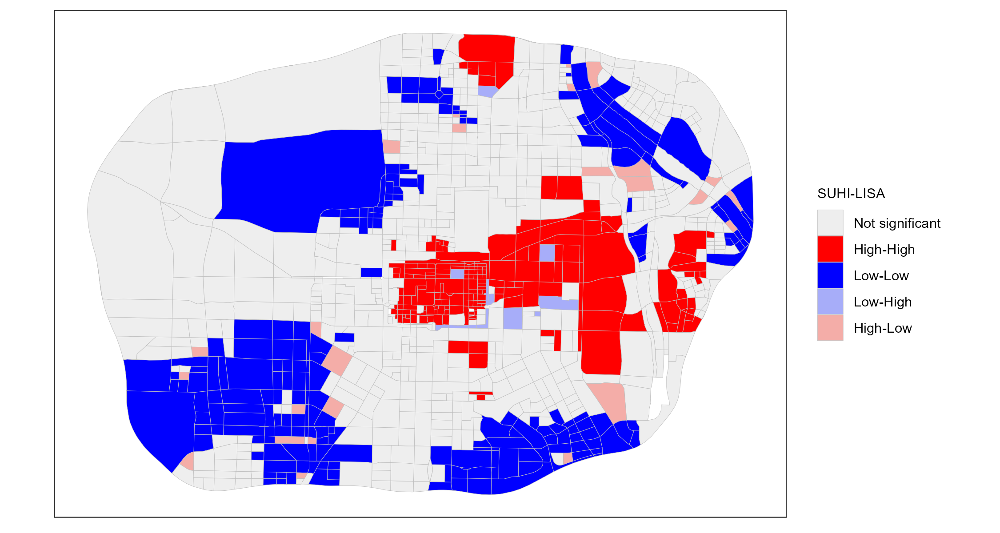
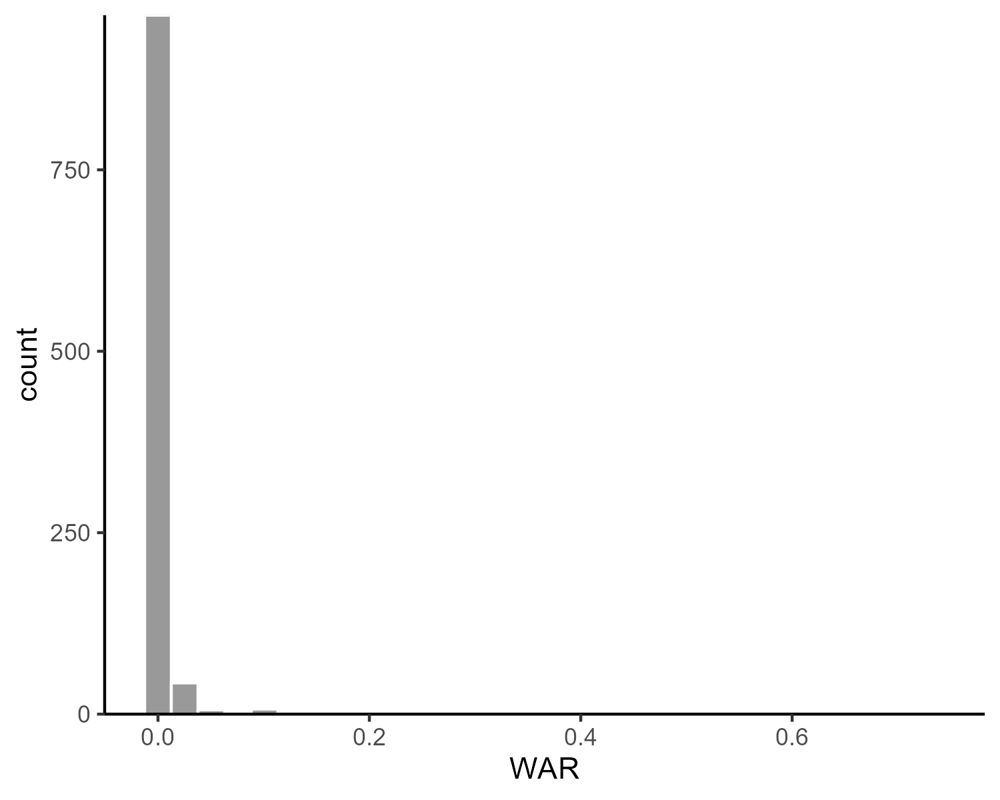

### Load data and package


``` r
library(sf)
library(gdverse)
library(magrittr)
library(tidyverse)
usfi = read_sf(system.file('extdata/USFI_Xian.gpkg',package = 'gdverse'))
usfi
## Simple feature collection with 1037 features and 19 fields
## Geometry type: POLYGON
## Dimension:     XY
## Bounding box:  xmin: 295713 ymin: 3784916 xmax: 324202.2 ymax: 3804669
## Projected CRS: WGS 84 / UTM zone 49N
## # A tibble: 1,037 × 20
##      LPI   LSI   GAR    DAR      WAR   TER  NDVI   NDWI   DTH   DTP    DTR   DTW    BH    BD
##    <dbl> <dbl> <dbl>  <dbl>    <dbl> <dbl> <dbl>  <dbl> <dbl> <dbl>  <dbl> <dbl> <dbl> <dbl>
##  1  57.2 10.5  0.630 0.273  0.00219  0.979 0.497 -0.356  5.66 1.08  0.934   1.16 3.16  0.635
##  2  85.7  2.35 0.905 0.0952 0        0.977 0.514 -0.288  5.66 1.41  0.0807  1.57 0.310 0.139
##  3  41.2  7.85 0.436 0.449  0.000672 0.972 0.365 -0.296  4.38 1.88  0.516   2.37 3.99  0.671
##  4  39.1  5.40 0.534 0.377  0        0.966 0.395 -0.299  4.25 1.97  0.442   2.81 4.63  0.634
##  5  32.0  8.04 0.405 0.437  0        0.968 0.354 -0.302  3.65 1.34  0.615   2.55 4.07  0.642
##  6  58.3  7.91 0.332 0.615  0.000377 0.966 0.312 -0.271  3.69 0.700 0.592   2.25 7.91  0.777
##  7  98.4  3.34 0.984 0.0161 0        0.948 0.451 -0.248  5.39 1.36  0.124   3.64 0.216 0.111
##  8  44.6 17.6  0.416 0.502  0.000672 0.949 0.365 -0.295  5.11 1.20  0.926   2.50 6.49  0.747
##  9  35.9  9.81 0.464 0.467  0.00134  0.936 0.379 -0.309  7.10 2.01  1.03    2.75 5.49  0.692
## 10  44.3  9.49 0.403 0.504  0.000547 0.926 0.310 -0.278  8.51 2.68  0.658   3.20 3.27  0.601
## # ℹ 1,027 more rows
## # ℹ 6 more variables: RL <dbl>, RFD <dbl>, SVF <dbl>, FAR <dbl>, SUHI <dbl>, geom <POLYGON [m]>
```

The polygon spatial data are the streets divided based on roads within *the Ring expressway of Xi'an City*, and the attribute data are the *SUHI*(surface urban  heat island effect) and its influence factors.

<div class="figure" style="text-align: center">

<p class="caption">The study area map of USFI_Xian data</p>
</div>

### Spatial pattern of SUHI

#### global spatial autocorrelation of SUHI

here I use `sfdep` to calculate the global **Moran's I**


``` r
global_moranI = \(data,col,nb,wt){
  I = sfdep::global_moran(dplyr::pull(data,{{col}}),
                          dplyr::pull(data,{{nb}}),
                          dplyr::pull(data,{{wt}}),
                          na_ok = T)$I
  PValue = sfdep::global_moran_test(dplyr::pull(data,{{col}}),
                                    dplyr::pull(data,{{nb}}),
                                    dplyr::pull(data,{{wt}}),
                                    na.action = na.omit)$p.value
  moranI = c(I,PValue)
  names(moranI) = c("Moran'I Index","P Value")
  return(moranI)
}

usfi |>
  dplyr::filter(!if_any(everything(),is.na)) |>
  mutate(nb = sfdep::st_contiguity(geom),
         wt = sfdep::st_weights(nb)) |>
  dplyr::select(SUHI,nb,wt) -> new_usfi

new_usfi
## Simple feature collection with 1037 features and 3 fields
## Geometry type: POLYGON
## Dimension:     XY
## Bounding box:  xmin: 295713 ymin: 3784916 xmax: 324202.2 ymax: 3804669
## Projected CRS: WGS 84 / UTM zone 49N
## # A tibble: 1,037 × 4
##     SUHI nb         wt                                                                      geom
##    <dbl> <nb>       <list>                                                         <POLYGON [m]>
##  1 1.76  <int [12]> <dbl [12]> ((297871.4 3787333, 297864.8 3787343, 297852.8 3787362, 297840.8…
##  2 0.519 <int [2]>  <dbl [2]>  ((297398.6 3788768, 297397.5 3788779, 297395.2 3788804, 297393.2…
##  3 3.04  <int [9]>  <dbl [9]>  ((297391.4 3789405, 297391 3789429, 297390.5 3789454, 297390.1 3…
##  4 3.22  <int [4]>  <dbl [4]>  ((297244.1 3790712, 297240.4 3790729, 297235 3790751, 297229.6 3…
##  5 3.47  <int [6]>  <dbl [6]>  ((296806.9 3791969, 296806.7 3791970, 296797.7 3791990, 296788.8…
##  6 4.71  <int [6]>  <dbl [6]>  ((296484.5 3792805, 296481.4 3792815, 296474.7 3792837, 296467.9…
##  7 1.24  <int [2]>  <dbl [2]>  ((296356.5 3793294, 296355.5 3793298, 296351.3 3793316, 296347.5…
##  8 4.30  <int [8]>  <dbl [8]>  ((296154.6 3794673, 296152.3 3794688, 296148.6 3794713, 296144.9…
##  9 3.76  <int [5]>  <dbl [5]>  ((296261.4 3798947, 296268.7 3798960, 296280.2 3798979, 296287.8…
## 10 4.23  <int [5]>  <dbl [5]>  ((296996.6 3800017, 297000.9 3800022, 297013.3 3800038, 297025.5…
## # ℹ 1,027 more rows
```

``` r

set.seed(123456789)

gmi = new_usfi |>
  global_moranI(SUHI,nb,wt)
gmi
## Moran'I Index       P Value 
##  5.359564e-01 5.078059e-217
```

The global Moran's Index is 0.5359564 and the P value is 5.0780594 &times; 10<sup>-217</sup>,which shows that SUHI in the main urban area of Xi'an has significant positive spatial autocorrelation in the global scale.

#### local spatial autocorrelation of SUHI

We will use `tidyrgeoda` to run the `LISA`, more details see [**here**](https://spatlyu.github.io/tidyrgeoda/articles/Local-Indicators-of-Spatial-Association.html)


``` r
library(tidyrgeoda)

new_usfi %>%
  mutate(lisa = st_local_moran(.,'SUHI',
                               wt = st_contiguity_weights(.),
                               significance_cutoff = 0.05)) %>%
  select(lisa) %>%
  ggplot() +
  geom_sf(aes(fill = lisa),lwd = .1,color = 'grey') +
  scale_fill_lisa(name = 'SUHI-LISA') +
  theme_bw() +
  theme(
    axis.text = element_blank(),
    axis.ticks = element_blank(),
    axis.title = element_blank(),
    panel.grid = element_blank(),
    legend.title = element_text(size = 5),
    legend.text = element_text(size = 5),
    legend.key.size = unit(.3, 'cm')
  )
```

<div class="figure">

<p class="caption">LISA Of SUHI in Xi'an Main City</p>
</div>

The global and local spatial autocorrelation shows that SUHI's strong spatial dependence.

Spatial dependence was neglected in native geodetector, which led to the **SPADE** spatial association detector.

### OPGD modeling


``` r
usfi_opgd = opgd(SUHI ~ ., data = st_drop_geometry(usfi), discnum = 3:15,
                 discvar = names(select(st_drop_geometry(usfi),-SUHI)),cores = 6)
usfi_opgd
## Spatial Stratified Heterogeneity Test 
##  
##           Factor detector
```


------------------------------------
 variable   Q-statistic    P-value  
---------- ------------- -----------
   DAR        0.4393      4.882e-10 

   NDVI       0.3971      2.024e-10 

   GAR        0.3823      8.253e-10 

   RFD         0.267      7.395e-10 

    BD         0.265      3.249e-10 

    BH        0.2478      8.793e-11 

   NDWI       0.2081      6.586e-10 

   FAR         0.198      1.35e-10  

   SVF        0.1309      4.973e-10 

    RL        0.1231      8.885e-10 

   TER        0.1164      6.774e-08 

   WAR        0.1062      5.574e-10 

   LSI        0.07673     3.213e-06 

   DTH        0.07629     7.669e-06 

   DTP        0.07479     7.947e-10 

   DTW        0.05576     0.0004072 

   DTR        0.05286     3.937e-07 

   LPI        0.02876      0.8158   
------------------------------------


**You can access the detailed q statistics by `usfi_opgd$factor`**


``` r
usfi_opgd$factor
## # A tibble: 18 × 3
##    variable `Q-statistic` `P-value`
##    <chr>            <dbl>     <dbl>
##  1 DAR             0.439   4.88e-10
##  2 NDVI            0.397   2.02e-10
##  3 GAR             0.382   8.25e-10
##  4 RFD             0.267   7.40e-10
##  5 BD              0.265   3.25e-10
##  6 BH              0.248   8.79e-11
##  7 NDWI            0.208   6.59e-10
##  8 FAR             0.198   1.35e-10
##  9 SVF             0.131   4.97e-10
## 10 RL              0.123   8.89e-10
## 11 TER             0.116   6.77e- 8
## 12 WAR             0.106   5.57e-10
## 13 LSI             0.0767  3.21e- 6
## 14 DTH             0.0763  7.67e- 6
## 15 DTP             0.0748  7.95e-10
## 16 DTW             0.0558  4.07e- 4
## 17 DTR             0.0529  3.94e- 7
## 18 LPI             0.0288  8.16e- 1
```

### SPADE modeling

*SPADE* explicitly considers the spatial variance by assigning the weight of the influence based on spatial distribution and also minimizes the influence of the number of levels on PD values by using the multilevel discretization and considering information loss due to discretization.

When response variable has a strong spatial dependence, maybe *SPADE* is a best choice.

The biggest difference between SPADE and native GD and OPGD in actual modeling is that SPADE requires a spatial weight matrix to calculate spatial variance.

In `gdverse`, when you not provide a spatial weight matrix, it will use **1st order inverse distance weight**, which can be created by `inverse_distance_weight()`.


``` r
coords = usfi |>
  st_centroid() |>
  st_coordinates()

wt1 = inverse_distance_weight(coords[,1],coords[,2])
```

You can also use gravity weight by assigning `power` parameter in `inverse_distance_weight()` function.


``` r
wt2 = inverse_distance_weight(coords[,1],coords[,2],power = 2)
```

You can also use spatial weight matrix from `sfdep`(which invoke `spdep`) or `tidyrgeoda`(which invoke `rgeoda``)

#### using spatial weight matrix from sfdep


``` r
wt3 = usfi |>
  dplyr::filter(!if_any(everything(),is.na)) |>
  mutate(nb = sfdep::st_contiguity(geom),
         wt = sfdep::st_weights(nb)) %$%
  sfdep::wt_as_matrix(nb,wt)
```

#### using spatial weight matrix from tidyrgeoda


``` r
wt4 = tidyrgeoda::st_contiguity_weights(usfi) |>
  as.matrix() |>
  apply(1,\(x) x/sum(x)) |>
  t()
```

The `wt3` is identical `wt4`


``` r
identical(wt3,wt4)
## [1] TRUE
```

**We recommend using the inverse distance weight function `inverse_distance_weight()` of the `gdverse` package to construct a spatial weight matrix if you're not sure which spatial weight matrix should to be used as the SPADE paper is using this.In practice, the appropriate spatial weight matrix is selected considering the characteristics of the research object and the research area! **

In the following section we will execute *SPADE* model using  spatial weight matrix `wt3` which is constructed by queen contiguity.

#### run SPADE


``` r
usfi_spade = spade(SUHI ~ ., data = st_drop_geometry(usfi), wt = wt3, discnum = 3:15,
                   discvar = names(select(st_drop_geometry(usfi),-SUHI)),cores = 6)
usfi_spade
## Spatial Stratified Heterogeneity Test 
##  
##           Factor detector
```


----------------------------------
 variable   Q-statistic   P-value 
---------- ------------- ---------
   NDVI       0.4655       0.01   

   DAR        0.4159       0.01   

   GAR        0.3953       0.01   

   RFD        0.3221       0.01   

   NDWI       0.2885       0.01   

    BD        0.2762       0.01   

   DTW        0.2532       0.01   

   DTR        0.2465       0.01   

    BH        0.2414       0.01   

   DTP        0.2412       0.01   

   FAR        0.2237       0.01   

   TER        0.2173       0.01   

   LPI        0.1646       0.01   

   SVF        0.1547       0.01   

    RL        0.1317       0.01   

   LSI        0.1312       0.01   

   DTH        0.09689      0.01   

   WAR          NA          NA    
----------------------------------


**You can also access the detailed q statistics by `usfi_spade$factor`**


``` r
usfi_spade$factor
## # A tibble: 18 × 3
##    variable `Q-statistic` `P-value`
##    <chr>            <dbl>     <dbl>
##  1 NDVI            0.465       0.01
##  2 DAR             0.416       0.01
##  3 GAR             0.395       0.01
##  4 RFD             0.322       0.01
##  5 NDWI            0.288       0.01
##  6 BD              0.276       0.01
##  7 DTW             0.253       0.01
##  8 DTR             0.247       0.01
##  9 BH              0.241       0.01
## 10 DTP             0.241       0.01
## 11 FAR             0.224       0.01
## 12 TER             0.217       0.01
## 13 LPI             0.165       0.01
## 14 SVF             0.155       0.01
## 15 RL              0.132       0.01
## 16 LSI             0.131       0.01
## 17 DTH             0.0969      0.01
## 18 WAR           NaN          NA
```

The result of `WAR` is `NA`,and you can see a big difference between the OPGD and SPADE model. The results of SPADE are more reliable in most cases.

We demonstrate the rationality of NA values calculated of `WAR` in the following section:

### SPADE NA results explained


``` r
WAR = usfi$WAR
skimr::skim(WAR)
```


Table: Data summary

|                         |     |
|:------------------------|:----|
|Name                     |WAR  |
|Number of rows           |1037 |
|Number of columns        |1    |
|_______________________  |     |
|Column type frequency:   |     |
|numeric                  |1    |
|________________________ |     |
|Group variables          |None |


**Variable type: numeric**

|skim_variable | n_missing| complete_rate| mean|   sd| p0| p25| p50| p75| p100|hist  |
|:-------------|---------:|-------------:|----:|----:|--:|---:|---:|---:|----:|:-----|
|data          |         0|             1| 0.01| 0.04|  0|   0|   0|   0| 0.73|▇▁▁▁▁ |


``` r
ggplot(data = usfi) +
  geom_histogram(aes(WAR),
               color='white',
               fill='gray60') +
  scale_y_continuous(expand = c(0,0)) +
  theme_classic()
```

<div class="figure">

<p class="caption">Histogram of WAR Variable</p>
</div>

``` r
moments::skewness(WAR)
## [1] 11.6917
```

``` r
shapiro.test(WAR)
## 
## 	Shapiro-Wilk normality test
## 
## data:  WAR
## W = 0.14693, p-value < 2.2e-16
```
From the histogram of `WAR`,its skewness and the result of shapiro.test, you will find that the WAR variable is heavily skewed, with a large number of zeros, which do not provide sufficient information for modeling SUHI.

In fact, the WAR variable represents the proportion of the water area of each block, and the WAR value is NA in the SPADE result probably because provide sufficient information for modeling SUHI.

In most cases, we use linear regression to explore linear relationships between variables and select appropriate variables for subsequent modeling through methods such as VIF.Here
we examine the effect of removing the WAR variable on VIF and linear models


``` r
lm.modelOne = lm(SUHI ~ ., data = st_drop_geometry(usfi))
summary(lm.modelOne)
## 
## Call:
## lm(formula = SUHI ~ ., data = st_drop_geometry(usfi))
## 
## Residuals:
##     Min      1Q  Median      3Q     Max 
## -4.1991 -0.6899 -0.0366  0.6837  3.7666 
## 
## Coefficients:
##               Estimate Std. Error t value Pr(>|t|)    
## (Intercept)  22.156854   5.003326   4.428 1.05e-05 ***
## LPI          -0.002280   0.002701  -0.844  0.39872    
## LSI          -0.004190   0.023320  -0.180  0.85746    
## GAR           6.869974   0.902865   7.609 6.27e-14 ***
## DAR           6.746594   0.829310   8.135 1.19e-15 ***
## WAR           5.283058   1.784052   2.961  0.00313 ** 
## TER          -1.388985   0.670337  -2.072  0.03851 *  
## NDVI        -15.268701   1.620501  -9.422  < 2e-16 ***
## NDWI        -15.408610   2.127737  -7.242 8.72e-13 ***
## DTH           0.015604   0.012255   1.273  0.20318    
## DTP           0.091178   0.098705   0.924  0.35584    
## DTR          -0.069387   0.064638  -1.073  0.28331    
## DTW          -0.195546   0.067418  -2.901  0.00381 ** 
## BH            0.197986   0.034505   5.738 1.26e-08 ***
## BD            6.151962   2.181999   2.819  0.00490 ** 
## RL            0.008593   0.228118   0.038  0.96996    
## RFD           0.117208   0.741697   0.158  0.87447    
## SVF         -22.397352   4.954590  -4.521 6.89e-06 ***
## FAR          -1.260657   0.112759 -11.180  < 2e-16 ***
## ---
## Signif. codes:  0 '***' 0.001 '**' 0.01 '*' 0.05 '.' 0.1 ' ' 1
## 
## Residual standard error: 1.06 on 1018 degrees of freedom
## Multiple R-squared:  0.6173,	Adjusted R-squared:  0.6106 
## F-statistic: 91.23 on 18 and 1018 DF,  p-value: < 2.2e-16
```

``` r
car::vif(lm.modelOne) |>
  tibble::as_tibble_row() |>
  tidyr::pivot_longer(everything(),
                      names_to = 'variable',
                      values_to = 'VIF')
## # A tibble: 18 × 2
##    variable    VIF
##    <chr>     <dbl>
##  1 LPI        1.68
##  2 LSI        1.50
##  3 GAR       31.1 
##  4 DAR       28.5 
##  5 WAR        5.85
##  6 TER        1.18
##  7 NDVI      20.5 
##  8 NDWI      13.2 
##  9 DTH        1.15
## 10 DTP        2.06
## 11 DTR        1.15
## 12 DTW        2.00
## 13 BH        31.9 
## 14 BD       105.  
## 15 RL         2.96
## 16 RFD       89.4 
## 17 SVF        3.02
## 18 FAR       31.3
```


``` r
lm.modelTwo = lm(SUHI ~ ., data = st_drop_geometry(usfi) |> select(-WAR))
summary(lm.modelTwo)
## 
## Call:
## lm(formula = SUHI ~ ., data = select(st_drop_geometry(usfi), 
##     -WAR))
## 
## Residuals:
##     Min      1Q  Median      3Q     Max 
## -4.1752 -0.7118 -0.0227  0.6896  3.6784 
## 
## Coefficients:
##               Estimate Std. Error t value Pr(>|t|)    
## (Intercept)  21.011090   5.007323   4.196 2.95e-05 ***
## LPI          -0.000917   0.002671  -0.343 0.731475    
## LSI          -0.002172   0.023399  -0.093 0.926046    
## GAR           5.283103   0.729402   7.243 8.64e-13 ***
## DAR           5.300795   0.672909   7.877 8.53e-15 ***
## TER          -1.174510   0.668949  -1.756 0.079431 .  
## NDVI        -13.026040   1.438097  -9.058  < 2e-16 ***
## NDWI        -10.693806   1.416860  -7.548 9.82e-14 ***
## DTH           0.011362   0.012217   0.930 0.352593    
## DTP           0.115158   0.098747   1.166 0.243809    
## DTR          -0.058443   0.064778  -0.902 0.367161    
## DTW          -0.226617   0.066850  -3.390 0.000726 ***
## BH            0.192503   0.034587   5.566 3.34e-08 ***
## BD            5.951972   2.189252   2.719 0.006665 ** 
## RL            0.061282   0.228288   0.268 0.788413    
## RFD           0.100502   0.744497   0.135 0.892644    
## SVF         -19.414910   4.869603  -3.987 7.17e-05 ***
## FAR          -1.227348   0.112624 -10.898  < 2e-16 ***
## ---
## Signif. codes:  0 '***' 0.001 '**' 0.01 '*' 0.05 '.' 0.1 ' ' 1
## 
## Residual standard error: 1.064 on 1019 degrees of freedom
## Multiple R-squared:  0.614,	Adjusted R-squared:  0.6076 
## F-statistic: 95.36 on 17 and 1019 DF,  p-value: < 2.2e-16
```

``` r
car::vif(lm.modelTwo) |>
  tibble::as_tibble_row() |>
  tidyr::pivot_longer(everything(),
                      names_to = 'variable',
                      values_to = 'VIF')
## # A tibble: 17 × 2
##    variable    VIF
##    <chr>     <dbl>
##  1 LPI        1.63
##  2 LSI        1.50
##  3 GAR       20.2 
##  4 DAR       18.6 
##  5 TER        1.16
##  6 NDVI      16.0 
##  7 NDWI       5.83
##  8 DTH        1.13
##  9 DTP        2.05
## 10 DTR        1.15
## 11 DTW        1.96
## 12 BH        31.8 
## 13 BD       104.  
## 14 RL         2.94
## 15 RFD       89.4 
## 16 SVF        2.90
## 17 FAR       31.0
```

You can see that the model does not change much before and after removing the WAR variable.In other words, WAR does not do much to model SUHI.

This suggests another use of `SPADE` for selection modeling variables
