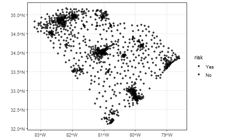

The IDSA model is based on the SPADE model, which extends the power of spatial determinant of the SPADE model to multivariable interaction and takes spatial fuzzy overlay into account.

In this vignette, we used the same data as the SPADE vignette to demonstrate the use of the IDSA model.

### Load data and package


``` r
library(sf)
library(tidyverse)
library(gdverse)

depression = system.file('extdata/Depression.csv',package = 'gdverse') %>%
  read_csv() %>%
  st_as_sf(coords = c('X','Y'), crs = 4326)
depression
## Simple feature collection with 1072 features and 11 fields
## Geometry type: POINT
## Dimension:     XY
## Bounding box:  xmin: -83.1795 ymin: 32.11464 xmax: -78.6023 ymax: 35.17354
## Geodetic CRS:  WGS 84
## # A tibble: 1,072 × 12
##    Depression_prevelence PopulationDensity Population65 NoHealthInsurance
##  *                 <dbl>             <dbl>        <dbl>             <dbl>
##  1                  23.1              61.5         22.5              7.98
##  2                  22.8              58.3         16.8             11.0 
##  3                  23.2              35.9         24.5              9.31
##  4                  21.8              76.1         21.8             13.2 
##  5                  20.7              47.3         22.0             11   
##  6                  21.3              32.5         19.2             13.0 
##  7                  22                36.9         19.2             10.8 
##  8                  21.2              61.5         15.9              8.57
##  9                  22.7              67.2         15.7             17.8 
## 10                  20.6             254.          11.3             12.7 
## # ℹ 1,062 more rows
## # ℹ 8 more variables: Neighbor_Disadvantage <dbl>, Beer <dbl>, MentalHealthPati <dbl>,
## #   NatureParks <dbl>, Casinos <dbl>, DrinkingPlaces <dbl>, X.HouseRent <dbl>,
## #   geometry <POINT [°]>
```

### Construct spatial Weight

We use the same spatial weight matrix as SPADE vignette.


``` r
wt = sdsfun::inverse_distance_swm(depression)
```

### IDSA modeling


``` r
tictoc::tic()
idsa.model = idsa(Depression_prevelence ~ .,
                  data = depression,
                  wt = wt, cores = 12)
tictoc::toc()
## 126.42 sec elapsed
idsa.model
## ***     Interactive Detector For Spatial Associations 
## 
## |                                                                           varibale                                                                            |    PID     |
## |:-------------------------------------------------------------------------------------------------------------------------------------------------------------:|:----------:|
## |                  PopulationDensity ∩ Population65 ∩ Neighbor_Disadvantage ∩ Beer ∩ MentalHealthPati ∩ NatureParks ∩ Casinos ∩ DrinkingPlaces                  | 0.75448031 |
## |                                 PopulationDensity ∩ Population65 ∩ Neighbor_Disadvantage ∩ Beer ∩ MentalHealthPati ∩ Casinos                                  | 0.74676920 |
## |                          PopulationDensity ∩ Population65 ∩ Neighbor_Disadvantage ∩ Beer ∩ MentalHealthPati ∩ Casinos ∩ X.HouseRent                           | 0.74440945 |
## |                          PopulationDensity ∩ Population65 ∩ Neighbor_Disadvantage ∩ Beer ∩ MentalHealthPati ∩ NatureParks ∩ Casinos                           | 0.74336618 |
## |                         PopulationDensity ∩ Population65 ∩ Neighbor_Disadvantage ∩ Beer ∩ MentalHealthPati ∩ Casinos ∩ DrinkingPlaces                         | 0.73690043 |
## |                  PopulationDensity ∩ Population65 ∩ Neighbor_Disadvantage ∩ Beer ∩ MentalHealthPati ∩ Casinos ∩ DrinkingPlaces ∩ X.HouseRent                  | 0.71493588 |
## |                              PopulationDensity ∩ Population65 ∩ Beer ∩ MentalHealthPati ∩ NatureParks ∩ Casinos ∩ DrinkingPlaces                              | 0.70149346 |
## |           PopulationDensity ∩ Population65 ∩ Neighbor_Disadvantage ∩ Beer ∩ MentalHealthPati ∩ NatureParks ∩ Casinos ∩ DrinkingPlaces ∩ X.HouseRent           | 0.69920202 |
## |                   PopulationDensity ∩ Population65 ∩ Neighbor_Disadvantage ∩ Beer ∩ MentalHealthPati ∩ NatureParks ∩ Casinos ∩ X.HouseRent                    | 0.69574284 |
## |                PopulationDensity ∩ Population65 ∩ Neighbor_Disadvantage ∩ Beer ∩ MentalHealthPati ∩ NatureParks ∩ DrinkingPlaces ∩ X.HouseRent                | 0.69570953 |
## |                               PopulationDensity ∩ Population65 ∩ Neighbor_Disadvantage ∩ Beer ∩ MentalHealthPati ∩ NatureParks                                | 0.69306371 |
## |                       PopulationDensity ∩ Population65 ∩ Neighbor_Disadvantage ∩ Beer ∩ MentalHealthPati ∩ DrinkingPlaces ∩ X.HouseRent                       | 0.69211633 |
## |                         PopulationDensity ∩ Neighbor_Disadvantage ∩ Beer ∩ MentalHealthPati ∩ NatureParks ∩ Casinos ∩ DrinkingPlaces                          | 0.69028946 |
## |                       PopulationDensity ∩ Population65 ∩ Neighbor_Disadvantage ∩ Beer ∩ MentalHealthPati ∩ NatureParks ∩ DrinkingPlaces                       | 0.69023557 |
## |                                    PopulationDensity ∩ Population65 ∩ Neighbor_Disadvantage ∩ Beer ∩ Casinos ∩ X.HouseRent                                    | 0.68529326 |
## |                                  PopulationDensity ∩ Neighbor_Disadvantage ∩ Beer ∩ MentalHealthPati ∩ NatureParks ∩ Casinos                                  | 0.68403399 |
## |                                      PopulationDensity ∩ Population65 ∩ Beer ∩ MentalHealthPati ∩ NatureParks ∩ Casinos                                       | 0.67851352 |
## |                           PopulationDensity ∩ Population65 ∩ Neighbor_Disadvantage ∩ Beer ∩ Casinos ∩ DrinkingPlaces ∩ X.HouseRent                            | 0.67765060 |
## |                                             PopulationDensity ∩ Population65 ∩ Beer ∩ MentalHealthPati ∩ Casinos                                              | 0.67605210 |
## |                        PopulationDensity ∩ Population65 ∩ Neighbor_Disadvantage ∩ Beer ∩ MentalHealthPati ∩ NatureParks ∩ X.HouseRent                         | 0.67063849 |
## |                              PopulationDensity ∩ Population65 ∩ Neighbor_Disadvantage ∩ Beer ∩ MentalHealthPati ∩ DrinkingPlaces                              | 0.67054395 |
## |                                    PopulationDensity ∩ Population65 ∩ Neighbor_Disadvantage ∩ Beer ∩ NatureParks ∩ Casinos                                    | 0.66777542 |
## |                                           PopulationDensity ∩ Population65 ∩ Neighbor_Disadvantage ∩ Beer ∩ Casinos                                           | 0.66733159 |
## |                                  PopulationDensity ∩ Population65 ∩ Neighbor_Disadvantage ∩ Beer ∩ Casinos ∩ DrinkingPlaces                                   | 0.66599686 |
## |        PopulationDensity ∩ Population65 ∩ NoHealthInsurance ∩ Neighbor_Disadvantage ∩ Beer ∩ MentalHealthPati ∩ NatureParks ∩ Casinos ∩ DrinkingPlaces        | 0.66294529 |
## |                           PopulationDensity ∩ Population65 ∩ Neighbor_Disadvantage ∩ Beer ∩ NatureParks ∩ Casinos ∩ DrinkingPlaces                            | 0.66291548 |
## |                                PopulationDensity ∩ Population65 ∩ Neighbor_Disadvantage ∩ Beer ∩ DrinkingPlaces ∩ X.HouseRent                                 | 0.66232713 |
## |                                      PopulationDensity ∩ Population65 ∩ Neighbor_Disadvantage ∩ Beer ∩ MentalHealthPati                                       | 0.66082712 |
## |                PopulationDensity ∩ Population65 ∩ NoHealthInsurance ∩ Neighbor_Disadvantage ∩ Beer ∩ MentalHealthPati ∩ NatureParks ∩ Casinos                 | 0.66032319 |
## |                                      PopulationDensity ∩ Population65 ∩ Beer ∩ MentalHealthPati ∩ Casinos ∩ X.HouseRent                                       | 0.66030690 |
## |                    PopulationDensity ∩ Population65 ∩ Neighbor_Disadvantage ∩ Beer ∩ NatureParks ∩ Casinos ∩ DrinkingPlaces ∩ X.HouseRent                     | 0.65998731 |
## |                                PopulationDensity ∩ Neighbor_Disadvantage ∩ Beer ∩ MentalHealthPati ∩ Casinos ∩ DrinkingPlaces                                 | 0.65896570 |
## |                              PopulationDensity ∩ Population65 ∩ Beer ∩ MentalHealthPati ∩ Casinos ∩ DrinkingPlaces ∩ X.HouseRent                              | 0.65757240 |
## |                                     PopulationDensity ∩ Population65 ∩ Beer ∩ MentalHealthPati ∩ Casinos ∩ DrinkingPlaces                                     | 0.65601035 |
## |                             PopulationDensity ∩ Population65 ∩ Neighbor_Disadvantage ∩ Beer ∩ NatureParks ∩ Casinos ∩ X.HouseRent                             | 0.65488122 |
## |                                         PopulationDensity ∩ Neighbor_Disadvantage ∩ Beer ∩ MentalHealthPati ∩ Casinos                                         | 0.65476238 |
## |                                   PopulationDensity ∩ Population65 ∩ Beer ∩ MentalHealthPati ∩ NatureParks ∩ DrinkingPlaces                                   | 0.65166976 |
## |                            PopulationDensity ∩ Population65 ∩ Beer ∩ MentalHealthPati ∩ NatureParks ∩ DrinkingPlaces ∩ X.HouseRent                            | 0.65015723 |
## |                               PopulationDensity ∩ Population65 ∩ Neighbor_Disadvantage ∩ Beer ∩ MentalHealthPati ∩ X.HouseRent                                | 0.64993263 |
## |                                   PopulationDensity ∩ Population65 ∩ Beer ∩ MentalHealthPati ∩ DrinkingPlaces ∩ X.HouseRent                                   | 0.64959689 |
## |                PopulationDensity ∩ Population65 ∩ NoHealthInsurance ∩ Neighbor_Disadvantage ∩ Beer ∩ MentalHealthPati ∩ Casinos ∩ X.HouseRent                 | 0.64624795 |
## | PopulationDensity ∩ Population65 ∩ NoHealthInsurance ∩ Neighbor_Disadvantage ∩ Beer ∩ MentalHealthPati ∩ NatureParks ∩ Casinos ∩ DrinkingPlaces ∩ X.HouseRent | 0.64532447 |
## |                  PopulationDensity ∩ Neighbor_Disadvantage ∩ Beer ∩ MentalHealthPati ∩ NatureParks ∩ Casinos ∩ DrinkingPlaces ∩ X.HouseRent                   | 0.64494519 |
## |                       PopulationDensity ∩ Population65 ∩ NoHealthInsurance ∩ Neighbor_Disadvantage ∩ Beer ∩ MentalHealthPati ∩ Casinos                        | 0.64362288 |
## |                       PopulationDensity ∩ Population65 ∩ Beer ∩ MentalHealthPati ∩ NatureParks ∩ Casinos ∩ DrinkingPlaces ∩ X.HouseRent                       | 0.64094341 |
## |        PopulationDensity ∩ Population65 ∩ NoHealthInsurance ∩ Neighbor_Disadvantage ∩ Beer ∩ MentalHealthPati ∩ Casinos ∩ DrinkingPlaces ∩ X.HouseRent        | 0.63889688 |
## |                                         PopulationDensity ∩ Population65 ∩ Neighbor_Disadvantage ∩ Beer ∩ X.HouseRent                                         | 0.63707532 |
## |         PopulationDensity ∩ Population65 ∩ NoHealthInsurance ∩ Neighbor_Disadvantage ∩ Beer ∩ MentalHealthPati ∩ NatureParks ∩ Casinos ∩ X.HouseRent          | 0.63639412 |
## |                                           PopulationDensity ∩ Population65 ∩ Beer ∩ MentalHealthPati ∩ NatureParks                                            | 0.63267749 |
## |                                  PopulationDensity ∩ Neighbor_Disadvantage ∩ Beer ∩ MentalHealthPati ∩ Casinos ∩ X.HouseRent                                  | 0.63230577 |
## |               PopulationDensity ∩ Population65 ∩ NoHealthInsurance ∩ Neighbor_Disadvantage ∩ Beer ∩ MentalHealthPati ∩ Casinos ∩ DrinkingPlaces               | 0.63204555 |
## |                                       PopulationDensity ∩ Population65 ∩ Neighbor_Disadvantage ∩ Beer ∩ DrinkingPlaces                                        | 0.63043256 |
## |                         PopulationDensity ∩ Neighbor_Disadvantage ∩ Beer ∩ MentalHealthPati ∩ Casinos ∩ DrinkingPlaces ∩ X.HouseRent                          | 0.62995816 |
## |                           PopulationDensity ∩ Neighbor_Disadvantage ∩ Beer ∩ MentalHealthPati ∩ NatureParks ∩ Casinos ∩ X.HouseRent                           | 0.62957708 |
## |                                PopulationDensity ∩ Population65 ∩ Neighbor_Disadvantage ∩ Beer ∩ NatureParks ∩ DrinkingPlaces                                 | 0.62926893 |
## |                                         PopulationDensity ∩ Population65 ∩ Neighbor_Disadvantage ∩ Beer ∩ NatureParks                                         | 0.62745539 |
## |                                       PopulationDensity ∩ Population65 ∩ Beer ∩ Casinos ∩ DrinkingPlaces ∩ X.HouseRent                                        | 0.62725842 |
## |                         PopulationDensity ∩ Population65 ∩ Neighbor_Disadvantage ∩ Beer ∩ NatureParks ∩ DrinkingPlaces ∩ X.HouseRent                          | 0.62677944 |
## |                                  PopulationDensity ∩ Population65 ∩ Neighbor_Disadvantage ∩ Beer ∩ NatureParks ∩ X.HouseRent                                  | 0.62456815 |
## |      PopulationDensity ∩ Population65 ∩ NoHealthInsurance ∩ Neighbor_Disadvantage ∩ Beer ∩ MentalHealthPati ∩ NatureParks ∩ DrinkingPlaces ∩ X.HouseRent      | 0.62338611 |
## |                   PopulationDensity ∩ Population65 ∩ NoHealthInsurance ∩ Neighbor_Disadvantage ∩ Beer ∩ NatureParks ∩ Casinos ∩ X.HouseRent                   | 0.62085403 |
## |          PopulationDensity ∩ Population65 ∩ NoHealthInsurance ∩ Neighbor_Disadvantage ∩ Beer ∩ NatureParks ∩ Casinos ∩ DrinkingPlaces ∩ X.HouseRent           | 0.62074268 |
## |                                                PopulationDensity ∩ Population65 ∩ Neighbor_Disadvantage ∩ Beer                                                | 0.61915179 |
## |                    PopulationDensity ∩ Population65 ∩ NoHealthInsurance ∩ Beer ∩ MentalHealthPati ∩ NatureParks ∩ Casinos ∩ DrinkingPlaces                    | 0.61843514 |
## |                                          PopulationDensity ∩ Population65 ∩ Beer ∩ MentalHealthPati ∩ DrinkingPlaces                                          | 0.61665189 |
## |             PopulationDensity ∩ Population65 ∩ NoHealthInsurance ∩ Neighbor_Disadvantage ∩ Beer ∩ MentalHealthPati ∩ DrinkingPlaces ∩ X.HouseRent             | 0.61584325 |
## |                               PopulationDensity ∩ Population65 ∩ Beer ∩ MentalHealthPati ∩ NatureParks ∩ Casinos ∩ X.HouseRent                                | 0.61542694 |
## |                                           PopulationDensity ∩ Neighbor_Disadvantage ∩ Beer ∩ NatureParks ∩ Casinos                                            | 0.61324443 |
## |                       PopulationDensity ∩ Neighbor_Disadvantage ∩ Beer ∩ MentalHealthPati ∩ NatureParks ∩ DrinkingPlaces ∩ X.HouseRent                        | 0.61274903 |
## |                              PopulationDensity ∩ Neighbor_Disadvantage ∩ Beer ∩ MentalHealthPati ∩ NatureParks ∩ DrinkingPlaces                               | 0.61086824 |
## |                     PopulationDensity ∩ Population65 ∩ NoHealthInsurance ∩ Neighbor_Disadvantage ∩ Beer ∩ MentalHealthPati ∩ X.HouseRent                      | 0.60602626 |
## |                            Population65 ∩ Neighbor_Disadvantage ∩ Beer ∩ MentalHealthPati ∩ Casinos ∩ DrinkingPlaces ∩ X.HouseRent                            | 0.60568617 |
## |                          PopulationDensity ∩ Population65 ∩ NoHealthInsurance ∩ Neighbor_Disadvantage ∩ Beer ∩ Casinos ∩ X.HouseRent                          | 0.60500216 |
## |                                           PopulationDensity ∩ Neighbor_Disadvantage ∩ Beer ∩ Casinos ∩ X.HouseRent                                            | 0.60498073 |
## |                                    PopulationDensity ∩ Population65 ∩ Beer ∩ MentalHealthPati ∩ NatureParks ∩ X.HouseRent                                     | 0.60388521 |
## |                                   PopulationDensity ∩ Neighbor_Disadvantage ∩ Beer ∩ NatureParks ∩ Casinos ∩ DrinkingPlaces                                   | 0.60367588 |
## |                 PopulationDensity ∩ Population65 ∩ NoHealthInsurance ∩ Neighbor_Disadvantage ∩ Beer ∩ Casinos ∩ DrinkingPlaces ∩ X.HouseRent                  | 0.60317849 |
## |              PopulationDensity ∩ Population65 ∩ NoHealthInsurance ∩ Neighbor_Disadvantage ∩ Beer ∩ MentalHealthPati ∩ NatureParks ∩ X.HouseRent               | 0.60300802 |
## |                                PopulationDensity ∩ Population65 ∩ Beer ∩ NatureParks ∩ Casinos ∩ DrinkingPlaces ∩ X.HouseRent                                 | 0.60208034 |
## |                               PopulationDensity ∩ Population65 ∩ NoHealthInsurance ∩ Neighbor_Disadvantage ∩ Beer ∩ X.HouseRent                               | 0.59996488 |
## |                          PopulationDensity ∩ Population65 ∩ NoHealthInsurance ∩ Neighbor_Disadvantage ∩ Beer ∩ NatureParks ∩ Casinos                          | 0.59960535 |
## |                                       PopulationDensity ∩ Neighbor_Disadvantage ∩ Beer ∩ MentalHealthPati ∩ NatureParks                                       | 0.59957870 |
## |                     PopulationDensity ∩ Population65 ∩ NoHealthInsurance ∩ Neighbor_Disadvantage ∩ Beer ∩ MentalHealthPati ∩ NatureParks                      | 0.59922213 |
## |                      PopulationDensity ∩ Population65 ∩ NoHealthInsurance ∩ Neighbor_Disadvantage ∩ Beer ∩ DrinkingPlaces ∩ X.HouseRent                       | 0.59791291 |
## |                            PopulationDensity ∩ Population65 ∩ NoHealthInsurance ∩ Beer ∩ MentalHealthPati ∩ NatureParks ∩ Casinos                             | 0.59775076 |
## |                        PopulationDensity ∩ Population65 ∩ NoHealthInsurance ∩ Neighbor_Disadvantage ∩ Beer ∩ NatureParks ∩ X.HouseRent                        | 0.59770080 |
## |                                 Population65 ∩ Neighbor_Disadvantage ∩ Beer ∩ MentalHealthPati ∩ DrinkingPlaces ∩ X.HouseRent                                 | 0.59741933 |
## |                                                PopulationDensity ∩ Population65 ∩ Beer ∩ Casinos ∩ X.HouseRent                                                | 0.59725351 |
## |                                            PopulationDensity ∩ Population65 ∩ Beer ∩ DrinkingPlaces ∩ X.HouseRent                                             | 0.59704003 |
## |                                       PopulationDensity ∩ Population65 ∩ Beer ∩ NatureParks ∩ Casinos ∩ DrinkingPlaces                                        | 0.59620023 |
## |                              PopulationDensity ∩ Population65 ∩ Neighbor_Disadvantage ∩ MentalHealthPati ∩ NatureParks ∩ Casinos                              | 0.59401464 |
## |                                     PopulationDensity ∩ Neighbor_Disadvantage ∩ Beer ∩ MentalHealthPati ∩ DrinkingPlaces                                      | 0.59400116 |
## |                            PopulationDensity ∩ Population65 ∩ NoHealthInsurance ∩ Neighbor_Disadvantage ∩ Beer ∩ MentalHealthPati                             | 0.59398142 |
## |                              PopulationDensity ∩ Neighbor_Disadvantage ∩ Beer ∩ MentalHealthPati ∩ DrinkingPlaces ∩ X.HouseRent                               | 0.59336902 |
## |                 PopulationDensity ∩ Population65 ∩ NoHealthInsurance ∩ Neighbor_Disadvantage ∩ Beer ∩ NatureParks ∩ Casinos ∩ DrinkingPlaces                  | 0.59204252 |
## |                                                PopulationDensity ∩ Population65 ∩ Beer ∩ NatureParks ∩ Casinos                                                | 0.59171196 |
## |                                                  PopulationDensity ∩ Neighbor_Disadvantage ∩ Beer ∩ Casinos                                                   | 0.59049540 |
## |                                                  PopulationDensity ∩ Population65 ∩ Beer ∩ MentalHealthPati                                                   | 0.59044957 |
## |                                          PopulationDensity ∩ Neighbor_Disadvantage ∩ Beer ∩ Casinos ∩ DrinkingPlaces                                          | 0.59043977 |
## |                        PopulationDensity ∩ NoHealthInsurance ∩ Neighbor_Disadvantage ∩ Beer ∩ MentalHealthPati ∩ NatureParks ∩ Casinos                        | 0.58998587 |
## |                              PopulationDensity ∩ Population65 ∩ Neighbor_Disadvantage ∩ MentalHealthPati ∩ Casinos ∩ X.HouseRent                              | 0.58940293 |
## |               PopulationDensity ∩ Population65 ∩ NoHealthInsurance ∩ Neighbor_Disadvantage ∩ Beer ∩ NatureParks ∩ DrinkingPlaces ∩ X.HouseRent                | 0.58903081 |
## |             PopulationDensity ∩ Population65 ∩ NoHealthInsurance ∩ Neighbor_Disadvantage ∩ Beer ∩ MentalHealthPati ∩ NatureParks ∩ DrinkingPlaces             | 0.58735331 |
## |                                              PopulationDensity ∩ Population65 ∩ Beer ∩ Casinos ∩ DrinkingPlaces                                               | 0.58676171 |
## |                                   PopulationDensity ∩ Neighbor_Disadvantage ∩ Beer ∩ Casinos ∩ DrinkingPlaces ∩ X.HouseRent                                   | 0.58527910 |
## |               PopulationDensity ∩ NoHealthInsurance ∩ Neighbor_Disadvantage ∩ Beer ∩ MentalHealthPati ∩ NatureParks ∩ Casinos ∩ DrinkingPlaces                | 0.58387712 |
## |                    PopulationDensity ∩ Population65 ∩ NoHealthInsurance ∩ Neighbor_Disadvantage ∩ Beer ∩ MentalHealthPati ∩ DrinkingPlaces                    | 0.58233569 |
## |                                PopulationDensity ∩ Neighbor_Disadvantage ∩ Beer ∩ MentalHealthPati ∩ NatureParks ∩ X.HouseRent                                | 0.58192851 |
## |        PopulationDensity ∩ NoHealthInsurance ∩ Neighbor_Disadvantage ∩ Beer ∩ MentalHealthPati ∩ NatureParks ∩ Casinos ∩ DrinkingPlaces ∩ X.HouseRent         | 0.58184154 |
## |                                     PopulationDensity ∩ Population65 ∩ Neighbor_Disadvantage ∩ MentalHealthPati ∩ Casinos                                     | 0.58143265 |
## |                     PopulationDensity ∩ Population65 ∩ Neighbor_Disadvantage ∩ MentalHealthPati ∩ NatureParks ∩ Casinos ∩ DrinkingPlaces                      | 0.58135948 |
## |                                         PopulationDensity ∩ Population65 ∩ Beer ∩ NatureParks ∩ Casinos ∩ X.HouseRent                                         | 0.58027319 |
## |                                 PopulationDensity ∩ Population65 ∩ NoHealthInsurance ∩ Neighbor_Disadvantage ∩ Beer ∩ Casinos                                 | 0.57955237 |
## |             PopulationDensity ∩ Population65 ∩ NoHealthInsurance ∩ Beer ∩ MentalHealthPati ∩ NatureParks ∩ Casinos ∩ DrinkingPlaces ∩ X.HouseRent             | 0.57816881 |
## |                 PopulationDensity ∩ NoHealthInsurance ∩ Neighbor_Disadvantage ∩ Beer ∩ MentalHealthPati ∩ NatureParks ∩ Casinos ∩ X.HouseRent                 | 0.57724433 |
## |                                           PopulationDensity ∩ Population65 ∩ Beer ∩ MentalHealthPati ∩ X.HouseRent                                            | 0.57622651 |
## |                                                       PopulationDensity ∩ Population65 ∩ Beer ∩ Casinos                                                       | 0.57602188 |
## |                                       PopulationDensity ∩ Neighbor_Disadvantage ∩ Beer ∩ MentalHealthPati ∩ X.HouseRent                                       | 0.57362436 |
## |                        PopulationDensity ∩ Population65 ∩ NoHealthInsurance ∩ Neighbor_Disadvantage ∩ Beer ∩ Casinos ∩ DrinkingPlaces                         | 0.57323469 |
## |                    PopulationDensity ∩ Population65 ∩ NoHealthInsurance ∩ Beer ∩ MentalHealthPati ∩ Casinos ∩ DrinkingPlaces ∩ X.HouseRent                    | 0.57029907 |
## |                       PopulationDensity ∩ Population65 ∩ Neighbor_Disadvantage ∩ MentalHealthPati ∩ NatureParks ∩ Casinos ∩ X.HouseRent                       | 0.56870085 |
## |                                              PopulationDensity ∩ Neighbor_Disadvantage ∩ Beer ∩ MentalHealthPati                                              | 0.56783741 |
## |                           PopulationDensity ∩ Population65 ∩ NoHealthInsurance ∩ Beer ∩ MentalHealthPati ∩ Casinos ∩ DrinkingPlaces                           | 0.56748355 |
## |              PopulationDensity ∩ Population65 ∩ Neighbor_Disadvantage ∩ MentalHealthPati ∩ NatureParks ∩ Casinos ∩ DrinkingPlaces ∩ X.HouseRent               | 0.56710105 |
## |                                   Population65 ∩ Neighbor_Disadvantage ∩ Beer ∩ MentalHealthPati ∩ Casinos ∩ DrinkingPlaces                                   | 0.56582981 |
## |                    PopulationDensity ∩ Population65 ∩ NoHealthInsurance ∩ Neighbor_Disadvantage ∩ MentalHealthPati ∩ NatureParks ∩ Casinos                    | 0.56327507 |
## |                         PopulationDensity ∩ Population65 ∩ NoHealthInsurance ∩ Beer ∩ MentalHealthPati ∩ NatureParks ∩ DrinkingPlaces                         | 0.56326078 |
## |                                   PopulationDensity ∩ Population65 ∩ NoHealthInsurance ∩ Beer ∩ MentalHealthPati ∩ Casinos                                    | 0.56264644 |
## |                                     PopulationDensity ∩ Population65 ∩ Beer ∩ NatureParks ∩ DrinkingPlaces ∩ X.HouseRent                                      | 0.56186965 |
## |                  PopulationDensity ∩ Population65 ∩ NoHealthInsurance ∩ Beer ∩ MentalHealthPati ∩ NatureParks ∩ DrinkingPlaces ∩ X.HouseRent                  | 0.56021344 |
## |                            PopulationDensity ∩ Neighbor_Disadvantage ∩ Beer ∩ NatureParks ∩ Casinos ∩ DrinkingPlaces ∩ X.HouseRent                            | 0.55996594 |
## |                          Population65 ∩ Neighbor_Disadvantage ∩ Beer ∩ MentalHealthPati ∩ NatureParks ∩ DrinkingPlaces ∩ X.HouseRent                          | 0.55993834 |
## |    PopulationDensity ∩ Population65 ∩ NoHealthInsurance ∩ Neighbor_Disadvantage ∩ MentalHealthPati ∩ NatureParks ∩ Casinos ∩ DrinkingPlaces ∩ X.HouseRent     | 0.55848020 |
## |                                    PopulationDensity ∩ Neighbor_Disadvantage ∩ Beer ∩ NatureParks ∩ Casinos ∩ X.HouseRent                                     | 0.55847564 |
## |                                     Population65 ∩ Neighbor_Disadvantage ∩ Beer ∩ Casinos ∩ DrinkingPlaces ∩ X.HouseRent                                      | 0.55637948 |
## |             PopulationDensity ∩ Population65 ∩ NoHealthInsurance ∩ Neighbor_Disadvantage ∩ MentalHealthPati ∩ NatureParks ∩ Casinos ∩ X.HouseRent             | 0.55607230 |
## |                               PopulationDensity ∩ Population65 ∩ NoHealthInsurance ∩ Neighbor_Disadvantage ∩ Beer ∩ NatureParks                               | 0.55459495 |
## |               PopulationDensity ∩ NoHealthInsurance ∩ Neighbor_Disadvantage ∩ Beer ∩ MentalHealthPati ∩ Casinos ∩ DrinkingPlaces ∩ X.HouseRent                | 0.55453387 |
## |           PopulationDensity ∩ Population65 ∩ NoHealthInsurance ∩ Neighbor_Disadvantage ∩ MentalHealthPati ∩ NatureParks ∩ Casinos ∩ DrinkingPlaces            | 0.55416277 |
## |                                    Population65 ∩ Neighbor_Disadvantage ∩ Beer ∩ MentalHealthPati ∩ Casinos ∩ X.HouseRent                                     | 0.55387813 |
## |                                                     PopulationDensity ∩ Population65 ∩ Beer ∩ X.HouseRent                                                     | 0.55358714 |
## |                         PopulationDensity ∩ Population65 ∩ NoHealthInsurance ∩ Beer ∩ MentalHealthPati ∩ DrinkingPlaces ∩ X.HouseRent                         | 0.55358527 |
## |                                        PopulationDensity ∩ Neighbor_Disadvantage ∩ Beer ∩ DrinkingPlaces ∩ X.HouseRent                                        | 0.55231040 |
## |                     Population65 ∩ Neighbor_Disadvantage ∩ Beer ∩ MentalHealthPati ∩ NatureParks ∩ Casinos ∩ DrinkingPlaces ∩ X.HouseRent                     | 0.55192223 |
## |                                      PopulationDensity ∩ Population65 ∩ NoHealthInsurance ∩ Neighbor_Disadvantage ∩ Beer                                      | 0.55100976 |
## |                      PopulationDensity ∩ NoHealthInsurance ∩ Neighbor_Disadvantage ∩ Beer ∩ MentalHealthPati ∩ Casinos ∩ DrinkingPlaces                       | 0.55074031 |
## |                            PopulationDensity ∩ Population65 ∩ NoHealthInsurance ∩ Beer ∩ MentalHealthPati ∩ Casinos ∩ X.HouseRent                             | 0.55003780 |
## |                                            PopulationDensity ∩ Population65 ∩ Beer ∩ NatureParks ∩ DrinkingPlaces                                             | 0.54886688 |
## |                           PopulationDensity ∩ Population65 ∩ NoHealthInsurance ∩ Neighbor_Disadvantage ∩ MentalHealthPati ∩ Casinos                           | 0.54847197 |
## |                                                   PopulationDensity ∩ Population65 ∩ Beer ∩ DrinkingPlaces                                                    | 0.54827082 |
## |                    PopulationDensity ∩ Population65 ∩ NoHealthInsurance ∩ Neighbor_Disadvantage ∩ MentalHealthPati ∩ Casinos ∩ X.HouseRent                    | 0.54823687 |
## |                      PopulationDensity ∩ Population65 ∩ NoHealthInsurance ∩ Beer ∩ NatureParks ∩ Casinos ∩ DrinkingPlaces ∩ X.HouseRent                       | 0.54670898 |
## |                                 PopulationDensity ∩ Population65 ∩ NoHealthInsurance ∩ Beer ∩ MentalHealthPati ∩ NatureParks                                  | 0.54665181 |
## |                               PopulationDensity ∩ NoHealthInsurance ∩ Neighbor_Disadvantage ∩ Beer ∩ MentalHealthPati ∩ Casinos                               | 0.54599161 |
## |                     PopulationDensity ∩ Population65 ∩ NoHealthInsurance ∩ Beer ∩ MentalHealthPati ∩ NatureParks ∩ Casinos ∩ X.HouseRent                      | 0.54505335 |
## |                                              PopulationDensity ∩ Population65 ∩ Beer ∩ NatureParks ∩ X.HouseRent                                              | 0.54499686 |
## |             PopulationDensity ∩ NoHealthInsurance ∩ Neighbor_Disadvantage ∩ Beer ∩ MentalHealthPati ∩ NatureParks ∩ DrinkingPlaces ∩ X.HouseRent              | 0.54489685 |
## |                                                     PopulationDensity ∩ Population65 ∩ Beer ∩ NatureParks                                                     | 0.54480871 |
## |                        PopulationDensity ∩ NoHealthInsurance ∩ Neighbor_Disadvantage ∩ Beer ∩ MentalHealthPati ∩ Casinos ∩ X.HouseRent                        | 0.54156914 |
## |                                          Population65 ∩ Neighbor_Disadvantage ∩ Beer ∩ DrinkingPlaces ∩ X.HouseRent                                           | 0.54136548 |
## |                     PopulationDensity ∩ Population65 ∩ Neighbor_Disadvantage ∩ MentalHealthPati ∩ Casinos ∩ DrinkingPlaces ∩ X.HouseRent                      | 0.54017128 |
## |                      PopulationDensity ∩ Population65 ∩ NoHealthInsurance ∩ Neighbor_Disadvantage ∩ Beer ∩ NatureParks ∩ DrinkingPlaces                       | 0.53928937 |
## |                                       PopulationDensity ∩ Population65 ∩ Neighbor_Disadvantage ∩ Casinos ∩ X.HouseRent                                        | 0.53915502 |
## |                                PopulationDensity ∩ Population65 ∩ Neighbor_Disadvantage ∩ NatureParks ∩ Casinos ∩ X.HouseRent                                 | 0.53906948 |
## |                            PopulationDensity ∩ Population65 ∩ Neighbor_Disadvantage ∩ MentalHealthPati ∩ Casinos ∩ DrinkingPlaces                             | 0.53820267 |
## |                        PopulationDensity ∩ Population65 ∩ Neighbor_Disadvantage ∩ NatureParks ∩ Casinos ∩ DrinkingPlaces ∩ X.HouseRent                        | 0.53692979 |
## |                                         Population65 ∩ Neighbor_Disadvantage ∩ Beer ∩ MentalHealthPati ∩ X.HouseRent                                          | 0.53471536 |
## |                                 PopulationDensity ∩ Neighbor_Disadvantage ∩ Beer ∩ NatureParks ∩ DrinkingPlaces ∩ X.HouseRent                                 | 0.53470397 |
## |           PopulationDensity ∩ Population65 ∩ NoHealthInsurance ∩ Neighbor_Disadvantage ∩ MentalHealthPati ∩ Casinos ∩ DrinkingPlaces ∩ X.HouseRent            | 0.53461037 |
## |                                        PopulationDensity ∩ Neighbor_Disadvantage ∩ Beer ∩ NatureParks ∩ DrinkingPlaces                                        | 0.53449097 |
## |                             PopulationDensity ∩ Population65 ∩ NoHealthInsurance ∩ Beer ∩ NatureParks ∩ Casinos ∩ DrinkingPlaces                              | 0.53430663 |
## |                    PopulationDensity ∩ NoHealthInsurance ∩ Neighbor_Disadvantage ∩ Beer ∩ MentalHealthPati ∩ NatureParks ∩ DrinkingPlaces                     | 0.53297229 |
## |                             PopulationDensity ∩ Population65 ∩ NoHealthInsurance ∩ Beer ∩ Casinos ∩ DrinkingPlaces ∩ X.HouseRent                              | 0.53224561 |
## |                      PopulationDensity ∩ Population65 ∩ NoHealthInsurance ∩ Neighbor_Disadvantage ∩ NatureParks ∩ Casinos ∩ X.HouseRent                       | 0.53221319 |
## |                                     PopulationDensity ∩ Beer ∩ MentalHealthPati ∩ NatureParks ∩ Casinos ∩ DrinkingPlaces                                      | 0.53187383 |
## |                          PopulationDensity ∩ Population65 ∩ MentalHealthPati ∩ NatureParks ∩ Casinos ∩ DrinkingPlaces ∩ X.HouseRent                           | 0.53157663 |
## |                                   PopulationDensity ∩ Population65 ∩ Neighbor_Disadvantage ∩ MentalHealthPati ∩ NatureParks                                   | 0.53128119 |
## |                                                PopulationDensity ∩ Neighbor_Disadvantage ∩ Beer ∩ NatureParks                                                 | 0.53055849 |
## |                                PopulationDensity ∩ Population65 ∩ NoHealthInsurance ∩ Beer ∩ MentalHealthPati ∩ DrinkingPlaces                                | 0.53008649 |
## |                                      PopulationDensity ∩ Population65 ∩ NoHealthInsurance ∩ Beer ∩ NatureParks ∩ Casinos                                      | 0.52994168 |
## |                                             Population65 ∩ Beer ∩ MentalHealthPati ∩ DrinkingPlaces ∩ X.HouseRent                                             | 0.52988243 |
## |                                            Population65 ∩ Neighbor_Disadvantage ∩ Beer ∩ Casinos ∩ DrinkingPlaces                                             | 0.52894503 |
## |                   PopulationDensity ∩ Population65 ∩ Neighbor_Disadvantage ∩ MentalHealthPati ∩ NatureParks ∩ DrinkingPlaces ∩ X.HouseRent                    | 0.52880707 |
## |                                               PopulationDensity ∩ Neighbor_Disadvantage ∩ Beer ∩ DrinkingPlaces                                               | 0.52810632 |
## |                               PopulationDensity ∩ Population65 ∩ NoHealthInsurance ∩ Beer ∩ NatureParks ∩ Casinos ∩ X.HouseRent                               | 0.52808685 |
## |                                                PopulationDensity ∩ Neighbor_Disadvantage ∩ Beer ∩ X.HouseRent                                                 | 0.52687162 |
## |                                          PopulationDensity ∩ Population65 ∩ MentalHealthPati ∩ Casinos ∩ X.HouseRent                                          | 0.52666936 |
## |                          PopulationDensity ∩ Population65 ∩ Neighbor_Disadvantage ∩ MentalHealthPati ∩ NatureParks ∩ DrinkingPlaces                           | 0.52652088 |
## |                      PopulationDensity ∩ NoHealthInsurance ∩ Neighbor_Disadvantage ∩ Beer ∩ MentalHealthPati ∩ NatureParks ∩ X.HouseRent                      | 0.52640995 |
## |                                                            PopulationDensity ∩ Population65 ∩ Beer                                                            | 0.52633983 |
## |                             PopulationDensity ∩ NoHealthInsurance ∩ Neighbor_Disadvantage ∩ Beer ∩ MentalHealthPati ∩ NatureParks                             | 0.52523527 |
## |                             PopulationDensity ∩ Population65 ∩ NoHealthInsurance ∩ Neighbor_Disadvantage ∩ Beer ∩ DrinkingPlaces                              | 0.52471122 |
## |                                  PopulationDensity ∩ Population65 ∩ NoHealthInsurance ∩ Beer ∩ DrinkingPlaces ∩ X.HouseRent                                   | 0.52448720 |
## |                    PopulationDensity ∩ NoHealthInsurance ∩ Neighbor_Disadvantage ∩ Beer ∩ MentalHealthPati ∩ DrinkingPlaces ∩ X.HouseRent                     | 0.52397362 |
## |                                          PopulationDensity ∩ Population65 ∩ MentalHealthPati ∩ NatureParks ∩ Casinos                                          | 0.52380840 |
## |                                 PopulationDensity ∩ Population65 ∩ MentalHealthPati ∩ NatureParks ∩ Casinos ∩ DrinkingPlaces                                  | 0.52354357 |
## |                             Population65 ∩ Neighbor_Disadvantage ∩ Beer ∩ MentalHealthPati ∩ NatureParks ∩ Casinos ∩ X.HouseRent                              | 0.52332289 |
## |                            PopulationDensity ∩ Population65 ∩ Neighbor_Disadvantage ∩ MentalHealthPati ∩ NatureParks ∩ X.HouseRent                            | 0.52094306 |
## |              PopulationDensity ∩ Population65 ∩ NoHealthInsurance ∩ Neighbor_Disadvantage ∩ NatureParks ∩ Casinos ∩ DrinkingPlaces ∩ X.HouseRent              | 0.52050551 |
## |                           PopulationDensity ∩ Population65 ∩ NoHealthInsurance ∩ Beer ∩ NatureParks ∩ DrinkingPlaces ∩ X.HouseRent                            | 0.52037262 |
## |                             PopulationDensity ∩ Population65 ∩ NoHealthInsurance ∩ Neighbor_Disadvantage ∩ Casinos ∩ X.HouseRent                              | 0.52034660 |
## |                                        PopulationDensity ∩ Population65 ∩ NoHealthInsurance ∩ Beer ∩ MentalHealthPati                                         | 0.52021981 |
## |                         PopulationDensity ∩ Population65 ∩ NoHealthInsurance ∩ Neighbor_Disadvantage ∩ MentalHealthPati ∩ X.HouseRent                         | 0.51958388 |
## |                                   PopulationDensity ∩ Population65 ∩ MentalHealthPati ∩ NatureParks ∩ Casinos ∩ X.HouseRent                                   | 0.51908696 |
## |                          PopulationDensity ∩ Population65 ∩ NoHealthInsurance ∩ Beer ∩ MentalHealthPati ∩ NatureParks ∩ X.HouseRent                           | 0.51882911 |
## |                           PopulationDensity ∩ NoHealthInsurance ∩ Neighbor_Disadvantage ∩ Beer ∩ MentalHealthPati ∩ DrinkingPlaces                            | 0.51873044 |
## |                                 PopulationDensity ∩ NoHealthInsurance ∩ Neighbor_Disadvantage ∩ Beer ∩ NatureParks ∩ Casinos                                  | 0.51846782 |
## |                                        Population65 ∩ Neighbor_Disadvantage ∩ Beer ∩ MentalHealthPati ∩ DrinkingPlaces                                        | 0.51824552 |
## |                  PopulationDensity ∩ Population65 ∩ NoHealthInsurance ∩ Neighbor_Disadvantage ∩ MentalHealthPati ∩ Casinos ∩ DrinkingPlaces                   | 0.51783106 |
## |                               PopulationDensity ∩ Population65 ∩ Neighbor_Disadvantage ∩ Casinos ∩ DrinkingPlaces ∩ X.HouseRent                               | 0.51615109 |
## |                                       PopulationDensity ∩ Population65 ∩ Neighbor_Disadvantage ∩ NatureParks ∩ Casinos                                        | 0.51569183 |
## |                                         PopulationDensity ∩ Neighbor_Disadvantage ∩ Beer ∩ NatureParks ∩ X.HouseRent                                          | 0.51558241 |
## |                                           PopulationDensity ∩ Population65 ∩ NoHealthInsurance ∩ Beer ∩ X.HouseRent                                           | 0.51524918 |
## |         PopulationDensity ∩ Population65 ∩ NoHealthInsurance ∩ Neighbor_Disadvantage ∩ MentalHealthPati ∩ NatureParks ∩ DrinkingPlaces ∩ X.HouseRent          | 0.51503052 |
## |                                              PopulationDensity ∩ Beer ∩ MentalHealthPati ∩ NatureParks ∩ Casinos                                              | 0.51497582 |
## |                                    PopulationDensity ∩ NoHealthInsurance ∩ Neighbor_Disadvantage ∩ Beer ∩ MentalHealthPati                                    | 0.51413653 |
## |                         PopulationDensity ∩ Population65 ∩ NoHealthInsurance ∩ Neighbor_Disadvantage ∩ MentalHealthPati ∩ NatureParks                         | 0.51357474 |
## |                          PopulationDensity ∩ Population65 ∩ Neighbor_Disadvantage ∩ MentalHealthPati ∩ DrinkingPlaces ∩ X.HouseRent                           | 0.51320364 |
## |                               PopulationDensity ∩ Population65 ∩ Neighbor_Disadvantage ∩ NatureParks ∩ Casinos ∩ DrinkingPlaces                               | 0.51314901 |
## |                                              PopulationDensity ∩ Population65 ∩ Neighbor_Disadvantage ∩ Casinos                                               | 0.51301613 |
## |                                        Population65 ∩ Beer ∩ MentalHealthPati ∩ Casinos ∩ DrinkingPlaces ∩ X.HouseRent                                        | 0.51252625 |
## |                                 PopulationDensity ∩ Population65 ∩ NoHealthInsurance ∩ Beer ∩ MentalHealthPati ∩ X.HouseRent                                  | 0.51243643 |
## |                                     PopulationDensity ∩ Beer ∩ MentalHealthPati ∩ Casinos ∩ DrinkingPlaces ∩ X.HouseRent                                      | 0.51243399 |
## |                                     PopulationDensity ∩ Neighbor_Disadvantage ∩ MentalHealthPati ∩ NatureParks ∩ Casinos                                      | 0.51234703 |
## |                  Population65 ∩ NoHealthInsurance ∩ Neighbor_Disadvantage ∩ Beer ∩ MentalHealthPati ∩ Casinos ∩ DrinkingPlaces ∩ X.HouseRent                  | 0.51188085 |
## |                                    PopulationDensity ∩ Population65 ∩ NoHealthInsurance ∩ Beer ∩ NatureParks ∩ X.HouseRent                                    | 0.51182432 |
## |                       Population65 ∩ NoHealthInsurance ∩ Neighbor_Disadvantage ∩ Beer ∩ MentalHealthPati ∩ DrinkingPlaces ∩ X.HouseRent                       | 0.50877042 |
## |                                    PopulationDensity ∩ Population65 ∩ NoHealthInsurance ∩ Neighbor_Disadvantage ∩ Casinos                                     | 0.50813864 |
## |                             PopulationDensity ∩ NoHealthInsurance ∩ Neighbor_Disadvantage ∩ Beer ∩ MentalHealthPati ∩ X.HouseRent                             | 0.50803843 |
## |                PopulationDensity ∩ Population65 ∩ NoHealthInsurance ∩ Neighbor_Disadvantage ∩ MentalHealthPati ∩ DrinkingPlaces ∩ X.HouseRent                 | 0.50699067 |
## |                     PopulationDensity ∩ Population65 ∩ NoHealthInsurance ∩ Neighbor_Disadvantage ∩ Casinos ∩ DrinkingPlaces ∩ X.HouseRent                     | 0.50678266 |
## |                       PopulationDensity ∩ Population65 ∩ NoHealthInsurance ∩ MentalHealthPati ∩ NatureParks ∩ Casinos ∩ DrinkingPlaces                        | 0.50642621 |
## |                                                Population65 ∩ Neighbor_Disadvantage ∩ Beer ∩ MentalHealthPati                                                 | 0.50581401 |
## |                PopulationDensity ∩ Population65 ∩ NoHealthInsurance ∩ MentalHealthPati ∩ NatureParks ∩ Casinos ∩ DrinkingPlaces ∩ X.HouseRent                 | 0.50563980 |
## |           Population65 ∩ NoHealthInsurance ∩ Neighbor_Disadvantage ∩ Beer ∩ MentalHealthPati ∩ NatureParks ∩ Casinos ∩ DrinkingPlaces ∩ X.HouseRent           | 0.50560447 |
## |                                    PopulationDensity ∩ Population65 ∩ NoHealthInsurance ∩ Beer ∩ Casinos ∩ DrinkingPlaces                                     | 0.50528212 |
## |                             PopulationDensity ∩ Neighbor_Disadvantage ∩ MentalHealthPati ∩ NatureParks ∩ Casinos ∩ DrinkingPlaces                             | 0.50519903 |
## |                                            PopulationDensity ∩ Beer ∩ MentalHealthPati ∩ Casinos ∩ DrinkingPlaces                                             | 0.50517350 |
## |                                   PopulationDensity ∩ Population65 ∩ Neighbor_Disadvantage ∩ MentalHealthPati ∩ X.HouseRent                                   | 0.50474666 |
## |                  PopulationDensity ∩ Population65 ∩ NoHealthInsurance ∩ Neighbor_Disadvantage ∩ MentalHealthPati ∩ NatureParks ∩ X.HouseRent                  | 0.50333604 |
## |                                 PopulationDensity ∩ Population65 ∩ MentalHealthPati ∩ Casinos ∩ DrinkingPlaces ∩ X.HouseRent                                  | 0.50325544 |
## |                         PopulationDensity ∩ NoHealthInsurance ∩ Neighbor_Disadvantage ∩ Beer ∩ NatureParks ∩ Casinos ∩ DrinkingPlaces                         | 0.50290217 |
## |                           PopulationDensity ∩ Population65 ∩ NoHealthInsurance ∩ Neighbor_Disadvantage ∩ NatureParks ∩ X.HouseRent                            | 0.50266120 |
## |                                      PopulationDensity ∩ Population65 ∩ NoHealthInsurance ∩ Beer ∩ Casinos ∩ X.HouseRent                                      | 0.50247737 |
## |                Population65 ∩ NoHealthInsurance ∩ Neighbor_Disadvantage ∩ Beer ∩ MentalHealthPati ∩ NatureParks ∩ DrinkingPlaces ∩ X.HouseRent                | 0.50221486 |
## |                           PopulationDensity ∩ NoHealthInsurance ∩ Beer ∩ MentalHealthPati ∩ NatureParks ∩ Casinos ∩ DrinkingPlaces                            | 0.50203955 |
## |                                      PopulationDensity ∩ Population65 ∩ Neighbor_Disadvantage ∩ Casinos ∩ DrinkingPlaces                                      | 0.50197819 |
## |                                      Population65 ∩ Beer ∩ MentalHealthPati ∩ NatureParks ∩ DrinkingPlaces ∩ X.HouseRent                                      | 0.50192170 |
## |                       PopulationDensity ∩ NoHealthInsurance ∩ Neighbor_Disadvantage ∩ Beer ∩ NatureParks ∩ DrinkingPlaces ∩ X.HouseRent                       | 0.50187435 |
## |                                PopulationDensity ∩ Population65 ∩ NoHealthInsurance ∩ Neighbor_Disadvantage ∩ MentalHealthPati                                | 0.50143129 |
## |                                PopulationDensity ∩ Population65 ∩ NoHealthInsurance ∩ MentalHealthPati ∩ NatureParks ∩ Casinos                                | 0.50102708 |
## |                               PopulationDensity ∩ NoHealthInsurance ∩ Neighbor_Disadvantage ∩ Beer ∩ NatureParks ∩ X.HouseRent                                | 0.50078099 |
## |                                   Neighbor_Disadvantage ∩ Beer ∩ MentalHealthPati ∩ Casinos ∩ DrinkingPlaces ∩ X.HouseRent                                    | 0.50043677 |
## |                              PopulationDensity ∩ Beer ∩ MentalHealthPati ∩ NatureParks ∩ Casinos ∩ DrinkingPlaces ∩ X.HouseRent                               | 0.50003931 |
## |                                    Population65 ∩ Neighbor_Disadvantage ∩ Beer ∩ MentalHealthPati ∩ NatureParks ∩ Casinos                                     | 0.49973960 |
## |                                   Population65 ∩ Neighbor_Disadvantage ∩ Beer ∩ NatureParks ∩ DrinkingPlaces ∩ X.HouseRent                                    | 0.49872659 |
## |                                 PopulationDensity ∩ NoHealthInsurance ∩ Neighbor_Disadvantage ∩ Beer ∩ Casinos ∩ X.HouseRent                                  | 0.49842453 |
## |                             PopulationDensity ∩ Population65 ∩ Neighbor_Disadvantage ∩ NatureParks ∩ DrinkingPlaces ∩ X.HouseRent                             | 0.49732552 |
## |                                                 PopulationDensity ∩ Population65 ∩ MentalHealthPati ∩ Casinos                                                 | 0.49719532 |
## |                                        PopulationDensity ∩ NoHealthInsurance ∩ Neighbor_Disadvantage ∩ Beer ∩ Casinos                                         | 0.49699084 |
## |                                             PopulationDensity ∩ Population65 ∩ NoHealthInsurance ∩ Beer ∩ Casinos                                             | 0.49698814 |
## |                                                       PopulationDensity ∩ Neighbor_Disadvantage ∩ Beer                                                        | 0.49666686 |
## |                            Population65 ∩ Neighbor_Disadvantage ∩ Beer ∩ MentalHealthPati ∩ NatureParks ∩ Casinos ∩ DrinkingPlaces                            | 0.49660780 |
## |                                     PopulationDensity ∩ Population65 ∩ Neighbor_Disadvantage ∩ NatureParks ∩ X.HouseRent                                      | 0.49571111 |
## |                          PopulationDensity ∩ NoHealthInsurance ∩ Neighbor_Disadvantage ∩ Beer ∩ NatureParks ∩ Casinos ∩ X.HouseRent                           | 0.49561067 |
## |                                               Population65 ∩ Beer ∩ MentalHealthPati ∩ Casinos ∩ DrinkingPlaces                                               | 0.49553304 |
## |                                              PopulationDensity ∩ Beer ∩ MentalHealthPati ∩ Casinos ∩ X.HouseRent                                              | 0.49525457 |
## |                                                 Population65 ∩ Neighbor_Disadvantage ∩ Beer ∩ DrinkingPlaces                                                  | 0.49490016 |
## |                                                     PopulationDensity ∩ Beer ∩ MentalHealthPati ∩ Casinos                                                     | 0.49429534 |
## |                             PopulationDensity ∩ Population65 ∩ NoHealthInsurance ∩ Neighbor_Disadvantage ∩ NatureParks ∩ Casinos                              | 0.49419441 |
## |                                                   Population65 ∩ Neighbor_Disadvantage ∩ Beer ∩ X.HouseRent                                                   | 0.49406565 |
## |                            PopulationDensity ∩ Population65 ∩ NoHealthInsurance ∩ Neighbor_Disadvantage ∩ Casinos ∩ DrinkingPlaces                            | 0.49351860 |
## |                                          PopulationDensity ∩ Beer ∩ MentalHealthPati ∩ DrinkingPlaces ∩ X.HouseRent                                           | 0.49312204 |
## |                      PopulationDensity ∩ Neighbor_Disadvantage ∩ MentalHealthPati ∩ NatureParks ∩ Casinos ∩ DrinkingPlaces ∩ X.HouseRent                      | 0.49288565 |
## |                                    PopulationDensity ∩ Population65 ∩ NatureParks ∩ Casinos ∩ DrinkingPlaces ∩ X.HouseRent                                    | 0.49231296 |
## |                                            PopulationDensity ∩ Population65 ∩ NatureParks ∩ Casinos ∩ X.HouseRent                                             | 0.49217748 |
## |                PopulationDensity ∩ Population65 ∩ NoHealthInsurance ∩ Neighbor_Disadvantage ∩ MentalHealthPati ∩ NatureParks ∩ DrinkingPlaces                 | 0.49092506 |
## |                  PopulationDensity ∩ NoHealthInsurance ∩ Neighbor_Disadvantage ∩ Beer ∩ NatureParks ∩ Casinos ∩ DrinkingPlaces ∩ X.HouseRent                  | 0.49036337 |
## |                              PopulationDensity ∩ NoHealthInsurance ∩ Neighbor_Disadvantage ∩ Beer ∩ DrinkingPlaces ∩ X.HouseRent                              | 0.49033240 |
## |                   Population65 ∩ NoHealthInsurance ∩ Neighbor_Disadvantage ∩ Beer ∩ MentalHealthPati ∩ NatureParks ∩ Casinos ∩ X.HouseRent                    | 0.48974989 |
## |                              Population65 ∩ Neighbor_Disadvantage ∩ Beer ∩ NatureParks ∩ Casinos ∩ DrinkingPlaces ∩ X.HouseRent                               | 0.48971587 |
## |                                 PopulationDensity ∩ Population65 ∩ Neighbor_Disadvantage ∩ MentalHealthPati ∩ DrinkingPlaces                                  | 0.48942528 |
## |                                           PopulationDensity ∩ Population65 ∩ NoHealthInsurance ∩ Beer ∩ NatureParks                                           | 0.48927119 |
## |                                           Population65 ∩ Neighbor_Disadvantage ∩ Beer ∩ MentalHealthPati ∩ Casinos                                            | 0.48840246 |
## |                   PopulationDensity ∩ Population65 ∩ NoHealthInsurance ∩ Neighbor_Disadvantage ∩ NatureParks ∩ DrinkingPlaces ∩ X.HouseRent                   | 0.48790293 |
## |                                  Population65 ∩ Neighbor_Disadvantage ∩ Beer ∩ MentalHealthPati ∩ NatureParks ∩ X.HouseRent                                   | 0.48767266 |
## |                                          PopulationDensity ∩ Population65 ∩ Neighbor_Disadvantage ∩ MentalHealthPati                                          | 0.48764754 |
## |                         PopulationDensity ∩ Population65 ∩ NoHealthInsurance ∩ MentalHealthPati ∩ NatureParks ∩ Casinos ∩ X.HouseRent                         | 0.48707507 |
## |                                            PopulationDensity ∩ Neighbor_Disadvantage ∩ MentalHealthPati ∩ Casinos                                             | 0.48630080 |
## |                                   PopulationDensity ∩ Beer ∩ MentalHealthPati ∩ NatureParks ∩ DrinkingPlaces ∩ X.HouseRent                                    | 0.48618112 |
## |                           PopulationDensity ∩ NoHealthInsurance ∩ Neighbor_Disadvantage ∩ MentalHealthPati ∩ NatureParks ∩ Casinos                            | 0.48605821 |
## |                                  PopulationDensity ∩ Population65 ∩ NoHealthInsurance ∩ Beer ∩ NatureParks ∩ DrinkingPlaces                                   | 0.48561088 |
## |                              PopulationDensity ∩ Neighbor_Disadvantage ∩ MentalHealthPati ∩ NatureParks ∩ Casinos ∩ X.HouseRent                               | 0.48408195 |
## |                         PopulationDensity ∩ NoHealthInsurance ∩ Neighbor_Disadvantage ∩ Beer ∩ Casinos ∩ DrinkingPlaces ∩ X.HouseRent                         | 0.48404406 |
## |                                     PopulationDensity ∩ Neighbor_Disadvantage ∩ MentalHealthPati ∩ Casinos ∩ X.HouseRent                                      | 0.48354373 |
## |                                      PopulationDensity ∩ NoHealthInsurance ∩ Neighbor_Disadvantage ∩ Beer ∩ X.HouseRent                                       | 0.48245126 |
## |                                    PopulationDensity ∩ Population65 ∩ Neighbor_Disadvantage ∩ DrinkingPlaces ∩ X.HouseRent                                    | 0.48235386 |
## |            PopulationDensity ∩ NoHealthInsurance ∩ Neighbor_Disadvantage ∩ MentalHealthPati ∩ NatureParks ∩ Casinos ∩ DrinkingPlaces ∩ X.HouseRent            | 0.48199041 |
## |                                    PopulationDensity ∩ NoHealthInsurance ∩ Beer ∩ MentalHealthPati ∩ NatureParks ∩ Casinos                                    | 0.48195230 |
## |                                      PopulationDensity ∩ NoHealthInsurance ∩ Neighbor_Disadvantage ∩ Beer ∩ NatureParks                                       | 0.48185982 |
## |                                PopulationDensity ∩ NoHealthInsurance ∩ Neighbor_Disadvantage ∩ Beer ∩ Casinos ∩ DrinkingPlaces                                | 0.48069395 |
## |                          PopulationDensity ∩ Population65 ∩ NoHealthInsurance ∩ Neighbor_Disadvantage ∩ DrinkingPlaces ∩ X.HouseRent                          | 0.48021924 |
## |                               PopulationDensity ∩ Population65 ∩ MentalHealthPati ∩ NatureParks ∩ DrinkingPlaces ∩ X.HouseRent                                | 0.47963150 |
## |                    PopulationDensity ∩ NoHealthInsurance ∩ Beer ∩ MentalHealthPati ∩ NatureParks ∩ Casinos ∩ DrinkingPlaces ∩ X.HouseRent                     | 0.47860028 |
## |                                  PopulationDensity ∩ Population65 ∩ NoHealthInsurance ∩ Neighbor_Disadvantage ∩ X.HouseRent                                   | 0.47770846 |
## |                                                    Population65 ∩ Beer ∩ MentalHealthPati ∩ DrinkingPlaces                                                    | 0.47770722 |
## |                                                   PopulationDensity ∩ Population65 ∩ Casinos ∩ X.HouseRent                                                    | 0.47740094 |
## |                              PopulationDensity ∩ NoHealthInsurance ∩ Neighbor_Disadvantage ∩ Beer ∩ NatureParks ∩ DrinkingPlaces                              | 0.47691381 |
## |                       PopulationDensity ∩ Population65 ∩ NoHealthInsurance ∩ MentalHealthPati ∩ Casinos ∩ DrinkingPlaces ∩ X.HouseRent                        | 0.47688897 |
## |                                       PopulationDensity ∩ Population65 ∩ NoHealthInsurance ∩ MentalHealthPati ∩ Casinos                                       | 0.47677089 |
## |                                     PopulationDensity ∩ NoHealthInsurance ∩ Neighbor_Disadvantage ∩ Beer ∩ DrinkingPlaces                                     | 0.47577856 |
## |                          Population65 ∩ NoHealthInsurance ∩ Neighbor_Disadvantage ∩ Beer ∩ MentalHealthPati ∩ Casinos ∩ X.HouseRent                           | 0.47548382 |
## |                       PopulationDensity ∩ Population65 ∩ NoHealthInsurance ∩ Neighbor_Disadvantage ∩ MentalHealthPati ∩ DrinkingPlaces                        | 0.47413156 |
## |                                        PopulationDensity ∩ Population65 ∩ MentalHealthPati ∩ Casinos ∩ DrinkingPlaces                                         | 0.47373286 |
## |                    PopulationDensity ∩ NoHealthInsurance ∩ Neighbor_Disadvantage ∩ MentalHealthPati ∩ NatureParks ∩ Casinos ∩ X.HouseRent                     | 0.47299091 |
## |                         Population65 ∩ NoHealthInsurance ∩ Neighbor_Disadvantage ∩ Beer ∩ NatureParks ∩ DrinkingPlaces ∩ X.HouseRent                          | 0.47261206 |
## |                                 Population65 ∩ Neighbor_Disadvantage ∩ MentalHealthPati ∩ NatureParks ∩ Casinos ∩ X.HouseRent                                 | 0.47223662 |
## |                                                  PopulationDensity ∩ Population65 ∩ NoHealthInsurance ∩ Beer                                                  | 0.47217363 |
## |                        Population65 ∩ Neighbor_Disadvantage ∩ MentalHealthPati ∩ NatureParks ∩ Casinos ∩ DrinkingPlaces ∩ X.HouseRent                         | 0.47214489 |
## |                                Population65 ∩ NoHealthInsurance ∩ Neighbor_Disadvantage ∩ Beer ∩ DrinkingPlaces ∩ X.HouseRent                                 | 0.47195008 |
## |                                 Population65 ∩ Neighbor_Disadvantage ∩ Beer ∩ MentalHealthPati ∩ NatureParks ∩ DrinkingPlaces                                 | 0.47168634 |
## |                                    PopulationDensity ∩ Neighbor_Disadvantage ∩ MentalHealthPati ∩ Casinos ∩ DrinkingPlaces                                    | 0.47079510 |
## |                                       PopulationDensity ∩ Beer ∩ MentalHealthPati ∩ NatureParks ∩ Casinos ∩ X.HouseRent                                       | 0.47030125 |
## |                     PopulationDensity ∩ Population65 ∩ NoHealthInsurance ∩ Neighbor_Disadvantage ∩ NatureParks ∩ Casinos ∩ DrinkingPlaces                     | 0.47002492 |
## |                               Population65 ∩ Neighbor_Disadvantage ∩ MentalHealthPati ∩ Casinos ∩ DrinkingPlaces ∩ X.HouseRent                                | 0.46929920 |
## |                                PopulationDensity ∩ Population65 ∩ NoHealthInsurance ∩ MentalHealthPati ∩ Casinos ∩ X.HouseRent                                | 0.46924583 |
## |                   PopulationDensity ∩ NoHealthInsurance ∩ Neighbor_Disadvantage ∩ MentalHealthPati ∩ NatureParks ∩ Casinos ∩ DrinkingPlaces                   | 0.46917381 |
## |                                                 Population65 ∩ Beer ∩ Casinos ∩ DrinkingPlaces ∩ X.HouseRent                                                  | 0.46911787 |
## |                                          Neighbor_Disadvantage ∩ Beer ∩ MentalHealthPati ∩ Casinos ∩ DrinkingPlaces                                           | 0.46901774 |
## |              Population65 ∩ NoHealthInsurance ∩ Neighbor_Disadvantage ∩ MentalHealthPati ∩ NatureParks ∩ Casinos ∩ DrinkingPlaces ∩ X.HouseRent               | 0.46851883 |
## |                                             PopulationDensity ∩ NoHealthInsurance ∩ Neighbor_Disadvantage ∩ Beer                                              | 0.46805869 |
## |                       Population65 ∩ NoHealthInsurance ∩ Neighbor_Disadvantage ∩ MentalHealthPati ∩ NatureParks ∩ Casinos ∩ X.HouseRent                       | 0.46720581 |
## |                                           PopulationDensity ∩ Population65 ∩ Casinos ∩ DrinkingPlaces ∩ X.HouseRent                                           | 0.46668447 |
## |                                  PopulationDensity ∩ NoHealthInsurance ∩ Neighbor_Disadvantage ∩ MentalHealthPati ∩ Casinos                                   | 0.46666812 |
## |                                      PopulationDensity ∩ Population65 ∩ MentalHealthPati ∩ DrinkingPlaces ∩ X.HouseRent                                       | 0.46647275 |
## |                                                       PopulationDensity ∩ Beer ∩ Casinos ∩ X.HouseRent                                                        | 0.46632493 |
## |                                  PopulationDensity ∩ Population65 ∩ NoHealthInsurance ∩ Neighbor_Disadvantage ∩ NatureParks                                   | 0.46613662 |
## |                                                 Neighbor_Disadvantage ∩ Beer ∩ MentalHealthPati ∩ X.HouseRent                                                 | 0.46537555 |
## |                                  PopulationDensity ∩ Population65 ∩ NoHealthInsurance ∩ NatureParks ∩ Casinos ∩ X.HouseRent                                   | 0.46522371 |
## |                                         Population65 ∩ Neighbor_Disadvantage ∩ Beer ∩ MentalHealthPati ∩ NatureParks                                          | 0.46447917 |
## |                           PopulationDensity ∩ Neighbor_Disadvantage ∩ MentalHealthPati ∩ NatureParks ∩ DrinkingPlaces ∩ X.HouseRent                           | 0.46419038 |
## |                                            PopulationDensity ∩ Population65 ∩ Neighbor_Disadvantage ∩ X.HouseRent                                             | 0.46306385 |
## |                                            PopulationDensity ∩ Population65 ∩ Neighbor_Disadvantage ∩ NatureParks                                             | 0.46302445 |
## |                                          PopulationDensity ∩ Beer ∩ MentalHealthPati ∩ NatureParks ∩ DrinkingPlaces                                           | 0.46301745 |
## |                                         PopulationDensity ∩ Population65 ∩ NoHealthInsurance ∩ Beer ∩ DrinkingPlaces                                          | 0.46294672 |
## |                                 Population65 ∩ Beer ∩ MentalHealthPati ∩ NatureParks ∩ Casinos ∩ DrinkingPlaces ∩ X.HouseRent                                 | 0.46261520 |
## |                          PopulationDensity ∩ Population65 ∩ NoHealthInsurance ∩ NatureParks ∩ Casinos ∩ DrinkingPlaces ∩ X.HouseRent                          | 0.46178784 |
## |                           Population65 ∩ NoHealthInsurance ∩ Neighbor_Disadvantage ∩ Beer ∩ Casinos ∩ DrinkingPlaces ∩ X.HouseRent                            | 0.46173347 |
## |                     PopulationDensity ∩ Population65 ∩ NoHealthInsurance ∩ MentalHealthPati ∩ NatureParks ∩ DrinkingPlaces ∩ X.HouseRent                      | 0.46071122 |
## |                              PopulationDensity ∩ Population65 ∩ NoHealthInsurance ∩ MentalHealthPati ∩ Casinos ∩ DrinkingPlaces                               | 0.46053604 |
## |                            Neighbor_Disadvantage ∩ Beer ∩ MentalHealthPati ∩ NatureParks ∩ Casinos ∩ DrinkingPlaces ∩ X.HouseRent                             | 0.46038278 |
## |                                    PopulationDensity ∩ Population65 ∩ Neighbor_Disadvantage ∩ NatureParks ∩ DrinkingPlaces                                    | 0.46007410 |
## |                                                 PopulationDensity ∩ Beer ∩ MentalHealthPati ∩ DrinkingPlaces                                                  | 0.45955406 |
## |                                        Neighbor_Disadvantage ∩ Beer ∩ MentalHealthPati ∩ DrinkingPlaces ∩ X.HouseRent                                         | 0.45941790 |
## |                                             Population65 ∩ Beer ∩ MentalHealthPati ∩ NatureParks ∩ DrinkingPlaces                                             | 0.45744788 |
## |                                        PopulationDensity ∩ Population65 ∩ MentalHealthPati ∩ NatureParks ∩ X.HouseRent                                        | 0.45653396 |
## |                           PopulationDensity ∩ NoHealthInsurance ∩ Neighbor_Disadvantage ∩ MentalHealthPati ∩ Casinos ∩ X.HouseRent                            | 0.45598258 |
## |                           PopulationDensity ∩ NoHealthInsurance ∩ Beer ∩ MentalHealthPati ∩ Casinos ∩ DrinkingPlaces ∩ X.HouseRent                            | 0.45554035 |
## |                                         PopulationDensity ∩ Population65 ∩ NoHealthInsurance ∩ Neighbor_Disadvantage                                          | 0.45535053 |
## |                    Population65 ∩ NoHealthInsurance ∩ Neighbor_Disadvantage ∩ Beer ∩ NatureParks ∩ Casinos ∩ DrinkingPlaces ∩ X.HouseRent                     | 0.45476522 |
## |                                                      Population65 ∩ Beer ∩ DrinkingPlaces ∩ X.HouseRent                                                       | 0.45441432 |
## |                                            Population65 ∩ Neighbor_Disadvantage ∩ Beer ∩ NatureParks ∩ X.HouseRent                                            | 0.45386477 |
## |                                  PopulationDensity ∩ NoHealthInsurance ∩ Beer ∩ MentalHealthPati ∩ Casinos ∩ DrinkingPlaces                                   | 0.45366489 |
## |                                              Population65 ∩ Neighbor_Disadvantage ∩ Beer ∩ Casinos ∩ X.HouseRent                                              | 0.45347068 |
## |                                               PopulationDensity ∩ Population65 ∩ MentalHealthPati ∩ NatureParks                                               | 0.45285861 |
## |                                                   PopulationDensity ∩ Beer ∩ MentalHealthPati ∩ NatureParks                                                   | 0.45268928 |
## |                             PopulationDensity ∩ Neighbor_Disadvantage ∩ MentalHealthPati ∩ Casinos ∩ DrinkingPlaces ∩ X.HouseRent                             | 0.45215123 |
## |                                PopulationDensity ∩ NoHealthInsurance ∩ Beer ∩ MentalHealthPati ∩ NatureParks ∩ DrinkingPlaces                                 | 0.45191084 |
## |                     Population65 ∩ NoHealthInsurance ∩ Neighbor_Disadvantage ∩ MentalHealthPati ∩ Casinos ∩ DrinkingPlaces ∩ X.HouseRent                      | 0.45177928 |
## |                                        Population65 ∩ Neighbor_Disadvantage ∩ MentalHealthPati ∩ Casinos ∩ X.HouseRent                                        | 0.45105899 |
## |                                      PopulationDensity ∩ Population65 ∩ MentalHealthPati ∩ NatureParks ∩ DrinkingPlaces                                       | 0.45085924 |
## |                   PopulationDensity ∩ NoHealthInsurance ∩ Neighbor_Disadvantage ∩ MentalHealthPati ∩ Casinos ∩ DrinkingPlaces ∩ X.HouseRent                   | 0.45074584 |
## |                                          PopulationDensity ∩ Neighbor_Disadvantage ∩ MentalHealthPati ∩ NatureParks                                           | 0.45032009 |
## |                                            Neighbor_Disadvantage ∩ Beer ∩ MentalHealthPati ∩ Casinos ∩ X.HouseRent                                            | 0.45010821 |
## |                          PopulationDensity ∩ NoHealthInsurance ∩ Neighbor_Disadvantage ∩ MentalHealthPati ∩ Casinos ∩ DrinkingPlaces                          | 0.44914749 |
## |                                           PopulationDensity ∩ Population65 ∩ NatureParks ∩ Casinos ∩ DrinkingPlaces                                           | 0.44898356 |
## |                                           PopulationDensity ∩ Population65 ∩ Neighbor_Disadvantage ∩ DrinkingPlaces                                           | 0.44855299 |
## |                                     Population65 ∩ Neighbor_Disadvantage ∩ Beer ∩ NatureParks ∩ Casinos ∩ DrinkingPlaces                                      | 0.44686192 |
## |                          PopulationDensity ∩ Population65 ∩ NoHealthInsurance ∩ Neighbor_Disadvantage ∩ NatureParks ∩ DrinkingPlaces                          | 0.44636889 |
## |                                               PopulationDensity ∩ Beer ∩ Casinos ∩ DrinkingPlaces ∩ X.HouseRent                                               | 0.44621313 |
## |                                 PopulationDensity ∩ Population65 ∩ NoHealthInsurance ∩ Neighbor_Disadvantage ∩ DrinkingPlaces                                 | 0.44618547 |
## |                            PopulationDensity ∩ Population65 ∩ NoHealthInsurance ∩ MentalHealthPati ∩ DrinkingPlaces ∩ X.HouseRent                             | 0.44571788 |
## |                                              Population65 ∩ Neighbor_Disadvantage ∩ Beer ∩ NatureParks ∩ Casinos                                              | 0.44567794 |
## |                              Population65 ∩ NoHealthInsurance ∩ Neighbor_Disadvantage ∩ MentalHealthPati ∩ Casinos ∩ X.HouseRent                              | 0.44503398 |
## |                                  Population65 ∩ NoHealthInsurance ∩ Neighbor_Disadvantage ∩ Beer ∩ NatureParks ∩ X.HouseRent                                  | 0.44496255 |
## |                                       Population65 ∩ Neighbor_Disadvantage ∩ Beer ∩ NatureParks ∩ Casinos ∩ X.HouseRent                                       | 0.44491818 |
## |                                 PopulationDensity ∩ Population65 ∩ NoHealthInsurance ∩ Casinos ∩ DrinkingPlaces ∩ X.HouseRent                                 | 0.44466834 |
## |                                        Population65 ∩ Beer ∩ MentalHealthPati ∩ NatureParks ∩ Casinos ∩ DrinkingPlaces                                        | 0.44463507 |
## |                             PopulationDensity ∩ NoHealthInsurance ∩ Beer ∩ MentalHealthPati ∩ NatureParks ∩ Casinos ∩ X.HouseRent                             | 0.44457993 |
## |                         Population65 ∩ NoHealthInsurance ∩ Neighbor_Disadvantage ∩ Beer ∩ MentalHealthPati ∩ Casinos ∩ DrinkingPlaces                         | 0.44423670 |
## |                                         PopulationDensity ∩ Population65 ∩ NoHealthInsurance ∩ Casinos ∩ X.HouseRent                                          | 0.44421729 |
## |                                     Neighbor_Disadvantage ∩ Beer ∩ MentalHealthPati ∩ NatureParks ∩ Casinos ∩ X.HouseRent                                     | 0.44410243 |
## |                         PopulationDensity ∩ NoHealthInsurance ∩ Beer ∩ MentalHealthPati ∩ NatureParks ∩ DrinkingPlaces ∩ X.HouseRent                          | 0.44395479 |
## |                                           PopulationDensity ∩ NoHealthInsurance ∩ Beer ∩ MentalHealthPati ∩ Casinos                                           | 0.44376429 |
## |                        Population65 ∩ NoHealthInsurance ∩ Neighbor_Disadvantage ∩ Beer ∩ MentalHealthPati ∩ NatureParks ∩ X.HouseRent                         | 0.44275164 |
## |                                     PopulationDensity ∩ Population65 ∩ NoHealthInsurance ∩ MentalHealthPati ∩ NatureParks                                     | 0.44268248 |
## |                                            PopulationDensity ∩ Beer ∩ MentalHealthPati ∩ NatureParks ∩ X.HouseRent                                            | 0.44251810 |
## |                                  PopulationDensity ∩ Neighbor_Disadvantage ∩ MentalHealthPati ∩ NatureParks ∩ DrinkingPlaces                                  | 0.44244847 |
## |                                                   PopulationDensity ∩ Population65 ∩ Neighbor_Disadvantage                                                    | 0.44162899 |
## |                 PopulationDensity ∩ NoHealthInsurance ∩ Neighbor_Disadvantage ∩ MentalHealthPati ∩ NatureParks ∩ DrinkingPlaces ∩ X.HouseRent                 | 0.44154430 |
## |                                                    PopulationDensity ∩ Beer ∩ DrinkingPlaces ∩ X.HouseRent                                                    | 0.44111120 |
## |                                                Population65 ∩ Beer ∩ MentalHealthPati ∩ NatureParks ∩ Casinos                                                 | 0.44093879 |
## |                                         PopulationDensity ∩ Population65 ∩ NatureParks ∩ DrinkingPlaces ∩ X.HouseRent                                         | 0.44082539 |
## |                                                       PopulationDensity ∩ Beer ∩ NatureParks ∩ Casinos                                                        | 0.44075483 |
## |                                                      PopulationDensity ∩ Beer ∩ Casinos ∩ DrinkingPlaces                                                      | 0.44067405 |
## |                                    Population65 ∩ Neighbor_Disadvantage ∩ MentalHealthPati ∩ DrinkingPlaces ∩ X.HouseRent                                     | 0.44059918 |
## |                                                   PopulationDensity ∩ Population65 ∩ NatureParks ∩ Casinos                                                    | 0.43991614 |
## |                                                   PopulationDensity ∩ Beer ∩ MentalHealthPati ∩ X.HouseRent                                                   | 0.43929312 |
## |                                 Population65 ∩ NoHealthInsurance ∩ Neighbor_Disadvantage ∩ Beer ∩ MentalHealthPati ∩ Casinos                                  | 0.43869378 |
## |                               Population65 ∩ NoHealthInsurance ∩ Neighbor_Disadvantage ∩ Beer ∩ MentalHealthPati ∩ X.HouseRent                                | 0.43781200 |
## |                                             Neighbor_Disadvantage ∩ Beer ∩ Casinos ∩ DrinkingPlaces ∩ X.HouseRent                                             | 0.43724644 |
## |                                 Neighbor_Disadvantage ∩ Beer ∩ MentalHealthPati ∩ NatureParks ∩ DrinkingPlaces ∩ X.HouseRent                                  | 0.43698024 |
## |                                   PopulationDensity ∩ Neighbor_Disadvantage ∩ MentalHealthPati ∩ NatureParks ∩ X.HouseRent                                    | 0.43689698 |
## |                                          Population65 ∩ Neighbor_Disadvantage ∩ Beer ∩ NatureParks ∩ DrinkingPlaces                                           | 0.43687197 |
## |                                               PopulationDensity ∩ Population65 ∩ MentalHealthPati ∩ X.HouseRent                                               | 0.43646916 |
## |                                                 PopulationDensity ∩ Population65 ∩ NatureParks ∩ X.HouseRent                                                  | 0.43577168 |
## |                                       PopulationDensity ∩ NoHealthInsurance ∩ Beer ∩ MentalHealthPati ∩ DrinkingPlaces                                        | 0.43486777 |
## |                          Population65 ∩ NoHealthInsurance ∩ Neighbor_Disadvantage ∩ MentalHealthPati ∩ DrinkingPlaces ∩ X.HouseRent                           | 0.43461987 |
## |                            PopulationDensity ∩ Population65 ∩ NoHealthInsurance ∩ MentalHealthPati ∩ NatureParks ∩ DrinkingPlaces                             | 0.43423487 |
## |                                                PopulationDensity ∩ Population65 ∩ NoHealthInsurance ∩ Casinos                                                 | 0.43389529 |
## |                   Population65 ∩ NoHealthInsurance ∩ Neighbor_Disadvantage ∩ MentalHealthPati ∩ NatureParks ∩ DrinkingPlaces ∩ X.HouseRent                    | 0.43381746 |
## |                                         Population65 ∩ NoHealthInsurance ∩ Neighbor_Disadvantage ∩ Beer ∩ X.HouseRent                                         | 0.43376438 |
## |                                                        Population65 ∩ Beer ∩ Casinos ∩ DrinkingPlaces                                                         | 0.43344994 |
## |                                        PopulationDensity ∩ Population65 ∩ NoHealthInsurance ∩ Casinos ∩ DrinkingPlaces                                        | 0.43318164 |
## |                                       PopulationDensity ∩ Population65 ∩ NoHealthInsurance ∩ NatureParks ∩ X.HouseRent                                        | 0.43237561 |
## |                                      Population65 ∩ Neighbor_Disadvantage ∩ MentalHealthPati ∩ Casinos ∩ DrinkingPlaces                                       | 0.43225814 |
## |                                               PopulationDensity ∩ Neighbor_Disadvantage ∩ Casinos ∩ X.HouseRent                                               | 0.43199644 |
## |                                          PopulationDensity ∩ Neighbor_Disadvantage ∩ MentalHealthPati ∩ X.HouseRent                                           | 0.43193184 |
## |                                                  PopulationDensity ∩ Population65 ∩ Casinos ∩ DrinkingPlaces                                                  | 0.43187739 |
## |                  NoHealthInsurance ∩ Neighbor_Disadvantage ∩ Beer ∩ MentalHealthPati ∩ NatureParks ∩ Casinos ∩ DrinkingPlaces ∩ X.HouseRent                   | 0.43180025 |
## |                             Population65 ∩ Neighbor_Disadvantage ∩ MentalHealthPati ∩ NatureParks ∩ DrinkingPlaces ∩ X.HouseRent                              | 0.43140515 |
## |                                               PopulationDensity ∩ Beer ∩ NatureParks ∩ Casinos ∩ DrinkingPlaces                                               | 0.43021171 |
## |                                PopulationDensity ∩ NoHealthInsurance ∩ Beer ∩ MentalHealthPati ∩ DrinkingPlaces ∩ X.HouseRent                                 | 0.42985684 |
## |                                PopulationDensity ∩ NoHealthInsurance ∩ Neighbor_Disadvantage ∩ MentalHealthPati ∩ NatureParks                                 | 0.42980914 |
## |                                            Neighbor_Disadvantage ∩ Beer ∩ MentalHealthPati ∩ NatureParks ∩ Casinos                                            | 0.42911367 |
## |                         NoHealthInsurance ∩ Neighbor_Disadvantage ∩ Beer ∩ MentalHealthPati ∩ Casinos ∩ DrinkingPlaces ∩ X.HouseRent                          | 0.42901210 |
## |                                                     Population65 ∩ Beer ∩ MentalHealthPati ∩ NatureParks                                                      | 0.42885045 |
## |                                  PopulationDensity ∩ Neighbor_Disadvantage ∩ MentalHealthPati ∩ DrinkingPlaces ∩ X.HouseRent                                  | 0.42879990 |
## |                          Population65 ∩ NoHealthInsurance ∩ Neighbor_Disadvantage ∩ Beer ∩ MentalHealthPati ∩ NatureParks ∩ Casinos                           | 0.42741645 |
## |                                         PopulationDensity ∩ Population65 ∩ NoHealthInsurance ∩ NatureParks ∩ Casinos                                          | 0.42713128 |
## |                                         PopulationDensity ∩ NoHealthInsurance ∩ Beer ∩ MentalHealthPati ∩ NatureParks                                         | 0.42631952 |
## |                           NoHealthInsurance ∩ Neighbor_Disadvantage ∩ Beer ∩ MentalHealthPati ∩ NatureParks ∩ Casinos ∩ X.HouseRent                           | 0.42624104 |
## |                                                PopulationDensity ∩ Population65 ∩ DrinkingPlaces ∩ X.HouseRent                                                | 0.42612276 |
## |                               PopulationDensity ∩ Population65 ∩ NoHealthInsurance ∩ NatureParks ∩ DrinkingPlaces ∩ X.HouseRent                               | 0.42522194 |
## |                                                              PopulationDensity ∩ Beer ∩ Casinos                                                               | 0.42472406 |
## |                               Population65 ∩ Neighbor_Disadvantage ∩ MentalHealthPati ∩ NatureParks ∩ Casinos ∩ DrinkingPlaces                                | 0.42417700 |
## |                                      Population65 ∩ Neighbor_Disadvantage ∩ MentalHealthPati ∩ NatureParks ∩ X.HouseRent                                      | 0.42397545 |
## |                                        Population65 ∩ Neighbor_Disadvantage ∩ MentalHealthPati ∩ NatureParks ∩ Casinos                                        | 0.42390362 |
## |                  Population65 ∩ NoHealthInsurance ∩ Neighbor_Disadvantage ∩ Beer ∩ MentalHealthPati ∩ NatureParks ∩ Casinos ∩ DrinkingPlaces                  | 0.42328360 |
## |                              PopulationDensity ∩ Population65 ∩ NoHealthInsurance ∩ MentalHealthPati ∩ NatureParks ∩ X.HouseRent                              | 0.42299839 |
## |                         PopulationDensity ∩ NoHealthInsurance ∩ Neighbor_Disadvantage ∩ MentalHealthPati ∩ NatureParks ∩ X.HouseRent                          | 0.42189483 |
## |                                         Population65 ∩ Neighbor_Disadvantage ∩ Casinos ∩ DrinkingPlaces ∩ X.HouseRent                                         | 0.42185516 |
## |                                        PopulationDensity ∩ Neighbor_Disadvantage ∩ NatureParks ∩ Casinos ∩ X.HouseRent                                        | 0.42110321 |
## |                              Population65 ∩ NoHealthInsurance ∩ Neighbor_Disadvantage ∩ Beer ∩ MentalHealthPati ∩ DrinkingPlaces                              | 0.42107348 |
## |                               PopulationDensity ∩ Neighbor_Disadvantage ∩ NatureParks ∩ Casinos ∩ DrinkingPlaces ∩ X.HouseRent                                | 0.42087118 |
## |                                                          PopulationDensity ∩ Population65 ∩ Casinos                                                           | 0.42060916 |
## |                            Population65 ∩ NoHealthInsurance ∩ Neighbor_Disadvantage ∩ MentalHealthPati ∩ NatureParks ∩ X.HouseRent                            | 0.42028847 |
## |                             Population65 ∩ NoHealthInsurance ∩ Neighbor_Disadvantage ∩ Beer ∩ NatureParks ∩ Casinos ∩ X.HouseRent                             | 0.41936846 |
## |                                   Neighbor_Disadvantage ∩ Beer ∩ MentalHealthPati ∩ NatureParks ∩ Casinos ∩ DrinkingPlaces                                    | 0.41832161 |
## |                                  Population65 ∩ Neighbor_Disadvantage ∩ NatureParks ∩ Casinos ∩ DrinkingPlaces ∩ X.HouseRent                                  | 0.41824722 |
## |                                               PopulationDensity ∩ Neighbor_Disadvantage ∩ NatureParks ∩ Casinos                                               | 0.41782943 |
## |                                               Neighbor_Disadvantage ∩ Beer ∩ MentalHealthPati ∩ DrinkingPlaces                                                | 0.41743224 |
## |                                                PopulationDensity ∩ NoHealthInsurance ∩ Beer ∩ MentalHealthPati                                                | 0.41740487 |
## |                                                   Population65 ∩ Neighbor_Disadvantage ∩ Beer ∩ NatureParks                                                   | 0.41713329 |
## |                                             Population65 ∩ Neighbor_Disadvantage ∩ MentalHealthPati ∩ X.HouseRent                                             | 0.41707969 |
## |                                            PopulationDensity ∩ Population65 ∩ NoHealthInsurance ∩ MentalHealthPati                                            | 0.41680073 |
## |                                              Population65 ∩ Beer ∩ MentalHealthPati ∩ NatureParks ∩ X.HouseRent                                               | 0.41540872 |
## |                                         PopulationDensity ∩ Neighbor_Disadvantage ∩ MentalHealthPati ∩ DrinkingPlaces                                         | 0.41535903 |
## |                              PopulationDensity ∩ NoHealthInsurance ∩ Neighbor_Disadvantage ∩ NatureParks ∩ Casinos ∩ X.HouseRent                              | 0.41521204 |
## |                                      PopulationDensity ∩ Population65 ∩ NoHealthInsurance ∩ DrinkingPlaces ∩ X.HouseRent                                      | 0.41518576 |
## |                                         Population65 ∩ Beer ∩ MentalHealthPati ∩ NatureParks ∩ Casinos ∩ X.HouseRent                                          | 0.41502845 |
## |                                       PopulationDensity ∩ NoHealthInsurance ∩ Neighbor_Disadvantage ∩ MentalHealthPati                                        | 0.41498144 |
## |                                  Population65 ∩ NoHealthInsurance ∩ Neighbor_Disadvantage ∩ Beer ∩ Casinos ∩ DrinkingPlaces                                   | 0.41493838 |
## |                                    PopulationDensity ∩ NoHealthInsurance ∩ Beer ∩ MentalHealthPati ∩ Casinos ∩ X.HouseRent                                    | 0.41469715 |
## |                                            PopulationDensity ∩ NoHealthInsurance ∩ Neighbor_Disadvantage ∩ Casinos                                            | 0.41352954 |
## |                                     PopulationDensity ∩ NoHealthInsurance ∩ Neighbor_Disadvantage ∩ NatureParks ∩ Casinos                                     | 0.41292836 |
## |                                 PopulationDensity ∩ Population65 ∩ NoHealthInsurance ∩ NatureParks ∩ Casinos ∩ DrinkingPlaces                                 | 0.41289319 |
## |                                             PopulationDensity ∩ Population65 ∩ MentalHealthPati ∩ DrinkingPlaces                                              | 0.41259686 |
## |                                     PopulationDensity ∩ NoHealthInsurance ∩ Neighbor_Disadvantage ∩ Casinos ∩ X.HouseRent                                     | 0.41209294 |
## |                                             PopulationDensity ∩ NoHealthInsurance ∩ Beer ∩ NatureParks ∩ Casinos                                              | 0.41194370 |
## |                                      PopulationDensity ∩ Neighbor_Disadvantage ∩ NatureParks ∩ Casinos ∩ DrinkingPlaces                                       | 0.41184306 |
## |                                     PopulationDensity ∩ NoHealthInsurance ∩ Beer ∩ NatureParks ∩ Casinos ∩ DrinkingPlaces                                     | 0.41167905 |
## |                                     PopulationDensity ∩ Population65 ∩ NoHealthInsurance ∩ MentalHealthPati ∩ X.HouseRent                                     | 0.41096852 |
## |                                   Population65 ∩ NoHealthInsurance ∩ Neighbor_Disadvantage ∩ MentalHealthPati ∩ X.HouseRent                                   | 0.41080141 |
## |                                                          PopulationDensity ∩ Beer ∩ MentalHealthPati                                                          | 0.41014616 |
## |                                                PopulationDensity ∩ Beer ∩ NatureParks ∩ Casinos ∩ X.HouseRent                                                 | 0.41000689 |
## |                                    Population65 ∩ MentalHealthPati ∩ NatureParks ∩ Casinos ∩ DrinkingPlaces ∩ X.HouseRent                                     | 0.40972889 |
## |                        PopulationDensity ∩ NoHealthInsurance ∩ Neighbor_Disadvantage ∩ MentalHealthPati ∩ DrinkingPlaces ∩ X.HouseRent                        | 0.40961224 |
## |                                PopulationDensity ∩ NoHealthInsurance ∩ Neighbor_Disadvantage ∩ MentalHealthPati ∩ X.HouseRent                                 | 0.40956497 |
## |                                  NoHealthInsurance ∩ Neighbor_Disadvantage ∩ Beer ∩ MentalHealthPati ∩ Casinos ∩ X.HouseRent                                  | 0.40938522 |
## |                                      PopulationDensity ∩ Neighbor_Disadvantage ∩ Casinos ∩ DrinkingPlaces ∩ X.HouseRent                                       | 0.40913598 |
## |                                          Neighbor_Disadvantage ∩ Beer ∩ MentalHealthPati ∩ NatureParks ∩ X.HouseRent                                          | 0.40911161 |
## |                                   Population65 ∩ NoHealthInsurance ∩ Beer ∩ MentalHealthPati ∩ DrinkingPlaces ∩ X.HouseRent                                   | 0.40795150 |
## |                        PopulationDensity ∩ NoHealthInsurance ∩ Neighbor_Disadvantage ∩ MentalHealthPati ∩ NatureParks ∩ DrinkingPlaces                        | 0.40780327 |
## |                               PopulationDensity ∩ NoHealthInsurance ∩ Neighbor_Disadvantage ∩ MentalHealthPati ∩ DrinkingPlaces                               | 0.40765179 |
## |                                                 PopulationDensity ∩ Neighbor_Disadvantage ∩ MentalHealthPati                                                  | 0.40745415 |
## |                       Population65 ∩ NoHealthInsurance ∩ Neighbor_Disadvantage ∩ Beer ∩ MentalHealthPati ∩ NatureParks ∩ DrinkingPlaces                       | 0.40745407 |
## |                                   PopulationDensity ∩ Population65 ∩ NoHealthInsurance ∩ MentalHealthPati ∩ DrinkingPlaces                                    | 0.40703368 |
## |                                                          Population65 ∩ Neighbor_Disadvantage ∩ Beer                                                          | 0.40566024 |
## |                                                     Population65 ∩ Neighbor_Disadvantage ∩ Beer ∩ Casinos                                                     | 0.40547747 |
## |                     PopulationDensity ∩ NoHealthInsurance ∩ Neighbor_Disadvantage ∩ NatureParks ∩ Casinos ∩ DrinkingPlaces ∩ X.HouseRent                      | 0.40479055 |
## |                                                      PopulationDensity ∩ Neighbor_Disadvantage ∩ Casinos                                                      | 0.40395628 |
## |                                                    Neighbor_Disadvantage ∩ Beer ∩ Casinos ∩ DrinkingPlaces                                                    | 0.40332662 |
## |                              Population65 ∩ NoHealthInsurance ∩ Beer ∩ MentalHealthPati ∩ Casinos ∩ DrinkingPlaces ∩ X.HouseRent                              | 0.40305752 |
## |                                                     Population65 ∩ Beer ∩ MentalHealthPati ∩ X.HouseRent                                                      | 0.40197034 |
## |                               Population65 ∩ NoHealthInsurance ∩ Beer ∩ MentalHealthPati ∩ NatureParks ∩ Casinos ∩ X.HouseRent                                | 0.40188601 |
## |                                       Population65 ∩ NoHealthInsurance ∩ Neighbor_Disadvantage ∩ Beer ∩ DrinkingPlaces                                        | 0.40186846 |
## |                            Population65 ∩ NoHealthInsurance ∩ Beer ∩ MentalHealthPati ∩ NatureParks ∩ DrinkingPlaces ∩ X.HouseRent                            | 0.40162491 |
## |                                  PopulationDensity ∩ NoHealthInsurance ∩ Beer ∩ MentalHealthPati ∩ NatureParks ∩ X.HouseRent                                  | 0.40091342 |
## |                                          Population65 ∩ Beer ∩ NatureParks ∩ Casinos ∩ DrinkingPlaces ∩ X.HouseRent                                           | 0.40045025 |
## |                                                        Neighbor_Disadvantage ∩ Beer ∩ MentalHealthPati                                                        | 0.39968784 |
## |                              Population65 ∩ NoHealthInsurance ∩ Neighbor_Disadvantage ∩ MentalHealthPati ∩ NatureParks ∩ Casinos                              | 0.39945332 |
## |                                                  Neighbor_Disadvantage ∩ Beer ∩ DrinkingPlaces ∩ X.HouseRent                                                  | 0.39941462 |
## |                             Population65 ∩ NoHealthInsurance ∩ Neighbor_Disadvantage ∩ NatureParks ∩ DrinkingPlaces ∩ X.HouseRent                             | 0.39911780 |
## |                                             PopulationDensity ∩ Beer ∩ NatureParks ∩ DrinkingPlaces ∩ X.HouseRent                                             | 0.39909071 |
## |                     Population65 ∩ NoHealthInsurance ∩ Neighbor_Disadvantage ∩ MentalHealthPati ∩ NatureParks ∩ Casinos ∩ DrinkingPlaces                      | 0.39886860 |
## |                        PopulationDensity ∩ NoHealthInsurance ∩ MentalHealthPati ∩ NatureParks ∩ Casinos ∩ DrinkingPlaces ∩ X.HouseRent                        | 0.39862525 |
## |                        Population65 ∩ NoHealthInsurance ∩ Neighbor_Disadvantage ∩ NatureParks ∩ Casinos ∩ DrinkingPlaces ∩ X.HouseRent                        | 0.39843866 |
## |                                                      PopulationDensity ∩ Population65 ∩ MentalHealthPati                                                      | 0.39838805 |
## |                                      Population65 ∩ NoHealthInsurance ∩ Neighbor_Disadvantage ∩ Beer ∩ MentalHealthPati                                       | 0.39819058 |
## |                                          Population65 ∩ Neighbor_Disadvantage ∩ NatureParks ∩ Casinos ∩ X.HouseRent                                           | 0.39723720 |
## |                                                        PopulationDensity ∩ Population65 ∩ X.HouseRent                                                         | 0.39713180 |
## |                                           Population65 ∩ MentalHealthPati ∩ Casinos ∩ DrinkingPlaces ∩ X.HouseRent                                            | 0.39663918 |
## |                                   PopulationDensity ∩ NoHealthInsurance ∩ Beer ∩ NatureParks ∩ DrinkingPlaces ∩ X.HouseRent                                   | 0.39628718 |
## |                      NoHealthInsurance ∩ Neighbor_Disadvantage ∩ MentalHealthPati ∩ NatureParks ∩ Casinos ∩ DrinkingPlaces ∩ X.HouseRent                      | 0.39628709 |
## |                                                Population65 ∩ Beer ∩ MentalHealthPati ∩ Casinos ∩ X.HouseRent                                                 | 0.39623454 |
## |                                                    PopulationDensity ∩ NoHealthInsurance ∩ Beer ∩ Casinos                                                     | 0.39595422 |
## |                               Population65 ∩ NoHealthInsurance ∩ Neighbor_Disadvantage ∩ Beer ∩ MentalHealthPati ∩ NatureParks                                | 0.39578802 |
## |                                              PopulationDensity ∩ Population65 ∩ NoHealthInsurance ∩ X.HouseRent                                               | 0.39527678 |
## |                                                 Neighbor_Disadvantage ∩ Beer ∩ MentalHealthPati ∩ NatureParks                                                 | 0.39501458 |
## |                                       PopulationDensity ∩ NoHealthInsurance ∩ MentalHealthPati ∩ NatureParks ∩ Casinos                                        | 0.39498543 |
## |                                               Population65 ∩ Beer ∩ NatureParks ∩ DrinkingPlaces ∩ X.HouseRent                                                | 0.39487964 |
## |                            PopulationDensity ∩ NoHealthInsurance ∩ Neighbor_Disadvantage ∩ NatureParks ∩ Casinos ∩ DrinkingPlaces                             | 0.39468670 |
## |                                   PopulationDensity ∩ NoHealthInsurance ∩ Neighbor_Disadvantage ∩ NatureParks ∩ X.HouseRent                                   | 0.39421358 |
## |                               Population65 ∩ NoHealthInsurance ∩ Neighbor_Disadvantage ∩ Casinos ∩ DrinkingPlaces ∩ X.HouseRent                               | 0.39415670 |
## |                            Population65 ∩ NoHealthInsurance ∩ Neighbor_Disadvantage ∩ MentalHealthPati ∩ Casinos ∩ DrinkingPlaces                             | 0.39405962 |
## |                                     PopulationDensity ∩ NoHealthInsurance ∩ Beer ∩ Casinos ∩ DrinkingPlaces ∩ X.HouseRent                                     | 0.39404494 |
## |                                                             Population65 ∩ Beer ∩ DrinkingPlaces                                                              | 0.39401173 |
## |                                     Population65 ∩ NoHealthInsurance ∩ Neighbor_Disadvantage ∩ MentalHealthPati ∩ Casinos                                     | 0.39400583 |
## |                                              PopulationDensity ∩ Population65 ∩ NoHealthInsurance ∩ NatureParks                                               | 0.39372862 |
## |                               PopulationDensity ∩ NoHealthInsurance ∩ MentalHealthPati ∩ NatureParks ∩ Casinos ∩ DrinkingPlaces                               | 0.39366257 |
## |                                Neighbor_Disadvantage ∩ MentalHealthPati ∩ NatureParks ∩ Casinos ∩ DrinkingPlaces ∩ X.HouseRent                                | 0.39358661 |
## |                                  PopulationDensity ∩ MentalHealthPati ∩ NatureParks ∩ Casinos ∩ DrinkingPlaces ∩ X.HouseRent                                  | 0.39258494 |
## |                                          PopulationDensity ∩ NoHealthInsurance ∩ Beer ∩ DrinkingPlaces ∩ X.HouseRent                                          | 0.39242279 |
## |                       NoHealthInsurance ∩ Neighbor_Disadvantage ∩ Beer ∩ MentalHealthPati ∩ NatureParks ∩ DrinkingPlaces ∩ X.HouseRent                        | 0.39238878 |
## |                            PopulationDensity ∩ NoHealthInsurance ∩ Neighbor_Disadvantage ∩ Casinos ∩ DrinkingPlaces ∩ X.HouseRent                             | 0.39234074 |
## |                                         Population65 ∩ NoHealthInsurance ∩ Neighbor_Disadvantage ∩ Beer ∩ NatureParks                                         | 0.39198200 |
## |                                            PopulationDensity ∩ NoHealthInsurance ∩ Beer ∩ Casinos ∩ DrinkingPlaces                                            | 0.39197119 |
## |                              PopulationDensity ∩ NoHealthInsurance ∩ Beer ∩ NatureParks ∩ Casinos ∩ DrinkingPlaces ∩ X.HouseRent                              | 0.39102570 |
## |                       Population65 ∩ NoHealthInsurance ∩ Beer ∩ MentalHealthPati ∩ NatureParks ∩ Casinos ∩ DrinkingPlaces ∩ X.HouseRent                       | 0.39076352 |
## |                           Population65 ∩ NoHealthInsurance ∩ Neighbor_Disadvantage ∩ Beer ∩ NatureParks ∩ Casinos ∩ DrinkingPlaces                            | 0.39065596 |
## |                                                            PopulationDensity ∩ Beer ∩ X.HouseRent                                                             | 0.39060800 |
## |                          PopulationDensity ∩ NoHealthInsurance ∩ Neighbor_Disadvantage ∩ NatureParks ∩ DrinkingPlaces ∩ X.HouseRent                           | 0.39055182 |
## |                            NoHealthInsurance ∩ Neighbor_Disadvantage ∩ Beer ∩ NatureParks ∩ Casinos ∩ DrinkingPlaces ∩ X.HouseRent                            | 0.38976965 |
## |                                                   Neighbor_Disadvantage ∩ Beer ∩ MentalHealthPati ∩ Casinos                                                   | 0.38967217 |
## |                                        Neighbor_Disadvantage ∩ Beer ∩ MentalHealthPati ∩ NatureParks ∩ DrinkingPlaces                                         | 0.38941582 |
## |                                   PopulationDensity ∩ NoHealthInsurance ∩ Neighbor_Disadvantage ∩ Casinos ∩ DrinkingPlaces                                    | 0.38913354 |
## |                                             PopulationDensity ∩ NoHealthInsurance ∩ Beer ∩ Casinos ∩ X.HouseRent                                              | 0.38879658 |
## |                                                 Population65 ∩ Beer ∩ NatureParks ∩ Casinos ∩ DrinkingPlaces                                                  | 0.38876352 |
## |                                             PopulationDensity ∩ Neighbor_Disadvantage ∩ Casinos ∩ DrinkingPlaces                                              | 0.38870980 |
## |                                    Population65 ∩ NoHealthInsurance ∩ Neighbor_Disadvantage ∩ Beer ∩ Casinos ∩ X.HouseRent                                    | 0.38869425 |
## |                                        PopulationDensity ∩ Beer ∩ NatureParks ∩ Casinos ∩ DrinkingPlaces ∩ X.HouseRent                                        | 0.38864338 |
## |                                               Population65 ∩ Neighbor_Disadvantage ∩ MentalHealthPati ∩ Casinos                                               | 0.38806956 |
## |                                                  PopulationDensity ∩ NoHealthInsurance ∩ Beer ∩ NatureParks                                                   | 0.38762038 |
## |                                         PopulationDensity ∩ MentalHealthPati ∩ NatureParks ∩ Casinos ∩ DrinkingPlaces                                         | 0.38705692 |
## |                                   NoHealthInsurance ∩ Neighbor_Disadvantage ∩ Beer ∩ Casinos ∩ DrinkingPlaces ∩ X.HouseRent                                   | 0.38672135 |
## |                                    Population65 ∩ NoHealthInsurance ∩ Neighbor_Disadvantage ∩ DrinkingPlaces ∩ X.HouseRent                                    | 0.38624642 |
## |                                         PopulationDensity ∩ NoHealthInsurance ∩ Beer ∩ MentalHealthPati ∩ X.HouseRent                                         | 0.38555273 |
## |                                          PopulationDensity ∩ NoHealthInsurance ∩ Beer ∩ NatureParks ∩ DrinkingPlaces                                          | 0.38544028 |
## |                                                       Population65 ∩ Beer ∩ MentalHealthPati ∩ Casinos                                                        | 0.38528395 |
## |                                      Neighbor_Disadvantage ∩ Beer ∩ NatureParks ∩ Casinos ∩ DrinkingPlaces ∩ X.HouseRent                                      | 0.38506311 |
## |                              NoHealthInsurance ∩ Neighbor_Disadvantage ∩ Beer ∩ MentalHealthPati ∩ DrinkingPlaces ∩ X.HouseRent                               | 0.38492397 |
## |                                Population65 ∩ NoHealthInsurance ∩ Neighbor_Disadvantage ∩ Beer ∩ NatureParks ∩ DrinkingPlaces                                 | 0.38482295 |
## |                                             Population65 ∩ Neighbor_Disadvantage ∩ MentalHealthPati ∩ NatureParks                                             | 0.38477807 |
## |                                     Population65 ∩ NoHealthInsurance ∩ Neighbor_Disadvantage ∩ NatureParks ∩ X.HouseRent                                      | 0.38440284 |
## |                                           Population65 ∩ Neighbor_Disadvantage ∩ MentalHealthPati ∩ DrinkingPlaces                                            | 0.38439681 |
## |                                    PopulationDensity ∩ Neighbor_Disadvantage ∩ NatureParks ∩ DrinkingPlaces ∩ X.HouseRent                                     | 0.38407939 |
## |                                              Population65 ∩ Neighbor_Disadvantage ∩ DrinkingPlaces ∩ X.HouseRent                                              | 0.38314351 |
## |                                                 PopulationDensity ∩ MentalHealthPati ∩ NatureParks ∩ Casinos                                                  | 0.38296508 |
## |                                NoHealthInsurance ∩ Neighbor_Disadvantage ∩ Beer ∩ MentalHealthPati ∩ Casinos ∩ DrinkingPlaces                                 | 0.38266497 |
## |                                           PopulationDensity ∩ NoHealthInsurance ∩ Beer ∩ NatureParks ∩ X.HouseRent                                            | 0.38181122 |
## |                                    Population65 ∩ NoHealthInsurance ∩ Neighbor_Disadvantage ∩ Beer ∩ NatureParks ∩ Casinos                                    | 0.38177607 |
## |                                Population65 ∩ NoHealthInsurance ∩ Neighbor_Disadvantage ∩ NatureParks ∩ Casinos ∩ X.HouseRent                                 | 0.38118698 |
## |                                         NoHealthInsurance ∩ Neighbor_Disadvantage ∩ Beer ∩ MentalHealthPati ∩ Casinos                                         | 0.38077603 |
## |                                       Population65 ∩ Neighbor_Disadvantage ∩ NatureParks ∩ DrinkingPlaces ∩ X.HouseRent                                       | 0.38007954 |
## |                                                Population65 ∩ NoHealthInsurance ∩ Neighbor_Disadvantage ∩ Beer                                                | 0.37966184 |
## |                                       Neighbor_Disadvantage ∩ MentalHealthPati ∩ Casinos ∩ DrinkingPlaces ∩ X.HouseRent                                       | 0.37949732 |
## |                             NoHealthInsurance ∩ Neighbor_Disadvantage ∩ MentalHealthPati ∩ Casinos ∩ DrinkingPlaces ∩ X.HouseRent                             | 0.37880223 |
## |                                                Population65 ∩ MentalHealthPati ∩ DrinkingPlaces ∩ X.HouseRent                                                 | 0.37806768 |
## |                                                 Population65 ∩ Neighbor_Disadvantage ∩ Casinos ∩ X.HouseRent                                                  | 0.37805709 |
## |                                                        PopulationDensity ∩ Population65 ∩ NatureParks                                                         | 0.37715680 |
## |                                      Population65 ∩ NoHealthInsurance ∩ Beer ∩ MentalHealthPati ∩ Casinos ∩ X.HouseRent                                       | 0.37677745 |
## |                                      PopulationDensity ∩ NoHealthInsurance ∩ Beer ∩ NatureParks ∩ Casinos ∩ X.HouseRent                                       | 0.37666123 |
## |                                  NoHealthInsurance ∩ Neighbor_Disadvantage ∩ Beer ∩ MentalHealthPati ∩ NatureParks ∩ Casinos                                  | 0.37657849 |
## |                                          PopulationDensity ∩ NoHealthInsurance ∩ Neighbor_Disadvantage ∩ NatureParks                                          | 0.37657834 |
## |                                                 PopulationDensity ∩ NoHealthInsurance ∩ Beer ∩ DrinkingPlaces                                                 | 0.37647207 |
## |                                                PopulationDensity ∩ Population65 ∩ NatureParks ∩ DrinkingPlaces                                                | 0.37644738 |
## |                                                  PopulationDensity ∩ NoHealthInsurance ∩ Beer ∩ X.HouseRent                                                   | 0.37550546 |
## |                                      PopulationDensity ∩ Population65 ∩ NoHealthInsurance ∩ NatureParks ∩ DrinkingPlaces                                      | 0.37537610 |
## |                                                     PopulationDensity ∩ Beer ∩ NatureParks ∩ X.HouseRent                                                      | 0.37535327 |
## |                                                Population65 ∩ Neighbor_Disadvantage ∩ Casinos ∩ DrinkingPlaces                                                | 0.37472563 |
## |                              NoHealthInsurance ∩ Neighbor_Disadvantage ∩ MentalHealthPati ∩ NatureParks ∩ Casinos ∩ X.HouseRent                               | 0.37450657 |
## |                                          PopulationDensity ∩ MentalHealthPati ∩ NatureParks ∩ Casinos ∩ X.HouseRent                                           | 0.37445316 |
## |                                             PopulationDensity ∩ Neighbor_Disadvantage ∩ NatureParks ∩ X.HouseRent                                             | 0.37415075 |
## |                                       NoHealthInsurance ∩ Neighbor_Disadvantage ∩ Beer ∩ MentalHealthPati ∩ X.HouseRent                                       | 0.37402950 |
## |                                             Neighbor_Disadvantage ∩ Beer ∩ NatureParks ∩ Casinos ∩ DrinkingPlaces                                             | 0.37388537 |
## |                                             PopulationDensity ∩ Population65 ∩ NoHealthInsurance ∩ DrinkingPlaces                                             | 0.37376750 |
## |                                 Population65 ∩ NoHealthInsurance ∩ Neighbor_Disadvantage ∩ MentalHealthPati ∩ DrinkingPlaces                                  | 0.37338398 |
## |                                   Population65 ∩ NoHealthInsurance ∩ Neighbor_Disadvantage ∩ MentalHealthPati ∩ NatureParks                                   | 0.37306990 |
## |                                                            Population65 ∩ Beer ∩ MentalHealthPati                                                             | 0.37283603 |
## |                                           PopulationDensity ∩ Neighbor_Disadvantage ∩ DrinkingPlaces ∩ X.HouseRent                                            | 0.37208572 |
## |                                 PopulationDensity ∩ NoHealthInsurance ∩ Neighbor_Disadvantage ∩ DrinkingPlaces ∩ X.HouseRent                                  | 0.37191255 |
## |                                                    Population65 ∩ Neighbor_Disadvantage ∩ MentalHealthPati                                                    | 0.37101236 |
## |                                                           PopulationDensity ∩ Beer ∩ DrinkingPlaces                                                           | 0.37066246 |
## |                                           Population65 ∩ MentalHealthPati ∩ NatureParks ∩ Casinos ∩ DrinkingPlaces                                            | 0.37052893 |
## |                         NoHealthInsurance ∩ Neighbor_Disadvantage ∩ Beer ∩ MentalHealthPati ∩ NatureParks ∩ Casinos ∩ DrinkingPlaces                          | 0.37002103 |
## |                                NoHealthInsurance ∩ Neighbor_Disadvantage ∩ Beer ∩ MentalHealthPati ∩ NatureParks ∩ X.HouseRent                                | 0.36957583 |
## |                                                            PopulationDensity ∩ Beer ∩ NatureParks                                                             | 0.36939272 |
## |                                PopulationDensity ∩ NoHealthInsurance ∩ MentalHealthPati ∩ NatureParks ∩ Casinos ∩ X.HouseRent                                 | 0.36905033 |
## |                                         Population65 ∩ MentalHealthPati ∩ NatureParks ∩ DrinkingPlaces ∩ X.HouseRent                                          | 0.36864462 |
## |                                                 Population65 ∩ Neighbor_Disadvantage ∩ NatureParks ∩ Casinos                                                  | 0.36840712 |
## |                                      Population65 ∩ NoHealthInsurance ∩ Beer ∩ MentalHealthPati ∩ NatureParks ∩ Casinos                                       | 0.36834499 |
## |                                                      Population65 ∩ Beer ∩ NatureParks ∩ DrinkingPlaces                                                       | 0.36762764 |
## |                                              PopulationDensity ∩ NoHealthInsurance ∩ MentalHealthPati ∩ Casinos                                               | 0.36699042 |
## |                                          PopulationDensity ∩ NoHealthInsurance ∩ Neighbor_Disadvantage ∩ X.HouseRent                                          | 0.36692555 |
## |                          Population65 ∩ NoHealthInsurance ∩ MentalHealthPati ∩ NatureParks ∩ Casinos ∩ DrinkingPlaces ∩ X.HouseRent                           | 0.36533701 |
## |                                                    PopulationDensity ∩ Beer ∩ NatureParks ∩ DrinkingPlaces                                                    | 0.36527210 |
## |                                                    Population65 ∩ MentalHealthPati ∩ NatureParks ∩ Casinos                                                    | 0.36521563 |
## |                                    Population65 ∩ Neighbor_Disadvantage ∩ MentalHealthPati ∩ NatureParks ∩ DrinkingPlaces                                     | 0.36514686 |
## |                                                       PopulationDensity ∩ Population65 ∩ DrinkingPlaces                                                       | 0.36492465 |
## |                                 PopulationDensity ∩ NoHealthInsurance ∩ Neighbor_Disadvantage ∩ NatureParks ∩ DrinkingPlaces                                  | 0.36485412 |
## |                                             Population65 ∩ MentalHealthPati ∩ NatureParks ∩ Casinos ∩ X.HouseRent                                             | 0.36475092 |
## |                                      PopulationDensity ∩ NoHealthInsurance ∩ MentalHealthPati ∩ Casinos ∩ DrinkingPlaces                                      | 0.36421415 |
## |                                     NoHealthInsurance ∩ Neighbor_Disadvantage ∩ MentalHealthPati ∩ Casinos ∩ X.HouseRent                                      | 0.36408181 |
## |                                        Neighbor_Disadvantage ∩ MentalHealthPati ∩ NatureParks ∩ Casinos ∩ X.HouseRent                                         | 0.36385831 |
## |                               PopulationDensity ∩ NoHealthInsurance ∩ MentalHealthPati ∩ Casinos ∩ DrinkingPlaces ∩ X.HouseRent                               | 0.36380541 |
## |                                    NoHealthInsurance ∩ Neighbor_Disadvantage ∩ Beer ∩ NatureParks ∩ Casinos ∩ X.HouseRent                                     | 0.36341840 |
## |                                                 PopulationDensity ∩ MentalHealthPati ∩ Casinos ∩ X.HouseRent                                                  | 0.36327251 |
## |                                         Population65 ∩ Neighbor_Disadvantage ∩ NatureParks ∩ Casinos ∩ DrinkingPlaces                                         | 0.36316933 |
## |                                          Population65 ∩ NoHealthInsurance ∩ Beer ∩ MentalHealthPati ∩ DrinkingPlaces                                          | 0.36313140 |
## |                                              Neighbor_Disadvantage ∩ Beer ∩ NatureParks ∩ Casinos ∩ X.HouseRent                                               | 0.36265198 |
## |                                 NoHealthInsurance ∩ Neighbor_Disadvantage ∩ Beer ∩ NatureParks ∩ DrinkingPlaces ∩ X.HouseRent                                 | 0.36256023 |
## |                                        NoHealthInsurance ∩ Neighbor_Disadvantage ∩ Beer ∩ DrinkingPlaces ∩ X.HouseRent                                        | 0.36208891 |
## |                                            Population65 ∩ NoHealthInsurance ∩ Neighbor_Disadvantage ∩ X.HouseRent                                             | 0.36203217 |
## |                                     Population65 ∩ NoHealthInsurance ∩ Beer ∩ MentalHealthPati ∩ Casinos ∩ DrinkingPlaces                                     | 0.36155357 |
## |                                                    PopulationDensity ∩ Neighbor_Disadvantage ∩ NatureParks                                                    | 0.36140447 |
## |                                       Population65 ∩ NoHealthInsurance ∩ Neighbor_Disadvantage ∩ Casinos ∩ X.HouseRent                                        | 0.36117567 |
## |                                                     PopulationDensity ∩ Population65 ∩ NoHealthInsurance                                                      | 0.36075118 |
## |                                          Population65 ∩ NoHealthInsurance ∩ Neighbor_Disadvantage ∩ MentalHealthPati                                          | 0.36042390 |
## |                                           PopulationDensity ∩ Neighbor_Disadvantage ∩ NatureParks ∩ DrinkingPlaces                                            | 0.35980958 |
## |                                                         PopulationDensity ∩ NoHealthInsurance ∩ Beer                                                          | 0.35929401 |
## |                                           Population65 ∩ NoHealthInsurance ∩ Neighbor_Disadvantage ∩ Beer ∩ Casinos                                           | 0.35885601 |
## |                          Population65 ∩ NoHealthInsurance ∩ Neighbor_Disadvantage ∩ MentalHealthPati ∩ NatureParks ∩ DrinkingPlaces                           | 0.35841113 |
## |                                                     Neighbor_Disadvantage ∩ Beer ∩ NatureParks ∩ Casinos                                                      | 0.35819166 |
## |                                     NoHealthInsurance ∩ Neighbor_Disadvantage ∩ Beer ∩ MentalHealthPati ∩ DrinkingPlaces                                      | 0.35812376 |
## |                                                    Beer ∩ MentalHealthPati ∩ DrinkingPlaces ∩ X.HouseRent                                                     | 0.35811409 |
## |                                      Population65 ∩ NoHealthInsurance ∩ Neighbor_Disadvantage ∩ Casinos ∩ DrinkingPlaces                                      | 0.35763090 |
## |                                   Population65 ∩ NoHealthInsurance ∩ Beer ∩ MentalHealthPati ∩ NatureParks ∩ DrinkingPlaces                                   | 0.35680802 |
## |                                           Neighbor_Disadvantage ∩ Beer ∩ NatureParks ∩ DrinkingPlaces ∩ X.HouseRent                                           | 0.35655540 |
## |                                    Population65 ∩ NoHealthInsurance ∩ Beer ∩ MentalHealthPati ∩ NatureParks ∩ X.HouseRent                                     | 0.35648229 |
## |                                                          Population65 ∩ Beer ∩ NatureParks ∩ Casinos                                                          | 0.35582423 |
## |                                               Population65 ∩ Neighbor_Disadvantage ∩ NatureParks ∩ X.HouseRent                                                | 0.35561453 |
## |                                                  Population65 ∩ MentalHealthPati ∩ Casinos ∩ DrinkingPlaces                                                   | 0.35487512 |
## |                                               Neighbor_Disadvantage ∩ MentalHealthPati ∩ Casinos ∩ X.HouseRent                                                | 0.35430686 |
## |                                       PopulationDensity ∩ MentalHealthPati ∩ NatureParks ∩ DrinkingPlaces ∩ X.HouseRent                                       | 0.35372426 |
## |                                         PopulationDensity ∩ MentalHealthPati ∩ Casinos ∩ DrinkingPlaces ∩ X.HouseRent                                         | 0.35283456 |
## |                              Population65 ∩ NoHealthInsurance ∩ Beer ∩ MentalHealthPati ∩ NatureParks ∩ Casinos ∩ DrinkingPlaces                              | 0.35269967 |
## |                                 Population65 ∩ NoHealthInsurance ∩ MentalHealthPati ∩ Casinos ∩ DrinkingPlaces ∩ X.HouseRent                                  | 0.35260592 |
## |                                             Population65 ∩ NoHealthInsurance ∩ Beer ∩ MentalHealthPati ∩ Casinos                                              | 0.35186967 |
## |                                        PopulationDensity ∩ NoHealthInsurance ∩ Neighbor_Disadvantage ∩ DrinkingPlaces                                         | 0.35185250 |
## |                                                     Neighbor_Disadvantage ∩ Beer ∩ Casinos ∩ X.HouseRent                                                      | 0.35074484 |
## |                             PopulationDensity ∩ NoHealthInsurance ∩ MentalHealthPati ∩ NatureParks ∩ DrinkingPlaces ∩ X.HouseRent                             | 0.35060820 |
## |                                       PopulationDensity ∩ NoHealthInsurance ∩ MentalHealthPati ∩ Casinos ∩ X.HouseRent                                        | 0.35032626 |
## |                                                      Population65 ∩ Neighbor_Disadvantage ∩ X.HouseRent                                                       | 0.34995826 |
## |                                       NoHealthInsurance ∩ Neighbor_Disadvantage ∩ Beer ∩ MentalHealthPati ∩ NatureParks                                       | 0.34975077 |
## |                                   Population65 ∩ NoHealthInsurance ∩ MentalHealthPati ∩ NatureParks ∩ Casinos ∩ X.HouseRent                                   | 0.34884617 |
## |                                                    PopulationDensity ∩ Neighbor_Disadvantage ∩ X.HouseRent                                                    | 0.34881110 |
## |                              NoHealthInsurance ∩ Neighbor_Disadvantage ∩ Beer ∩ MentalHealthPati ∩ NatureParks ∩ DrinkingPlaces                               | 0.34862290 |
## |                                           Population65 ∩ NoHealthInsurance ∩ Beer ∩ MentalHealthPati ∩ NatureParks                                            | 0.34777393 |
## |                                                     Population65 ∩ Casinos ∩ DrinkingPlaces ∩ X.HouseRent                                                     | 0.34769073 |
## |                                             Beer ∩ MentalHealthPati ∩ NatureParks ∩ DrinkingPlaces ∩ X.HouseRent                                              | 0.34730031 |
## |                                              Population65 ∩ NoHealthInsurance ∩ Neighbor_Disadvantage ∩ Casinos                                               | 0.34716083 |
## |                                               Beer ∩ MentalHealthPati ∩ Casinos ∩ DrinkingPlaces ∩ X.HouseRent                                                | 0.34679500 |
## |                                                 PopulationDensity ∩ NoHealthInsurance ∩ Neighbor_Disadvantage                                                 | 0.34659909 |
## |                                       Population65 ∩ NoHealthInsurance ∩ Neighbor_Disadvantage ∩ NatureParks ∩ Casinos                                        | 0.34596980 |
## |                                                  PopulationDensity ∩ Neighbor_Disadvantage ∩ DrinkingPlaces                                                   | 0.34541495 |
## |                                                      Beer ∩ MentalHealthPati ∩ Casinos ∩ DrinkingPlaces                                                       | 0.34451068 |
## |                                                PopulationDensity ∩ MentalHealthPati ∩ Casinos ∩ DrinkingPlaces                                                | 0.34437379 |
## |                               Population65 ∩ NoHealthInsurance ∩ Neighbor_Disadvantage ∩ NatureParks ∩ Casinos ∩ DrinkingPlaces                               | 0.34337550 |
## |                                              Population65 ∩ NatureParks ∩ Casinos ∩ DrinkingPlaces ∩ X.HouseRent                                              | 0.34335013 |
## |                                            Population65 ∩ NoHealthInsurance ∩ Beer ∩ DrinkingPlaces ∩ X.HouseRent                                             | 0.34334002 |
## |                                      Population65 ∩ NoHealthInsurance ∩ MentalHealthPati ∩ DrinkingPlaces ∩ X.HouseRent                                       | 0.34328999 |
## |                                                          Neighbor_Disadvantage ∩ Beer ∩ X.HouseRent                                                           | 0.34328628 |
## |                                         NoHealthInsurance ∩ Neighbor_Disadvantage ∩ Beer ∩ NatureParks ∩ X.HouseRent                                          | 0.34304660 |
## |                                                         Neighbor_Disadvantage ∩ Beer ∩ DrinkingPlaces                                                         | 0.34287761 |
## |                                                    Neighbor_Disadvantage ∩ MentalHealthPati ∩ X.HouseRent                                                     | 0.34237809 |
## |                           NoHealthInsurance ∩ Neighbor_Disadvantage ∩ MentalHealthPati ∩ NatureParks ∩ DrinkingPlaces ∩ X.HouseRent                           | 0.34081683 |
## |                                   NoHealthInsurance ∩ Neighbor_Disadvantage ∩ Beer ∩ NatureParks ∩ Casinos ∩ DrinkingPlaces                                   | 0.34041077 |
## |                                   NoHealthInsurance ∩ Neighbor_Disadvantage ∩ MentalHealthPati ∩ NatureParks ∩ X.HouseRent                                    | 0.34021186 |
## |                                                    Population65 ∩ MentalHealthPati ∩ Casinos ∩ X.HouseRent                                                    | 0.33953427 |
## |                                            NoHealthInsurance ∩ Neighbor_Disadvantage ∩ MentalHealthPati ∩ Casinos                                             | 0.33849488 |
## |                                              Neighbor_Disadvantage ∩ MentalHealthPati ∩ Casinos ∩ DrinkingPlaces                                              | 0.33825414 |
## |                                       Population65 ∩ NoHealthInsurance ∩ Beer ∩ Casinos ∩ DrinkingPlaces ∩ X.HouseRent                                        | 0.33804295 |
## |                                                               PopulationDensity ∩ Population65                                                                | 0.33754963 |
## |                                     Neighbor_Disadvantage ∩ MentalHealthPati ∩ NatureParks ∩ DrinkingPlaces ∩ X.HouseRent                                     | 0.33552843 |
## |                                                        Population65 ∩ Neighbor_Disadvantage ∩ Casinos                                                         | 0.33515780 |
## |                                       Neighbor_Disadvantage ∩ MentalHealthPati ∩ NatureParks ∩ Casinos ∩ DrinkingPlaces                                       | 0.33471813 |
## |                                            Population65 ∩ NoHealthInsurance ∩ Neighbor_Disadvantage ∩ NatureParks                                             | 0.33463105 |
## |                                              NoHealthInsurance ∩ Neighbor_Disadvantage ∩ Beer ∩ MentalHealthPati                                              | 0.33460784 |
## |                                                               Population65 ∩ Beer ∩ X.HouseRent                                                               | 0.33389670 |
## |                                                        PopulationDensity ∩ MentalHealthPati ∩ Casinos                                                         | 0.33352923 |
## |                                                                   PopulationDensity ∩ Beer                                                                    | 0.33209691 |
## |                                               Neighbor_Disadvantage ∩ MentalHealthPati ∩ NatureParks ∩ Casinos                                                | 0.33175491 |
## |                               Population65 ∩ NoHealthInsurance ∩ MentalHealthPati ∩ NatureParks ∩ DrinkingPlaces ∩ X.HouseRent                                | 0.33169699 |
## |                                          NoHealthInsurance ∩ Neighbor_Disadvantage ∩ Beer ∩ Casinos ∩ DrinkingPlaces                                          | 0.33101820 |
## |                                                     Population65 ∩ Neighbor_Disadvantage ∩ DrinkingPlaces                                                     | 0.33070407 |
## |                                           Population65 ∩ NoHealthInsurance ∩ Neighbor_Disadvantage ∩ DrinkingPlaces                                           | 0.33064319 |
## |                                                        Population65 ∩ Beer ∩ NatureParks ∩ X.HouseRent                                                        | 0.33064042 |
## |                                    Population65 ∩ NoHealthInsurance ∩ Neighbor_Disadvantage ∩ NatureParks ∩ DrinkingPlaces                                    | 0.33058445 |
## |                                     NoHealthInsurance ∩ Neighbor_Disadvantage ∩ MentalHealthPati ∩ NatureParks ∩ Casinos                                      | 0.33003878 |
## |                                     Population65 ∩ NoHealthInsurance ∩ Beer ∩ NatureParks ∩ DrinkingPlaces ∩ X.HouseRent                                      | 0.32990697 |
## |                                           NoHealthInsurance ∩ Neighbor_Disadvantage ∩ Beer ∩ NatureParks ∩ Casinos                                            | 0.32960210 |
## |                                           NoHealthInsurance ∩ Neighbor_Disadvantage ∩ Beer ∩ Casinos ∩ X.HouseRent                                            | 0.32853747 |
## |                                          Population65 ∩ NoHealthInsurance ∩ MentalHealthPati ∩ Casinos ∩ X.HouseRent                                          | 0.32842042 |
## |                                                        Beer ∩ MentalHealthPati ∩ NatureParks ∩ Casinos                                                        | 0.32822297 |
## |                                            PopulationDensity ∩ NoHealthInsurance ∩ MentalHealthPati ∩ NatureParks                                             | 0.32729529 |
## |                                    NoHealthInsurance ∩ Neighbor_Disadvantage ∩ MentalHealthPati ∩ Casinos ∩ DrinkingPlaces                                    | 0.32701179 |
## |                                Population65 ∩ NoHealthInsurance ∩ Beer ∩ NatureParks ∩ Casinos ∩ DrinkingPlaces ∩ X.HouseRent                                 | 0.32664246 |
## |                                               Beer ∩ MentalHealthPati ∩ NatureParks ∩ Casinos ∩ DrinkingPlaces                                                | 0.32638421 |
## |                                               NoHealthInsurance ∩ Neighbor_Disadvantage ∩ Beer ∩ DrinkingPlaces                                               | 0.32549029 |
## |                                           Population65 ∩ NoHealthInsurance ∩ Beer ∩ MentalHealthPati ∩ X.HouseRent                                            | 0.32523710 |
## |                             NoHealthInsurance ∩ Neighbor_Disadvantage ∩ MentalHealthPati ∩ NatureParks ∩ Casinos ∩ DrinkingPlaces                             | 0.32511159 |
## |                                                 PopulationDensity ∩ NoHealthInsurance ∩ NatureParks ∩ Casinos                                                 | 0.32472463 |
## |                                                          Population65 ∩ DrinkingPlaces ∩ X.HouseRent                                                          | 0.32447893 |
## |                                          NoHealthInsurance ∩ Neighbor_Disadvantage ∩ MentalHealthPati ∩ X.HouseRent                                           | 0.32441107 |
## |                                            Neighbor_Disadvantage ∩ MentalHealthPati ∩ DrinkingPlaces ∩ X.HouseRent                                            | 0.32410765 |
## |                                  NoHealthInsurance ∩ Neighbor_Disadvantage ∩ MentalHealthPati ∩ DrinkingPlaces ∩ X.HouseRent                                  | 0.32409326 |
## |                                                   Neighbor_Disadvantage ∩ Beer ∩ NatureParks ∩ X.HouseRent                                                    | 0.32399070 |
## |                                                               Population65 ∩ Beer ∩ NatureParks                                                               | 0.32276109 |
## |                                                           PopulationDensity ∩ Casinos ∩ X.HouseRent                                                           | 0.32211161 |
## |                                                  Neighbor_Disadvantage ∩ Beer ∩ NatureParks ∩ DrinkingPlaces                                                  | 0.32145790 |
## |                                              Population65 ∩ Neighbor_Disadvantage ∩ NatureParks ∩ DrinkingPlaces                                              | 0.32144537 |
## |                                       NoHealthInsurance ∩ Beer ∩ MentalHealthPati ∩ NatureParks ∩ Casinos ∩ X.HouseRent                                       | 0.32111374 |
## |                                                    PopulationDensity ∩ NatureParks ∩ Casinos ∩ X.HouseRent                                                    | 0.32096793 |
## |                                          Population65 ∩ NoHealthInsurance ∩ MentalHealthPati ∩ NatureParks ∩ Casinos                                          | 0.32055315 |
## |                                              PopulationDensity ∩ MentalHealthPati ∩ DrinkingPlaces ∩ X.HouseRent                                              | 0.32045125 |
## |                                        NoHealthInsurance ∩ Neighbor_Disadvantage ∩ Beer ∩ NatureParks ∩ DrinkingPlaces                                        | 0.32013663 |
## |                                                           PopulationDensity ∩ Neighbor_Disadvantage                                                           | 0.31984820 |
## |                                                Population65 ∩ MentalHealthPati ∩ NatureParks ∩ DrinkingPlaces                                                 | 0.31966152 |
## |                                    PopulationDensity ∩ NoHealthInsurance ∩ MentalHealthPati ∩ NatureParks ∩ DrinkingPlaces                                    | 0.31961884 |
## |                               NoHealthInsurance ∩ Neighbor_Disadvantage ∩ NatureParks ∩ Casinos ∩ DrinkingPlaces ∩ X.HouseRent                                | 0.31935640 |
## |                                               PopulationDensity ∩ MentalHealthPati ∩ NatureParks ∩ X.HouseRent                                                | 0.31917260 |
## |                                          PopulationDensity ∩ NoHealthInsurance ∩ NatureParks ∩ Casinos ∩ X.HouseRent                                          | 0.31905072 |
## |                                                NoHealthInsurance ∩ Neighbor_Disadvantage ∩ Beer ∩ X.HouseRent                                                 | 0.31813076 |
## |                                                   Population65 ∩ Beer ∩ NatureParks ∩ Casinos ∩ X.HouseRent                                                   | 0.31638005 |
## |                                                      PopulationDensity ∩ MentalHealthPati ∩ NatureParks                                                       | 0.31557980 |
## |                                        Beer ∩ MentalHealthPati ∩ NatureParks ∩ Casinos ∩ DrinkingPlaces ∩ X.HouseRent                                         | 0.31547726 |
## |                                                        PopulationDensity ∩ NoHealthInsurance ∩ Casinos                                                        | 0.31533407 |
## |                                 PopulationDensity ∩ NoHealthInsurance ∩ NatureParks ∩ Casinos ∩ DrinkingPlaces ∩ X.HouseRent                                  | 0.31520610 |
## |                                                 PopulationDensity ∩ NoHealthInsurance ∩ Casinos ∩ X.HouseRent                                                 | 0.31495853 |
## |                                                   Population65 ∩ NatureParks ∩ DrinkingPlaces ∩ X.HouseRent                                                   | 0.31436831 |
## |                                                       Population65 ∩ MentalHealthPati ∩ DrinkingPlaces                                                        | 0.31424378 |
## |                                                 Population65 ∩ NoHealthInsurance ∩ MentalHealthPati ∩ Casinos                                                 | 0.31422902 |
## |                                        PopulationDensity ∩ NoHealthInsurance ∩ NatureParks ∩ Casinos ∩ DrinkingPlaces                                         | 0.31400506 |
## |                                 Population65 ∩ NoHealthInsurance ∩ MentalHealthPati ∩ NatureParks ∩ Casinos ∩ DrinkingPlaces                                  | 0.31368796 |
## |                                      NoHealthInsurance ∩ Neighbor_Disadvantage ∩ Casinos ∩ DrinkingPlaces ∩ X.HouseRent                                       | 0.31343219 |
## |                                           PopulationDensity ∩ NatureParks ∩ Casinos ∩ DrinkingPlaces ∩ X.HouseRent                                            | 0.31300197 |
## |                                                  Population65 ∩ NoHealthInsurance ∩ Beer ∩ MentalHealthPati                                                   | 0.31235642 |
## |                                                  Population65 ∩ MentalHealthPati ∩ NatureParks ∩ X.HouseRent                                                  | 0.31226457 |
## |                                             Neighbor_Disadvantage ∩ MentalHealthPati ∩ NatureParks ∩ X.HouseRent                                              | 0.31209505 |
## |                                    PopulationDensity ∩ NoHealthInsurance ∩ MentalHealthPati ∩ DrinkingPlaces ∩ X.HouseRent                                    | 0.31171930 |
## |                                                      Neighbor_Disadvantage ∩ MentalHealthPati ∩ Casinos                                                       | 0.31135923 |
## |                                                      Population65 ∩ Neighbor_Disadvantage ∩ NatureParks                                                       | 0.31108243 |
## |                                              Population65 ∩ NoHealthInsurance ∩ Beer ∩ NatureParks ∩ X.HouseRent                                              | 0.31086267 |
## |                                              PopulationDensity ∩ MentalHealthPati ∩ NatureParks ∩ DrinkingPlaces                                              | 0.31023031 |
## |                                                         Population65 ∩ MentalHealthPati ∩ NatureParks                                                         | 0.30993602 |
## |                                        Population65 ∩ NoHealthInsurance ∩ MentalHealthPati ∩ Casinos ∩ DrinkingPlaces                                         | 0.30838218 |
## |                                               PopulationDensity ∩ NoHealthInsurance ∩ Casinos ∩ DrinkingPlaces                                                | 0.30589750 |
## |                                        NoHealthInsurance ∩ Neighbor_Disadvantage ∩ NatureParks ∩ Casinos ∩ X.HouseRent                                        | 0.30571852 |
## |                                                   PopulationDensity ∩ NoHealthInsurance ∩ MentalHealthPati                                                    | 0.30552831 |
## |                                                   Population65 ∩ NoHealthInsurance ∩ Neighbor_Disadvantage                                                    | 0.30521594 |
## |                                           PopulationDensity ∩ NoHealthInsurance ∩ MentalHealthPati ∩ DrinkingPlaces                                           | 0.30492900 |
## |                                        PopulationDensity ∩ NoHealthInsurance ∩ Casinos ∩ DrinkingPlaces ∩ X.HouseRent                                         | 0.30473832 |
## |                                                  PopulationDensity ∩ Casinos ∩ DrinkingPlaces ∩ X.HouseRent                                                   | 0.30361382 |
## |                                            Population65 ∩ NoHealthInsurance ∩ Beer ∩ NatureParks ∩ DrinkingPlaces                                             | 0.30299316 |
## |                                                NoHealthInsurance ∩ Neighbor_Disadvantage ∩ Beer ∩ NatureParks                                                 | 0.30297838 |
## |                                                      Beer ∩ MentalHealthPati ∩ NatureParks ∩ X.HouseRent                                                      | 0.30281986 |
## |                                          NoHealthInsurance ∩ Neighbor_Disadvantage ∩ MentalHealthPati ∩ NatureParks                                           | 0.30266717 |
## |                                                Population65 ∩ NoHealthInsurance ∩ DrinkingPlaces ∩ X.HouseRent                                                | 0.30234658 |
## |                                                      PopulationDensity ∩ MentalHealthPati ∩ X.HouseRent                                                       | 0.30207346 |
## |                                                         Beer ∩ Casinos ∩ DrinkingPlaces ∩ X.HouseRent                                                         | 0.30157689 |
## |                                                          Population65 ∩ Beer ∩ Casinos ∩ X.HouseRent                                                          | 0.30106453 |
## |                                     PopulationDensity ∩ NoHealthInsurance ∩ MentalHealthPati ∩ NatureParks ∩ X.HouseRent                                      | 0.30049293 |
## |                                         Population65 ∩ NoHealthInsurance ∩ NatureParks ∩ DrinkingPlaces ∩ X.HouseRent                                         | 0.29959724 |
## |                                         Population65 ∩ NoHealthInsurance ∩ Beer ∩ NatureParks ∩ Casinos ∩ X.HouseRent                                         | 0.29944558 |
## |                                           Population65 ∩ NoHealthInsurance ∩ Casinos ∩ DrinkingPlaces ∩ X.HouseRent                                           | 0.29893996 |
## |                                              NoHealthInsurance ∩ Beer ∩ MentalHealthPati ∩ NatureParks ∩ Casinos                                              | 0.29880236 |
## |                                      PopulationDensity ∩ NoHealthInsurance ∩ NatureParks ∩ DrinkingPlaces ∩ X.HouseRent                                       | 0.29796642 |
## |                                                   Population65 ∩ NoHealthInsurance ∩ Beer ∩ DrinkingPlaces                                                    | 0.29791038 |
## |                                               PopulationDensity ∩ NoHealthInsurance ∩ NatureParks ∩ X.HouseRent                                               | 0.29762404 |
## |                                               NoHealthInsurance ∩ Neighbor_Disadvantage ∩ Casinos ∩ X.HouseRent                                               | 0.29713324 |
## |                              NoHealthInsurance ∩ Beer ∩ MentalHealthPati ∩ NatureParks ∩ Casinos ∩ DrinkingPlaces ∩ X.HouseRent                               | 0.29708475 |
## |                                         NoHealthInsurance ∩ Neighbor_Disadvantage ∩ MentalHealthPati ∩ DrinkingPlaces                                         | 0.29674173 |
## |                                    NoHealthInsurance ∩ Neighbor_Disadvantage ∩ NatureParks ∩ DrinkingPlaces ∩ X.HouseRent                                     | 0.29643479 |
## |                                                     Population65 ∩ NatureParks ∩ Casinos ∩ DrinkingPlaces                                                     | 0.29641428 |
## |                                                          Neighbor_Disadvantage ∩ Beer ∩ NatureParks                                                           | 0.29620440 |
## |                                             Population65 ∩ NoHealthInsurance ∩ MentalHealthPati ∩ DrinkingPlaces                                              | 0.29607172 |
## |                                                      Population65 ∩ NatureParks ∩ Casinos ∩ X.HouseRent                                                       | 0.29576067 |
## |                                  NoHealthInsurance ∩ Neighbor_Disadvantage ∩ MentalHealthPati ∩ NatureParks ∩ DrinkingPlaces                                  | 0.29499486 |
## |                                            MentalHealthPati ∩ NatureParks ∩ Casinos ∩ DrinkingPlaces ∩ X.HouseRent                                            | 0.29394920 |
## |                                                           Beer ∩ MentalHealthPati ∩ DrinkingPlaces                                                            | 0.29314416 |
## |                                       Population65 ∩ NoHealthInsurance ∩ Beer ∩ NatureParks ∩ Casinos ∩ DrinkingPlaces                                        | 0.29289396 |
## |                                    Population65 ∩ NoHealthInsurance ∩ NatureParks ∩ Casinos ∩ DrinkingPlaces ∩ X.HouseRent                                    | 0.29239903 |
## |                                        Population65 ∩ NoHealthInsurance ∩ MentalHealthPati ∩ NatureParks ∩ X.HouseRent                                        | 0.29220185 |
## |                                                Neighbor_Disadvantage ∩ Casinos ∩ DrinkingPlaces ∩ X.HouseRent                                                 | 0.29164777 |
## |                                                           Population65 ∩ MentalHealthPati ∩ Casinos                                                           | 0.29121519 |
## |                                         Neighbor_Disadvantage ∩ NatureParks ∩ Casinos ∩ DrinkingPlaces ∩ X.HouseRent                                          | 0.29046759 |
## |                                             NoHealthInsurance ∩ Neighbor_Disadvantage ∩ NatureParks ∩ X.HouseRent                                             | 0.29019902 |
## |                                           NoHealthInsurance ∩ Neighbor_Disadvantage ∩ DrinkingPlaces ∩ X.HouseRent                                            | 0.29018154 |
## |                                                       NoHealthInsurance ∩ Neighbor_Disadvantage ∩ Beer                                                        | 0.29014608 |
## |                                               Population65 ∩ NoHealthInsurance ∩ MentalHealthPati ∩ NatureParks                                               | 0.29009804 |
## |                                                    Beer ∩ MentalHealthPati ∩ NatureParks ∩ DrinkingPlaces                                                     | 0.28920524 |
## |                                                           PopulationDensity ∩ NatureParks ∩ Casinos                                                           | 0.28893121 |
## |                                              Population65 ∩ NoHealthInsurance ∩ Beer ∩ Casinos ∩ DrinkingPlaces                                               | 0.28866482 |
## |                                                         Neighbor_Disadvantage ∩ Casinos ∩ X.HouseRent                                                         | 0.28762159 |
## |                                                     Population65 ∩ NoHealthInsurance ∩ Beer ∩ NatureParks                                                     | 0.28612138 |
## |                                                  PopulationDensity ∩ NatureParks ∩ Casinos ∩ DrinkingPlaces                                                   | 0.28606540 |
## |                                                      PopulationDensity ∩ NoHealthInsurance ∩ NatureParks                                                      | 0.28567099 |
## |                                                            Population65 ∩ Casinos ∩ DrinkingPlaces                                                            | 0.28526342 |
## |                                      Population65 ∩ NoHealthInsurance ∩ MentalHealthPati ∩ NatureParks ∩ DrinkingPlaces                                       | 0.28520387 |
## |                                                Population65 ∩ NoHealthInsurance ∩ Beer ∩ NatureParks ∩ Casinos                                                | 0.28442943 |
## |                                                              Beer ∩ DrinkingPlaces ∩ X.HouseRent                                                              | 0.28442780 |
## |                                                             Beer ∩ MentalHealthPati ∩ NatureParks                                                             | 0.28436389 |
## |                                                 Beer ∩ MentalHealthPati ∩ NatureParks ∩ Casinos ∩ X.HouseRent                                                 | 0.28350886 |
## |                                   NoHealthInsurance ∩ Beer ∩ MentalHealthPati ∩ NatureParks ∩ DrinkingPlaces ∩ X.HouseRent                                    | 0.28261906 |
## |                                     NoHealthInsurance ∩ Beer ∩ MentalHealthPati ∩ Casinos ∩ DrinkingPlaces ∩ X.HouseRent                                      | 0.28188431 |
## |                                  NoHealthInsurance ∩ MentalHealthPati ∩ NatureParks ∩ Casinos ∩ DrinkingPlaces ∩ X.HouseRent                                  | 0.28178059 |
## |                                                 NoHealthInsurance ∩ Neighbor_Disadvantage ∩ MentalHealthPati                                                  | 0.28046694 |
## |                                                    Neighbor_Disadvantage ∩ MentalHealthPati ∩ NatureParks                                                     | 0.27979159 |
## |                                                  NoHealthInsurance ∩ Neighbor_Disadvantage ∩ Beer ∩ Casinos                                                   | 0.27967947 |
## |                                            PopulationDensity ∩ NoHealthInsurance ∩ MentalHealthPati ∩ X.HouseRent                                             | 0.27954122 |
## |                                                  Neighbor_Disadvantage ∩ NatureParks ∩ Casinos ∩ X.HouseRent                                                  | 0.27874758 |
## |                                                             Population65 ∩ Neighbor_Disadvantage                                                              | 0.27838004 |
## |                                             PopulationDensity ∩ NoHealthInsurance ∩ DrinkingPlaces ∩ X.HouseRent                                              | 0.27835236 |
## |                                              NoHealthInsurance ∩ Beer ∩ MentalHealthPati ∩ Casinos ∩ X.HouseRent                                              | 0.27808416 |
## |                                                    NoHealthInsurance ∩ Neighbor_Disadvantage ∩ X.HouseRent                                                    | 0.27795943 |
## |                                                PopulationDensity ∩ NatureParks ∩ DrinkingPlaces ∩ X.HouseRent                                                 | 0.27700596 |
## |                                     NoHealthInsurance ∩ Beer ∩ MentalHealthPati ∩ NatureParks ∩ Casinos ∩ DrinkingPlaces                                      | 0.27678996 |
## |                                                     PopulationDensity ∩ MentalHealthPati ∩ DrinkingPlaces                                                     | 0.27661805 |
## |                                                           Neighbor_Disadvantage ∩ MentalHealthPati                                                            | 0.27501739 |
## |                                             PopulationDensity ∩ NoHealthInsurance ∩ NatureParks ∩ DrinkingPlaces                                              | 0.27473283 |
## |                                          NoHealthInsurance ∩ MentalHealthPati ∩ NatureParks ∩ Casinos ∩ X.HouseRent                                           | 0.27455229 |
## |                                                            Neighbor_Disadvantage ∩ Beer ∩ Casinos                                                             | 0.27429860 |
## |                                                                 Neighbor_Disadvantage ∩ Beer                                                                  | 0.27343504 |
## |                                            Neighbor_Disadvantage ∩ MentalHealthPati ∩ NatureParks ∩ DrinkingPlaces                                            | 0.27332553 |
## |                                                                Beer ∩ Casinos ∩ DrinkingPlaces                                                                | 0.27277621 |
## |                                            Population65 ∩ NoHealthInsurance ∩ NatureParks ∩ Casinos ∩ X.HouseRent                                             | 0.27259769 |
## |                                             NoHealthInsurance ∩ Neighbor_Disadvantage ∩ Casinos ∩ DrinkingPlaces                                              | 0.27217487 |
## |                                                   Neighbor_Disadvantage ∩ MentalHealthPati ∩ DrinkingPlaces                                                   | 0.27199132 |
## |                                                     Population65 ∩ NoHealthInsurance ∩ Beer ∩ X.HouseRent                                                     | 0.27159868 |
## |                                                 Population65 ∩ NoHealthInsurance ∩ NatureParks ∩ X.HouseRent                                                  | 0.26912353 |
## |                                            NoHealthInsurance ∩ Beer ∩ MentalHealthPati ∩ NatureParks ∩ X.HouseRent                                            | 0.26848555 |
## |                                          NoHealthInsurance ∩ Beer ∩ MentalHealthPati ∩ DrinkingPlaces ∩ X.HouseRent                                           | 0.26804915 |
## |                                                       PopulationDensity ∩ DrinkingPlaces ∩ X.HouseRent                                                        | 0.26765407 |
## |                                                   NoHealthInsurance ∩ Beer ∩ MentalHealthPati ∩ NatureParks                                                   | 0.26761390 |
## |                                      NoHealthInsurance ∩ Neighbor_Disadvantage ∩ NatureParks ∩ Casinos ∩ DrinkingPlaces                                       | 0.26757581 |
## |                                            NoHealthInsurance ∩ Beer ∩ MentalHealthPati ∩ Casinos ∩ DrinkingPlaces                                             | 0.26753641 |
## |                                               NoHealthInsurance ∩ Neighbor_Disadvantage ∩ NatureParks ∩ Casinos                                               | 0.26703033 |
## |                                                         PopulationDensity ∩ NatureParks ∩ X.HouseRent                                                         | 0.26662623 |
## |                                                         PopulationDensity ∩ Casinos ∩ DrinkingPlaces                                                          | 0.26554843 |
## |                                                        Beer ∩ MentalHealthPati ∩ Casinos ∩ X.HouseRent                                                        | 0.26554333 |
## |                                                                 Population65 ∩ Beer ∩ Casinos                                                                 | 0.26509749 |
## |                                                      PopulationDensity ∩ NoHealthInsurance ∩ X.HouseRent                                                      | 0.26467867 |
## |                                                             Population65 ∩ NatureParks ∩ Casinos                                                              | 0.26429408 |
## |                                                     Neighbor_Disadvantage ∩ DrinkingPlaces ∩ X.HouseRent                                                      | 0.26403895 |
## |                                                             Beer ∩ MentalHealthPati ∩ X.HouseRent                                                             | 0.26276050 |
## |                                                     NoHealthInsurance ∩ Beer ∩ MentalHealthPati ∩ Casinos                                                     | 0.26163522 |
## |                                              Neighbor_Disadvantage ∩ NatureParks ∩ DrinkingPlaces ∩ X.HouseRent                                               | 0.26023864 |
## |                                                                  PopulationDensity ∩ Casinos                                                                  | 0.26008706 |
## |                                                           Population65 ∩ NatureParks ∩ X.HouseRent                                                            | 0.25911890 |
## |                                                      NoHealthInsurance ∩ Neighbor_Disadvantage ∩ Casinos                                                      | 0.25884925 |
## |                                          NoHealthInsurance ∩ Beer ∩ MentalHealthPati ∩ NatureParks ∩ DrinkingPlaces                                           | 0.25728189 |
## |                                                    PopulationDensity ∩ NoHealthInsurance ∩ DrinkingPlaces                                                     | 0.25720923 |
## |                                                      Population65 ∩ NoHealthInsurance ∩ MentalHealthPati                                                      | 0.25664941 |
## |                                                             Population65 ∩ Casinos ∩ X.HouseRent                                                              | 0.25618801 |
## |                                                             PopulationDensity ∩ MentalHealthPati                                                              | 0.25439311 |
## |                                               Population65 ∩ NoHealthInsurance ∩ MentalHealthPati ∩ X.HouseRent                                               | 0.25293973 |
## |                                                              Neighbor_Disadvantage ∩ X.HouseRent                                                              | 0.25289652 |
## |                                                         Beer ∩ NatureParks ∩ Casinos ∩ DrinkingPlaces                                                         | 0.25255446 |
## |                                                   MentalHealthPati ∩ Casinos ∩ DrinkingPlaces ∩ X.HouseRent                                                   | 0.25184093 |
## |                                         NoHealthInsurance ∩ MentalHealthPati ∩ Casinos ∩ DrinkingPlaces ∩ X.HouseRent                                         | 0.25088701 |
## |                                                         Population65 ∩ MentalHealthPati ∩ X.HouseRent                                                         | 0.24970017 |
## |                                                  Population65 ∩ NoHealthInsurance ∩ Casinos ∩ DrinkingPlaces                                                  | 0.24958381 |
## |                                                   MentalHealthPati ∩ NatureParks ∩ Casinos ∩ DrinkingPlaces                                                   | 0.24848285 |
## |                                                   NoHealthInsurance ∩ Beer ∩ MentalHealthPati ∩ X.HouseRent                                                   | 0.24807143 |
## |                                                 MentalHealthPati ∩ NatureParks ∩ DrinkingPlaces ∩ X.HouseRent                                                 | 0.24768231 |
## |                                                       Neighbor_Disadvantage ∩ Casinos ∩ DrinkingPlaces                                                        | 0.24761407 |
## |                                                       Neighbor_Disadvantage ∩ NatureParks ∩ X.HouseRent                                                       | 0.24758513 |
## |                                                          Population65 ∩ NatureParks ∩ DrinkingPlaces                                                          | 0.24732753 |
## |                                                 NoHealthInsurance ∩ Beer ∩ MentalHealthPati ∩ DrinkingPlaces                                                  | 0.24699016 |
## |                                                    MentalHealthPati ∩ NatureParks ∩ Casinos ∩ X.HouseRent                                                     | 0.24641861 |
## |                                                 NoHealthInsurance ∩ MentalHealthPati ∩ NatureParks ∩ Casinos                                                  | 0.24539112 |
## |                                                Population65 ∩ NoHealthInsurance ∩ Beer ∩ Casinos ∩ X.HouseRent                                                | 0.24518476 |
## |                                           Population65 ∩ NoHealthInsurance ∩ NatureParks ∩ Casinos ∩ DrinkingPlaces                                           | 0.24457789 |
## |                                                             PopulationDensity ∩ NoHealthInsurance                                                             | 0.24449556 |
## |                                                Neighbor_Disadvantage ∩ NatureParks ∩ Casinos ∩ DrinkingPlaces                                                 | 0.24427413 |
## |                                                  NoHealthInsurance ∩ Neighbor_Disadvantage ∩ DrinkingPlaces                                                   | 0.24201119 |
## |                                                Population65 ∩ NoHealthInsurance ∩ NatureParks ∩ DrinkingPlaces                                                | 0.24124271 |
## |                                           NoHealthInsurance ∩ Neighbor_Disadvantage ∩ NatureParks ∩ DrinkingPlaces                                            | 0.24111210 |
## |                                                         Neighbor_Disadvantage ∩ NatureParks ∩ Casinos                                                         | 0.24104520 |
## |                                                                PopulationDensity ∩ X.HouseRent                                                                | 0.24004243 |
## |                                                    NoHealthInsurance ∩ Neighbor_Disadvantage ∩ NatureParks                                                    | 0.23968194 |
## |                                                   Population65 ∩ NoHealthInsurance ∩ Casinos ∩ X.HouseRent                                                    | 0.23963114 |
## |                                                           MentalHealthPati ∩ NatureParks ∩ Casinos                                                            | 0.23819973 |
## |                                                       Population65 ∩ NoHealthInsurance ∩ Beer ∩ Casinos                                                       | 0.23770740 |
## |                                                                          NatureParks                                                                          | 0.23740494 |
## |                                                    NoHealthInsurance ∩ Beer ∩ DrinkingPlaces ∩ X.HouseRent                                                    | 0.23612297 |
## |                                                                 Population65 ∩ DrinkingPlaces                                                                 | 0.23559977 |
## |                                                                      Population65 ∩ Beer                                                                      | 0.23465151 |
## |                                                            Population65 ∩ NoHealthInsurance ∩ Beer                                                            | 0.23452123 |
## |                                                                       PopulationDensity                                                                       | 0.23402183 |
## |                                                   Population65 ∩ NoHealthInsurance ∩ NatureParks ∩ Casinos                                                    | 0.23379210 |
## |                                                       Population65 ∩ NoHealthInsurance ∩ DrinkingPlaces                                                       | 0.23368405 |
## |                                         NoHealthInsurance ∩ MentalHealthPati ∩ NatureParks ∩ Casinos ∩ DrinkingPlaces                                         | 0.23264600 |
## |                                               NoHealthInsurance ∩ MentalHealthPati ∩ NatureParks ∩ X.HouseRent                                                | 0.23112546 |
## |                                                          Population65 ∩ NoHealthInsurance ∩ Casinos                                                           | 0.23037117 |
## |                                       NoHealthInsurance ∩ MentalHealthPati ∩ NatureParks ∩ DrinkingPlaces ∩ X.HouseRent                                       | 0.22870402 |
## |                                                NoHealthInsurance ∩ MentalHealthPati ∩ Casinos ∩ DrinkingPlaces                                                | 0.22814230 |
## |                                                       PopulationDensity ∩ NatureParks ∩ DrinkingPlaces                                                        | 0.22768105 |
## |                                                                PopulationDensity ∩ NatureParks                                                                | 0.22765723 |
## |                                                        Population65 ∩ NoHealthInsurance ∩ NatureParks                                                         | 0.22764907 |
## |                                                  Beer ∩ NatureParks ∩ Casinos ∩ DrinkingPlaces ∩ X.HouseRent                                                  | 0.22744337 |
## |                                                       Beer ∩ NatureParks ∩ DrinkingPlaces ∩ X.HouseRent                                                       | 0.22620305 |
## |                                             NoHealthInsurance ∩ Beer ∩ NatureParks ∩ DrinkingPlaces ∩ X.HouseRent                                             | 0.22503556 |
## |                                                               Beer ∩ MentalHealthPati ∩ Casinos                                                               | 0.22415517 |
## |                                                 NoHealthInsurance ∩ MentalHealthPati ∩ Casinos ∩ X.HouseRent                                                  | 0.22288686 |
## |                                                        Population65 ∩ NoHealthInsurance ∩ X.HouseRent                                                         | 0.22284903 |
## |                                                                Neighbor_Disadvantage ∩ Casinos                                                                | 0.22279063 |
## |                                                        MentalHealthPati ∩ DrinkingPlaces ∩ X.HouseRent                                                        | 0.22152864 |
## |                                               NoHealthInsurance ∩ Beer ∩ NatureParks ∩ Casinos ∩ DrinkingPlaces                                               | 0.22129285 |
## |                                               NoHealthInsurance ∩ Beer ∩ Casinos ∩ DrinkingPlaces ∩ X.HouseRent                                               | 0.22123247 |
## |                                                           MentalHealthPati ∩ Casinos ∩ X.HouseRent                                                            | 0.22067662 |
## |                                                                 Beer ∩ NatureParks ∩ Casinos                                                                  | 0.21946328 |
## |                                        NoHealthInsurance ∩ Beer ∩ NatureParks ∩ Casinos ∩ DrinkingPlaces ∩ X.HouseRent                                        | 0.21783905 |
## |                                              NoHealthInsurance ∩ MentalHealthPati ∩ DrinkingPlaces ∩ X.HouseRent                                              | 0.21734976 |
## |                                                              PopulationDensity ∩ DrinkingPlaces                                                               | 0.21708152 |
## |                                                        NoHealthInsurance ∩ MentalHealthPati ∩ Casinos                                                         | 0.21687135 |
## |                                                          NoHealthInsurance ∩ Beer ∩ MentalHealthPati                                                          | 0.21554382 |
## |                                                          MentalHealthPati ∩ Casinos ∩ DrinkingPlaces                                                          | 0.21361363 |
## |                                                                  Population65 ∩ NatureParks                                                                   | 0.21357281 |
## |                                                NoHealthInsurance ∩ Beer ∩ NatureParks ∩ Casinos ∩ X.HouseRent                                                 | 0.21268788 |
## |                                                     NoHealthInsurance ∩ Beer ∩ NatureParks ∩ X.HouseRent                                                      | 0.20713530 |
## |                                                      NoHealthInsurance ∩ MentalHealthPati ∩ NatureParks                                                       | 0.20611773 |
## |                                                    NoHealthInsurance ∩ Beer ∩ NatureParks ∩ DrinkingPlaces                                                    | 0.20558415 |
## |                                                      NoHealthInsurance ∩ Beer ∩ Casinos ∩ DrinkingPlaces                                                      | 0.20532585 |
## |                                                                        DrinkingPlaces                                                                         | 0.20524564 |
## |                                                                  Population65 ∩ X.HouseRent                                                                   | 0.20521875 |
## |                                                       NoHealthInsurance ∩ Beer ∩ NatureParks ∩ Casinos                                                        | 0.20520439 |
## |                                                                            Casinos                                                                            | 0.20462436 |
## |                                                            Neighbor_Disadvantage ∩ DrinkingPlaces                                                             | 0.20404922 |
## |                                                         MentalHealthPati ∩ NatureParks ∩ X.HouseRent                                                          | 0.20069209 |
## |                                                                Population65 ∩ MentalHealthPati                                                                | 0.19934913 |
## |                                                           NoHealthInsurance ∩ Neighbor_Disadvantage                                                           | 0.19868143 |
## |                                                                     Beer ∩ DrinkingPlaces                                                                     | 0.19809826 |
## |                                                           NoHealthInsurance ∩ Beer ∩ DrinkingPlaces                                                           | 0.19792974 |
## |                                              NoHealthInsurance ∩ MentalHealthPati ∩ NatureParks ∩ DrinkingPlaces                                              | 0.19782054 |
## |                                                                    Population65 ∩ Casinos                                                                     | 0.19623542 |
## |                                                     Neighbor_Disadvantage ∩ NatureParks ∩ DrinkingPlaces                                                      | 0.19473066 |
## |                                           NoHealthInsurance ∩ NatureParks ∩ Casinos ∩ DrinkingPlaces ∩ X.HouseRent                                            | 0.19336656 |
## |                                                  NoHealthInsurance ∩ Casinos ∩ DrinkingPlaces ∩ X.HouseRent                                                   | 0.19297257 |
## |                                                              Beer ∩ NatureParks ∩ DrinkingPlaces                                                              | 0.19250218 |
## |                                                     NoHealthInsurance ∩ MentalHealthPati ∩ DrinkingPlaces                                                     | 0.19102411 |
## |                                                                     Neighbor_Disadvantage                                                                     | 0.19027476 |
## |                                                                    Beer ∩ MentalHealthPati                                                                    | 0.18851458 |
## |                                                              Neighbor_Disadvantage ∩ NatureParks                                                              | 0.18693892 |
## |                                                                 Beer ∩ Casinos ∩ X.HouseRent                                                                  | 0.18673619 |
## |                                                    NoHealthInsurance ∩ NatureParks ∩ Casinos ∩ X.HouseRent                                                    | 0.18581834 |
## |                                                     NatureParks ∩ Casinos ∩ DrinkingPlaces ∩ X.HouseRent                                                      | 0.18482496 |
## |                                                          Beer ∩ NatureParks ∩ Casinos ∩ X.HouseRent                                                           | 0.18476581 |
## |                                                            Casinos ∩ DrinkingPlaces ∩ X.HouseRent                                                             | 0.18356919 |
## |                                                NoHealthInsurance ∩ NatureParks ∩ DrinkingPlaces ∩ X.HouseRent                                                 | 0.18240660 |
## |                                                      NoHealthInsurance ∩ MentalHealthPati ∩ X.HouseRent                                                       | 0.18129962 |
## |                                                       NoHealthInsurance ∩ DrinkingPlaces ∩ X.HouseRent                                                        | 0.18100979 |
## |                                                        MentalHealthPati ∩ NatureParks ∩ DrinkingPlaces                                                        | 0.17922273 |
## |                                                            NoHealthInsurance ∩ Beer ∩ NatureParks                                                             | 0.17916603 |
## |                                                               Population65 ∩ NoHealthInsurance                                                                | 0.17804285 |
## |                                                               Beer ∩ NatureParks ∩ X.HouseRent                                                                | 0.17567783 |
## |                                                         NoHealthInsurance ∩ NatureParks ∩ X.HouseRent                                                         | 0.16884976 |
## |                                                              NatureParks ∩ Casinos ∩ X.HouseRent                                                              | 0.16685347 |
## |                                                                MentalHealthPati ∩ NatureParks                                                                 | 0.16218154 |
## |                                                          NatureParks ∩ DrinkingPlaces ∩ X.HouseRent                                                           | 0.16076197 |
## |                                                                 DrinkingPlaces ∩ X.HouseRent                                                                  | 0.16038767 |
## |                                                  NoHealthInsurance ∩ NatureParks ∩ Casinos ∩ DrinkingPlaces                                                   | 0.16014772 |
## |                                                            NoHealthInsurance ∩ Beer ∩ X.HouseRent                                                             | 0.15960133 |
## |                                                           NoHealthInsurance ∩ NatureParks ∩ Casinos                                                           | 0.15738558 |
## |                                                                         Population65                                                                          | 0.15626741 |
## |                                                       NoHealthInsurance ∩ Beer ∩ Casinos ∩ X.HouseRent                                                        | 0.15464397 |
## |                                                                MentalHealthPati ∩ X.HouseRent                                                                 | 0.15357156 |
## |                                                                     Casinos ∩ X.HouseRent                                                                     | 0.15279521 |
## |                                                                      Beer ∩ X.HouseRent                                                                       | 0.15156856 |
## |                                                            NatureParks ∩ Casinos ∩ DrinkingPlaces                                                             | 0.15123977 |
## |                                                              NoHealthInsurance ∩ Beer ∩ Casinos                                                               | 0.15028415 |
## |                                                             NoHealthInsurance ∩ MentalHealthPati                                                              | 0.14841889 |
## |                                                         NoHealthInsurance ∩ Casinos ∩ DrinkingPlaces                                                          | 0.14800161 |
## |                                                               MentalHealthPati ∩ DrinkingPlaces                                                               | 0.14739335 |
## |                                                                      Beer ∩ NatureParks                                                                       | 0.14440625 |
## |                                                                        Beer ∩ Casinos                                                                         | 0.14388149 |
## |                                                                  MentalHealthPati ∩ Casinos                                                                   | 0.14087704 |
## |                                                           NoHealthInsurance ∩ Casinos ∩ X.HouseRent                                                           | 0.13933590 |
## |                                                       NoHealthInsurance ∩ NatureParks ∩ DrinkingPlaces                                                        | 0.13838888 |
## |                                                                   NoHealthInsurance ∩ Beer                                                                    | 0.13565017 |
## |                                                                NoHealthInsurance ∩ X.HouseRent                                                                | 0.13133794 |
## |                                                                     NatureParks ∩ Casinos                                                                     | 0.13097770 |
## |                                                              NoHealthInsurance ∩ DrinkingPlaces                                                               | 0.12809463 |
## |                                                                NoHealthInsurance ∩ NatureParks                                                                | 0.12437640 |
## |                                                                   Casinos ∩ DrinkingPlaces                                                                    | 0.12267464 |
## |                                                                   NatureParks ∩ X.HouseRent                                                                   | 0.12022722 |
## |                                                                  NoHealthInsurance ∩ Casinos                                                                  | 0.11930685 |
## |                                                                             Beer                                                                              | 0.11215986 |
## |                                                                          X.HouseRent                                                                          | 0.08528314 |
## |                                                                 NatureParks ∩ DrinkingPlaces                                                                  | 0.08370944 |
## |                                                                       NoHealthInsurance                                                                       | 0.07634773 |
## |                                                                       MentalHealthPati                                                                        | 0.07621721 |
## 
##  --------- IDSA model performance evaluation: --------
##  * Number of overlay zones :  32 
##  * Percentage of finely divided zones :  0.003731343 
##  * Number of individual explanatory variables :  8 
##  
##  ## Different of response variable between a pair of overlay zones:
## 
## |   zone1st   |   zone2nd   | Risk |
## |:-----------:|:-----------:|:----:|
## | zoneBeer_10 | zoneBeer_11 |  No  |
## | zoneBeer_10 | zoneBeer_2  |  No  |
## | zoneBeer_10 | zoneBeer_3  |  No  |
## | zoneBeer_10 | zoneBeer_7  |  No  |
## | zoneBeer_10 | zoneBeer_8  |  No  |
## 
##  #### Only the first five pairs of overlay zones are displayed! ####
plot(idsa.model)
```


The risk detection outcomes, as determined by IDSA, can be graphically represented on a map.


``` r
idsa_risk = idsa.model$risk2
depression$risk = idsa_risk

ggplot(data = depression) +
    ggplot2::geom_sf(aes(color = risk), alpha = .65) +
    ggplot2::scale_color_manual(values = c("No" = "#7fdbff",
                                          "Yes" = "#ffa500")) +
    theme_bw()
```


