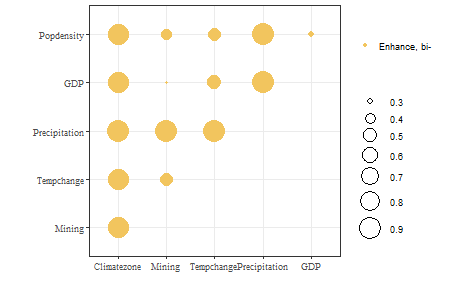

### Set up python dependence

1. Install **miniconda3**
2. Open the conda terminal and perform steps `3` to `6`
3. Create a new conda env `gdverse`

   > `conda create -n gdverse python=3.10 -y`

4. Activate this env

   > `conda activate gdverse`

5. Install `mamba`

   > `conda install -c conda-forge mamba -y`

6. Set up python packages

   > `mamba install -c conda-forge numpy joblib pandas ruptures -y`

7. Configure `GDVERSE_PYTHON` environment variable

   - Temporarily setting up `gdverse` python dependence environment using `Sys.setenv()` in the R console or R code like `Sys.setenv(GDVERSE_PYTHON = "path/to/python/environment")`.

   - Or using `usethis::edit_r_profile()` and `Sys.setenv(GDVERSE_PYTHON = "path/to/python/environment")` to set long-available `gdverse` python dependencies environment path.

### Load data and package


``` r
library(gdverse)
## gdverse 1.3.2
## See itmsa package for entropy-based spatial association measures.

data("ndvi")
```


``` r
names(ndvi)
## [1] "NDVIchange"    "Climatezone"   "Mining"        "Tempchange"    "Precipitation"
## [6] "GDP"           "Popdensity"
```

### Run RGD


``` r
ndvi_rgd = rgd(NDVIchange ~ ., data = ndvi,
               discvar = names(dplyr::select(ndvi,-c(NDVIchange,Climatezone,Mining))),
               discnum = 3:8, cores = 12)
ndvi_rgd
## ***      Robust Geographical Detector    
## 
## |   variable    | Q-statistic | P-value  |
## |:-------------:|:-----------:|:--------:|
## | Precipitation |  0.8883955  | 4.77e-10 |
## |  Climatezone  |  0.8218335  | 7.34e-10 |
## |  Tempchange   |  0.3722571  | 3.22e-10 |
## |  Popdensity   |  0.2205321  | 9.65e-10 |
## |    Mining     |  0.1411154  | 6.73e-10 |
## |      GDP      |  0.1164814  | 1.08e-10 |
plot(ndvi_rgd)
```


### Run RID

`RID` allows you to obtain the interactions of all possible combinations of variables. By default, `Spatial Intersection` are used to generate a new spatial partition of the interaction variables.


``` r
ndvi_rid = rid(NDVIchange ~ ., data = ndvi,
               discvar = names(dplyr::select(ndvi,-c(NDVIchange,Climatezone,Mining))),
               discnum = 8, cores = 12)
ndvi_rid
## ***       Robust Interaction Detector      
## 
## |   variable1   |   variable2   | Interaction  |
## |:-------------:|:-------------:|:------------:|
## |  Tempchange   | Precipitation | Enhance, bi- |
## |  Tempchange   |      GDP      | Enhance, bi- |
## |  Tempchange   |  Popdensity   | Enhance, bi- |
## |  Tempchange   |  Climatezone  | Enhance, bi- |
## |  Tempchange   |    Mining     | Enhance, bi- |
## | Precipitation |      GDP      | Enhance, bi- |
## | Precipitation |  Popdensity   | Enhance, bi- |
## | Precipitation |  Climatezone  | Enhance, bi- |
## | Precipitation |    Mining     | Enhance, bi- |
## |      GDP      |  Popdensity   | Enhance, bi- |
## |      GDP      |  Climatezone  | Enhance, bi- |
## |      GDP      |    Mining     | Enhance, bi- |
## |  Popdensity   |  Climatezone  | Enhance, bi- |
## |  Popdensity   |    Mining     | Enhance, bi- |
## |  Climatezone  |    Mining     | Enhance, bi- |
plot(ndvi_rid)
```


