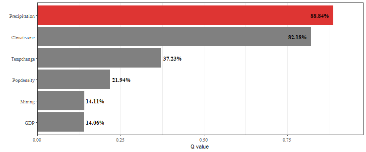

### Set up python dependence

1. Install **miniconda**
2. Open the conda terminal and perform steps `3` to `6`
3. Create a new conda env `gdverse`

   > `conda create -n gdverse python=3.10 -y`

4. Activate this env

   > `conda activate gdverse`

5. Install `mamba`

   > `conda install -c conda-forge mamba -y`

6. Set up python packages

   > `mamba install -c conda-forge numpy joblib pandas ruptures -y`

7. Configure `GDVERSE_PYTHON` environment variable

   - Temporarily setting up `gdverse` python dependence environment using `Sys.setenv()` in the R console or R code like `Sys.setenv(GDVERSE_PYTHON = "path/to/python/environment")`.

   - Or using `usethis::edit_r_environ()` to set long-available `gdverse` python dependencies environment path.

### Load data and package


``` r
library(tidyverse)
library(gdverse)

data("ndvi")
```


``` r
names(ndvi)
## [1] "NDVIchange"    "Climatezone"   "Mining"        "Tempchange"    "Precipitation"
## [6] "GDP"           "Popdensity"
```

### Run RGD


``` r
ndvi_rgd = rgd(NDVIchange ~ ., data = ndvi,
               discvar = names(select(ndvi,-c(NDVIchange,Climatezone,Mining))),
               discnum = 3:10, cores = 12)
ndvi_rgd
## ***          Robust Geographical Detector       
## 
## |   variable    | Q-statistic | P-value  |
## |:-------------:|:-----------:|:--------:|
## | Precipitation |  0.8933049  | 3.25e-10 |
## |  Climatezone  |  0.8218335  | 7.34e-10 |
## |  Tempchange   |  0.3874615  | 7.59e-10 |
## |  Popdensity   |  0.2622265  | 3.65e-10 |
## |      GDP      |  0.1491878  | 3.63e-10 |
## |    Mining     |  0.1411154  | 6.73e-10 |
## 
## #### Only display the results corresponding to the maximum number of discretizations!
```


``` r
plot(ndvi_rgd)
```



### Run RID

`RID` allows you to obtain the interactions of all possible combinations of variables. By default, `Spatial Intersection` are used to generate a new spatial partition of the interaction variables.


``` r
ndvi_rid = rid(NDVIchange ~ ., data = ndvi,
               discvar = names(select(ndvi,-c(NDVIchange,Climatezone,Mining))),
               discnum = 10, cores = 12)
ndvi_rid
## ***          Robust Interaction Detector       
## 
## |                               varibale                               |    PD     |
## |:--------------------------------------------------------------------:|:---------:|
## |       Climatezone ∩ Mining ∩ Tempchange ∩ Precipitation ∩ GDP        | 0.9684917 |
## | Climatezone ∩ Mining ∩ Tempchange ∩ Precipitation ∩ GDP ∩ Popdensity | 0.9628383 |
## |            Climatezone ∩ Tempchange ∩ Precipitation ∩ GDP            | 0.9618024 |
## |    Climatezone ∩ Mining ∩ Tempchange ∩ Precipitation ∩ Popdensity    | 0.9611111 |
## |              Mining ∩ Tempchange ∩ Precipitation ∩ GDP               | 0.9601571 |
## 
##  #### Only the first five pairs of interactions are displayed! ####
```
