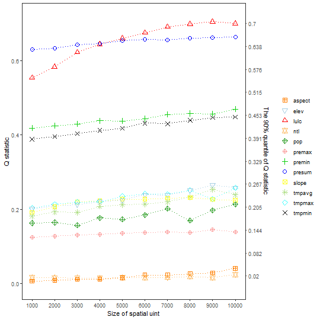
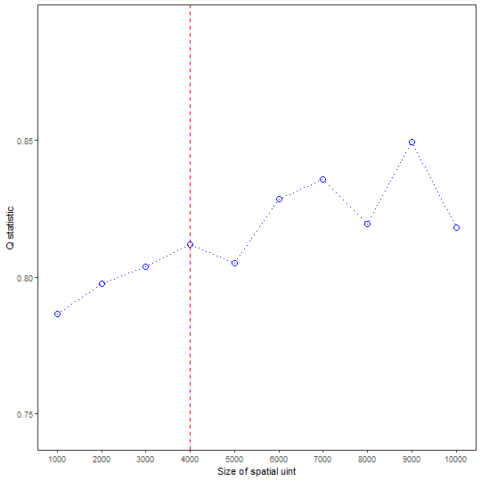

**gdverse** provides the `sesu_opgd()` and `sesu_gozh()` function to support the selection of optimal spatial analysis scales which based on **OPGD** and **GOZH** respectively. Please
refer to the help documentation of the corresponding function for more details.

Here, we use [FVC raster data](https://github.com/SpatLyu/rdevdata/blob/main/FVC.tif) as an example to demonstrate the optimal spatial analysis scale selection function in **gdverse**.

## Processing data

First, we construct FVC data under different spatial units using the original data.


``` r
library(terra)
library(tidyverse)
library(gdverse)
fvcpath = "https://github.com/SpatLyu/rdevdata/raw/main/FVC.tif"
fvc = terra::rast(paste0("/vsicurl/",fvcpath))
fvc
## class       : SpatRaster 
## dimensions  : 418, 568, 13  (nrow, ncol, nlyr)
## resolution  : 1000, 1000  (x, y)
## extent      : -92742.16, 475257.8, 3591385, 4009385  (xmin, xmax, ymin, ymax)
## coord. ref. : Asia_North_Albers_Equal_Area_Conic 
## source      : FVC.tif 
## names       :       fvc,   premax,   premin,   presum,    tmpmax,     tmpmin, ... 
## min values  : 0.1363270, 109.8619,  2.00000, 3783.904,  9.289694, -11.971293, ... 
## max values  : 0.9596695, 249.9284, 82.74928, 8549.112, 26.781870,   1.322163, ...
```

The original data resolution is `1000`m, and then we construct the data under `2000-10000` m spatial units with 1000 spatial unit interval.


``` r
su = seq(1000,10000,by = 1000)
fvc1000 = tibble::as_tibble(terra::as.data.frame(fvc,na.rm = T))
fvc_other = 2:10 %>%
  purrr::map(\(.x) terra::aggregate(fvc,fact=.x ,fun="mean") %>%
               terra::as.data.frame(na.rm = T) %>%
               tibble::as_tibble())
fvc = c(list(fvc1000),fvc_other)
str(fvc)
## List of 10
##  $ : tibble [136,243 × 13] (S3: tbl_df/tbl/data.frame)
##   ..$ fvc   : num [1:136243] 0.198 0.193 0.192 0.189 0.208 ...
##   ..$ premax: num [1:136243] 163 161 160 159 164 ...
##   ..$ premin: num [1:136243] 7.95 6.8 5.24 5 9.98 ...
##   ..$ presum: num [1:136243] 3956 3892 3842 3808 4051 ...
##   ..$ tmpmax: num [1:136243] 20.8 20.7 20.9 21.1 20.6 ...
##   ..$ tmpmin: num [1:136243] -7.53 -7.55 -7.48 -7.39 -7.59 ...
##   ..$ tmpavg: num [1:136243] 8.05 8.02 8.15 8.35 7.97 ...
##   ..$ pop   : num [1:136243] 1.903 1.203 0.547 0.542 10.392 ...
##   ..$ ntl   : num [1:136243] 6.6 4.91 3.75 3.99 7.1 ...
##   ..$ lulc  : num [1:136243] 10 10 10 10 10 10 10 10 10 10 ...
##   ..$ elev  : num [1:136243] 1758 1754 1722 1672 1780 ...
##   ..$ slope : num [1:136243] 2.65 3.45 3.96 2.9 1.94 ...
##   ..$ aspect: num [1:136243] 176.4 169.6 138.5 110.9 99.5 ...
##  $ : tibble [33,722 × 13] (S3: tbl_df/tbl/data.frame)
##   ..$ fvc   : num [1:33722] 0.195 0.184 0.157 0.204 0.208 ...
##   ..$ premax: num [1:33722] 162 159 167 165 165 ...
##   ..$ premin: num [1:33722] 7.37 5.14 4.21 10.98 9.8 ...
##   ..$ presum: num [1:33722] 3935 3799 3975 4134 4089 ...
##   ..$ tmpmax: num [1:33722] 20.9 21.3 21.1 20.4 20.9 ...
##   ..$ tmpmin: num [1:33722] -7.39 -7.21 -7.3 -7.62 -7.33 ...
##   ..$ tmpavg: num [1:33722] 8.17 8.5 8.49 7.78 8.2 ...
##   ..$ pop   : num [1:33722] 18.69 0.91 8.94 10.31 6.46 ...
##   ..$ ntl   : num [1:33722] 6.15 4.32 2.14 4.64 6.79 ...
##   ..$ lulc  : num [1:33722] 10 10 10 10 10 10 10 10 10 10 ...
##   ..$ elev  : num [1:33722] 1720 1638 1662 1835 1717 ...
##   ..$ slope : num [1:33722] 3.89 2.63 3.06 3.37 3.93 ...
##   ..$ aspect: num [1:33722] 114 158 136 102 120 ...
##  $ : tibble [14,840 × 13] (S3: tbl_df/tbl/data.frame)
##   ..$ fvc   : num [1:14840] 0.205 0.197 0.175 0.163 0.21 ...
##   ..$ premax: num [1:14840] 165 161 160 162 165 ...
##   ..$ premin: num [1:14840] 10.35 6.02 4.97 4.48 11.04 ...
##   ..$ presum: num [1:14840] 4098 3908 3848 3910 4131 ...
##   ..$ tmpmax: num [1:14840] 20.7 21.2 21.5 21.3 20.4 ...
##   ..$ tmpmin: num [1:14840] -7.46 -7.19 -7.07 -7.24 -7.52 ...
##   ..$ tmpavg: num [1:14840] 8.04 8.44 8.67 8.52 7.84 ...
##   ..$ pop   : num [1:14840] 12.33 13.78 4.59 6.52 2.97 ...
##   ..$ ntl   : num [1:14840] 6.37 7.79 7.23 9.96 4.59 ...
##   ..$ lulc  : num [1:14840] 10 10 10 10 10 10 10 10 10 10 ...
##   ..$ elev  : num [1:14840] 1762 1654 1600 1649 1805 ...
##   ..$ slope : num [1:14840] 3.41 3.19 2.61 3.06 3.76 ...
##   ..$ aspect: num [1:14840] 126 130 179 201 146 ...
##  $ : tibble [8,268 × 13] (S3: tbl_df/tbl/data.frame)
##   ..$ fvc   : num [1:8268] 0.2 0.174 0.175 0.182 0.193 ...
##   ..$ premax: num [1:8268] 164 161 165 171 164 ...
##   ..$ premin: num [1:8268] 7.57 5.37 6.07 5.78 9.32 ...
##   ..$ presum: num [1:8268] 4022 3896 4026 4177 4072 ...
##   ..$ tmpmax: num [1:8268] 21 21.6 21.3 20.8 21 ...
##   ..$ tmpmin: num [1:8268] -7.22 -6.96 -7.15 -7.46 -7.15 ...
##   ..$ tmpavg: num [1:8268] 8.36 8.81 8.57 8.19 8.35 ...
##   ..$ pop   : num [1:8268] 5.82 15.87 20.4 8.66 1.55 ...
##   ..$ ntl   : num [1:8268] 8.33 8.39 13.18 2.69 11 ...
##   ..$ lulc  : num [1:8268] 10 10 10 10 10 10 10 10 10 10 ...
##   ..$ elev  : num [1:8268] 1684 1567 1642 1690 1693 ...
##   ..$ slope : num [1:8268] 3.43 2.13 3.48 3.22 3.56 ...
##   ..$ aspect: num [1:8268] 115 159 224 207 133 ...
##  $ : tibble [5,240 × 13] (S3: tbl_df/tbl/data.frame)
##   ..$ fvc   : num [1:5240] 0.188 0.162 0.168 0.186 0.189 ...
##   ..$ premax: num [1:5240] 163 162 168 174 164 ...
##   ..$ premin: num [1:5240] 6.86 5.23 4.15 5.99 7.86 ...
##   ..$ presum: num [1:5240] 3992 3922 4040 4254 4047 ...
##   ..$ tmpmax: num [1:5240] 21.2 21.7 21.2 20.8 21.2 ...
##   ..$ tmpmin: num [1:5240] -7.09 -6.9 -7.22 -7.42 -7 ...
##   ..$ tmpavg: num [1:5240] 8.54 8.92 8.53 8.21 8.58 ...
##   ..$ pop   : num [1:5240] 5.64 23.14 9.73 6.84 2.36 ...
##   ..$ ntl   : num [1:5240] 9.1 10.45 5.58 2.89 12.3 ...
##   ..$ lulc  : num [1:5240] 10 10 10 10 10 10 10 10 10 10 ...
##   ..$ elev  : num [1:5240] 1645 1539 1611 1677 1643 ...
##   ..$ slope : num [1:5240] 2.96 1.86 3.19 3.32 2.79 ...
##   ..$ aspect: num [1:5240] 122 174 192 213 132 ...
##  $ : tibble [3,607 × 13] (S3: tbl_df/tbl/data.frame)
##   ..$ fvc   : num [1:3607] 0.196 0.169 0.165 0.174 0.188 ...
##   ..$ premax: num [1:3607] 165 161 165 168 175 ...
##   ..$ premin: num [1:3607] 9.19 5.07 5.89 4.14 5.51 ...
##   ..$ presum: num [1:3607] 4081 3885 4035 4064 4281 ...
##   ..$ tmpmax: num [1:3607] 20.9 21.7 21.6 21.3 20.7 ...
##   ..$ tmpmin: num [1:3607] -7.2 -6.91 -6.99 -7.17 -7.39 ...
##   ..$ tmpavg: num [1:3607] 8.3 8.86 8.79 8.63 8.23 ...
##   ..$ pop   : num [1:3607] 2.69 11.89 27.15 12.59 4.31 ...
##   ..$ ntl   : num [1:3607] 8.82 9.36 12.72 6.77 2.09 ...
##   ..$ lulc  : num [1:3607] 10 10 10 10 10 10 10 10 10 10 ...
##   ..$ elev  : num [1:3607] 1705 1557 1577 1585 1680 ...
##   ..$ slope : num [1:3607] 3.37 1.92 2.69 2.89 3.33 ...
##   ..$ aspect: num [1:3607] 141 130 200 201 218 ...
##  $ : tibble [2,634 × 13] (S3: tbl_df/tbl/data.frame)
##   ..$ fvc   : num [1:2634] 0.172 0.159 0.177 0.179 0.208 ...
##   ..$ premax: num [1:2634] 161 163 166 170 165 ...
##   ..$ premin: num [1:2634] 5.53 4.98 4.19 4.17 8.3 ...
##   ..$ presum: num [1:2634] 3924 3969 4003 4115 4133 ...
##   ..$ tmpmax: num [1:2634] 21.6 21.8 21.2 21.3 21.1 ...
##   ..$ tmpmin: num [1:2634] -6.91 -6.9 -7.15 -7.17 -7.06 ...
##   ..$ tmpavg: num [1:2634] 8.84 8.96 8.52 8.64 8.46 ...
##   ..$ pop   : num [1:2634] 4.79 23.35 33.75 6.38 8.72 ...
##   ..$ ntl   : num [1:2634] 9.65 11.31 11.85 7.32 5.76 ...
##   ..$ lulc  : num [1:2634] 10 10 10 10 10 10 10 10 10 10 ...
##   ..$ elev  : num [1:2634] 1568 1528 1632 1585 1670 ...
##   ..$ slope : num [1:2634] 1.92 2.08 3.24 2.86 2.62 ...
##   ..$ aspect: num [1:2634] 129 181 169 222 164 ...
##  $ : tibble [2,002 × 13] (S3: tbl_df/tbl/data.frame)
##   ..$ fvc   : num [1:2002] 0.169 0.162 0.176 0.184 0.203 ...
##   ..$ premax: num [1:2002] 162 163 167 172 165 ...
##   ..$ premin: num [1:2002] 5.12 4.14 3.82 4.05 8.5 ...
##   ..$ presum: num [1:2002] 3957 3949 4022 4170 4145 ...
##   ..$ tmpmax: num [1:2002] 21.6 21.7 21.4 21.2 20.9 ...
##   ..$ tmpmin: num [1:2002] -6.92 -6.9 -7.08 -7.21 -7.09 ...
##   ..$ tmpavg: num [1:2002] 8.86 8.96 8.68 8.57 8.32 ...
##   ..$ pop   : num [1:2002] 5.81 15.22 26.95 6.31 11.41 ...
##   ..$ ntl   : num [1:2002] 9.42 11.06 12.13 6.12 3.6 ...
##   ..$ lulc  : num [1:2002] 10 10 10 10 10 10 10 10 10 10 ...
##   ..$ elev  : num [1:2002] 1560 1524 1584 1605 1708 ...
##   ..$ slope : num [1:2002] 2.16 2.37 2.9 3.02 2.77 ...
##   ..$ aspect: num [1:2002] 129 194 172 211 161 ...
##  $ : tibble [1,561 × 13] (S3: tbl_df/tbl/data.frame)
##   ..$ fvc   : num [1:1561] 0.175 0.169 0.179 0.196 0.198 ...
##   ..$ premax: num [1:1561] 163 163 168 164 166 ...
##   ..$ premin: num [1:1561] 5.42 3.72 3.66 8.46 5.79 ...
##   ..$ presum: num [1:1561] 4014 3950 4050 4134 4138 ...
##   ..$ tmpmax: num [1:1561] 21.5 21.7 21.4 20.8 21.4 ...
##   ..$ tmpmin: num [1:1561] -6.97 -6.91 -7.05 -7.08 -6.82 ...
##   ..$ tmpavg: num [1:1561] 8.78 8.95 8.76 8.28 8.75 ...
##   ..$ pop   : num [1:1561] 4.5 17.55 15.72 12.63 7.42 ...
##   ..$ ntl   : num [1:1561] 8.93 10.71 10.93 2.97 3.35 ...
##   ..$ lulc  : num [1:1561] 10 10 10 10 10 10 10 10 10 10 ...
##   ..$ elev  : num [1:1561] 1581 1524 1563 1723 1599 ...
##   ..$ slope : num [1:1561] 2.3 2.44 2.91 2.8 2.83 ...
##   ..$ aspect: num [1:1561] 137 191 175 177 150 ...
##  $ : tibble [1,253 × 13] (S3: tbl_df/tbl/data.frame)
##   ..$ fvc   : num [1:1253] 0.177 0.177 0.178 0.186 0.19 ...
##   ..$ premax: num [1:1253] 164 164 169 160 162 ...
##   ..$ premin: num [1:1253] 5.22 3.56 3.34 10.52 7.39 ...
##   ..$ presum: num [1:1253] 4046 3990 4098 4058 4069 ...
##   ..$ tmpmax: num [1:1253] 21.5 21.6 21.5 21.2 21 ...
##   ..$ tmpmin: num [1:1253] -6.98 -6.96 -7.07 -6.86 -6.98 ...
##   ..$ tmpavg: num [1:1253] 8.77 8.86 8.79 8.68 8.4 ...
##   ..$ pop   : num [1:1253] 6.1 18.38 8.83 9.96 8.91 ...
##   ..$ ntl   : num [1:1253] 7.901 11.324 9.294 0.611 2.963 ...
##   ..$ lulc  : num [1:1253] 10 10 10 10 10 10 10 10 10 10 ...
##   ..$ elev  : num [1:1253] 1581 1547 1552 1640 1692 ...
##   ..$ slope : num [1:1253] 2.41 2.83 3.04 2.29 2.85 ...
##   ..$ aspect: num [1:1253] 130 182 211 194 163 ...
```

## Comparison of Size Effect of Spatial Units based on OPGD model


``` r
discvar = names(select(fvc1000,-c(fvc,lulc)))
g1 = sesu_opgd(fvc ~ ., data = fvc,su = su,discvar = discvar,cores = 6)
g1
##    Size Effect Of Spatial Units Using OPGD Model   
##  ***    Optimal Spatial Unit: 6000
##  Spatial Unit: 1000 
## 
## | variable | Q-statistic | P-value  |
## |:--------:|:-----------:|:--------:|
## |  presum  | 0.644896726 | 6.53e-10 |
## |   lulc   | 0.553328610 | 9.11e-10 |
## |  premin  | 0.446359888 | 9.70e-10 |
## |  tmpmin  | 0.412000430 | 6.76e-10 |
## |  tmpmax  | 0.237429472 | 4.24e-10 |
## |   elev   | 0.211925203 | 4.57e-10 |
## |  tmpavg  | 0.207978081 | 7.48e-10 |
## |  slope   | 0.196924816 | 7.69e-10 |
## |   pop    | 0.196454606 | 1.79e-10 |
## |  premax  | 0.139618341 | 6.54e-10 |
## |   ntl    | 0.016731141 | 7.11e-10 |
## |  aspect  | 0.007638907 | 5.96e-10 |
## 
##  Spatial Unit: 2000 
## 
## | variable | Q-statistic | P-value  |
## |:--------:|:-----------:|:--------:|
## |  presum  | 0.651002616 | 8.10e-10 |
## |   lulc   | 0.583495504 | 8.71e-10 |
## |  premin  | 0.451155788 | 5.56e-10 |
## |  tmpmin  | 0.418203827 | 5.89e-10 |
## |  tmpmax  | 0.245145296 | 6.96e-10 |
## |   elev   | 0.219220574 | 9.65e-10 |
## |  tmpavg  | 0.213225507 | 7.88e-10 |
## |  slope   | 0.213087329 | 7.99e-10 |
## |   pop    | 0.200580691 | 2.44e-10 |
## |  premax  | 0.142483609 | 4.13e-10 |
## |   ntl    | 0.021746542 | 6.11e-10 |
## |  aspect  | 0.009886046 | 7.22e-10 |
## 
##  Spatial Unit: 3000 
## 
## | variable | Q-statistic | P-value  |
## |:--------:|:-----------:|:--------:|
## |  presum  | 0.65673759  | 8.72e-10 |
## |   lulc   | 0.62197064  | 7.93e-10 |
## |  premin  | 0.46135595  | 7.88e-10 |
## |  tmpmin  | 0.42860201  | 5.68e-10 |
## |  tmpmax  | 0.25605757  | 2.00e-10 |
## |   elev   | 0.22754699  | 4.14e-10 |
## |  slope   | 0.22709759  | 5.29e-10 |
## |  tmpavg  | 0.22282992  | 5.93e-10 |
## |   pop    | 0.20341229  | 6.09e-10 |
## |  premax  | 0.14681717  | 4.98e-10 |
## |   ntl    | 0.02463303  | 9.83e-10 |
## |  aspect  | 0.01328324  | 7.55e-10 |
## 
##  Spatial Unit: 4000 
## 
## | variable | Q-statistic |   P-value    |
## |:--------:|:-----------:|:------------:|
## |  presum  | 0.66423476  | 4.670000e-10 |
## |   lulc   | 0.64389956  | 8.290000e-10 |
## |  premin  | 0.46611096  | 8.320000e-10 |
## |  tmpmin  | 0.43071281  | 3.530000e-10 |
## |  tmpmax  | 0.26222426  | 2.950000e-10 |
## |   elev   | 0.23406764  | 4.900000e-10 |
## |  slope   | 0.23398433  | 7.190000e-10 |
## |  tmpavg  | 0.23211805  | 7.860000e-10 |
## |   pop    | 0.22352085  | 5.740000e-10 |
## |  premax  | 0.14889619  | 1.480000e-10 |
## |   ntl    | 0.02382989  | 9.551530e-03 |
## |  aspect  | 0.01430436  | 2.987485e-04 |
## 
##  Spatial Unit: 5000 
## 
## | variable | Q-statistic |   P-value    |
## |:--------:|:-----------:|:------------:|
## |  presum  | 0.66723767  | 5.350000e-10 |
## |   lulc   | 0.65972601  | 8.780000e-10 |
## |  premin  | 0.47166574  | 7.960000e-10 |
## |  tmpmin  | 0.44318321  | 8.370000e-10 |
## |  tmpmax  | 0.26854375  | 2.030000e-10 |
## |   elev   | 0.24093899  | 6.160000e-10 |
## |  slope   | 0.23911464  | 8.220000e-10 |
## |  tmpavg  | 0.23215568  | 5.000000e-10 |
## |   pop    | 0.23137881  | 5.570000e-10 |
## |  premax  | 0.15321756  | 5.710000e-10 |
## |   ntl    | 0.02361094  | 9.243723e-01 |
## |  aspect  | 0.01901487  | 9.695436e-01 |
## 
##  Spatial Unit: 6000 
## 
## | variable | Q-statistic |   P-value    |
## |:--------:|:-----------:|:------------:|
## |   lulc   | 0.67492096  | 8.910000e-10 |
## |  presum  | 0.67457872  | 8.120000e-10 |
## |  premin  | 0.47602331  | 5.230000e-10 |
## |  tmpmin  | 0.44957279  | 4.350000e-10 |
## |  tmpmax  | 0.27860993  | 7.370000e-10 |
## |   elev   | 0.25034707  | 3.650000e-10 |
## |  tmpavg  | 0.24551180  | 7.930000e-10 |
## |  slope   | 0.23932587  | 7.450000e-10 |
## |   pop    | 0.23353835  | 6.110000e-10 |
## |  premax  | 0.15512729  | 3.910000e-10 |
## |   ntl    | 0.03039862  | 9.750525e-01 |
## |  aspect  | 0.02766942  | 1.530000e-10 |
## 
##  Spatial Unit: 7000 
## 
## | variable | Q-statistic |   P-value    |
## |:--------:|:-----------:|:------------:|
## |   lulc   | 0.69056548  | 8.460000e-10 |
## |  presum  | 0.67824355  | 4.350000e-10 |
## |  premin  | 0.48668656  | 6.450000e-10 |
## |  tmpmin  | 0.45405560  | 8.580000e-10 |
## |  tmpmax  | 0.27553212  | 6.030000e-10 |
## |   elev   | 0.25825440  | 6.840000e-10 |
## |  tmpavg  | 0.24998398  | 5.650000e-10 |
## |   pop    | 0.24636414  | 9.650000e-10 |
## |  slope   | 0.24510647  | 6.120000e-10 |
## |  premax  | 0.15447562  | 6.360000e-10 |
## |  aspect  | 0.03663031  | 3.440000e-10 |
## |   ntl    | 0.02363438  | 9.999999e-01 |
## 
##  Spatial Unit: 8000 
## 
## | variable | Q-statistic |   P-value    |
## |:--------:|:-----------:|:------------:|
## |   lulc   | 0.69775844  | 9.850000e-10 |
## |  presum  | 0.68405979  | 7.680000e-10 |
## |  premin  | 0.48814489  | 4.600000e-10 |
## |  tmpmin  | 0.46333665  | 3.830000e-10 |
## |  tmpmax  | 0.29120160  | 7.350000e-10 |
## |   elev   | 0.26985618  | 5.750000e-10 |
## |  tmpavg  | 0.26029782  | 6.950000e-10 |
## |  slope   | 0.25156377  | 6.150000e-10 |
## |   pop    | 0.22722423  | 5.170000e-10 |
## |  premax  | 0.15738903  | 5.710000e-10 |
## |  aspect  | 0.03837457  | 2.608700e-08 |
## |   ntl    | 0.02756764  | 2.048244e-03 |
## 
##  Spatial Unit: 9000 
## 
## | variable | Q-statistic |   P-value    |
## |:--------:|:-----------:|:------------:|
## |   lulc   | 0.70417030  | 9.610000e-10 |
## |  presum  | 0.68112200  | 7.340000e-10 |
## |  premin  | 0.48792936  | 5.470000e-10 |
## |  tmpmin  | 0.47182686  | 8.710000e-10 |
## |   elev   | 0.28569931  | 7.440000e-10 |
## |  tmpavg  | 0.27758326  | 9.160000e-10 |
## |  tmpmax  | 0.26940380  | 6.690000e-10 |
## |  slope   | 0.24406094  | 8.310000e-10 |
## |   pop    | 0.24154830  | 6.920000e-10 |
## |  premax  | 0.16793667  | 5.890000e-10 |
## |  aspect  | 0.03874024  | 1.011974e-05 |
## |   ntl    | 0.02314022  | 1.631959e-01 |
## 
##  Spatial Unit: 10000 
## 
## | variable | Q-statistic |   P-value    |
## |:--------:|:-----------:|:------------:|
## |   lulc   | 0.69927128  | 2.871432e-05 |
## |  presum  | 0.68398964  | 4.650000e-10 |
## |  premin  | 0.50638558  | 6.480000e-10 |
## |  tmpmin  | 0.47172838  | 4.100000e-10 |
## |  tmpmax  | 0.29717870  | 1.900000e-10 |
## |  tmpavg  | 0.28227578  | 4.440000e-10 |
## |   pop    | 0.28041324  | 5.300000e-10 |
## |   elev   | 0.27903119  | 8.090000e-10 |
## |  slope   | 0.24509020  | 6.800000e-10 |
## |  premax  | 0.15919897  | 7.220000e-10 |
## |  aspect  | 0.05584990  | 2.114400e-07 |
## |   ntl    | 0.04080605  | 3.248329e-02 |
plot(g1)
```



## Comparison of Size Effect of Spatial Units based on GOZH model


``` r
g2 = sesu_gozh(fvc ~ ., data = fvc,su = su,cores = 6)
g2
##    Size Effect Of Spatial Units Using GOZH Model   
##  ***        Optimal Spatial Unit: 9000
##  Spatial Unit: 1000 
## 
## |   variable    | Q-statistic | P-value  |
## |:-------------:|:-----------:|:--------:|
## | TotalVariable |  0.7866938  | 3.33e-10 |
## 
##  Spatial Unit: 2000 
## 
## |   variable    | Q-statistic | P-value  |
## |:-------------:|:-----------:|:--------:|
## | TotalVariable |  0.7975525  | 4.96e-10 |
## 
##  Spatial Unit: 3000 
## 
## |   variable    | Q-statistic | P-value  |
## |:-------------:|:-----------:|:--------:|
## | TotalVariable |  0.8038107  | 9.51e-10 |
## 
##  Spatial Unit: 4000 
## 
## |   variable    | Q-statistic | P-value  |
## |:-------------:|:-----------:|:--------:|
## | TotalVariable |  0.8120727  | 7.54e-10 |
## 
##  Spatial Unit: 5000 
## 
## |   variable    | Q-statistic | P-value  |
## |:-------------:|:-----------:|:--------:|
## | TotalVariable |  0.8051771  | 7.15e-10 |
## 
##  Spatial Unit: 6000 
## 
## |   variable    | Q-statistic | P-value  |
## |:-------------:|:-----------:|:--------:|
## | TotalVariable |  0.8285607  | 6.23e-10 |
## 
##  Spatial Unit: 7000 
## 
## |   variable    | Q-statistic | P-value  |
## |:-------------:|:-----------:|:--------:|
## | TotalVariable |  0.8356357  | 7.91e-10 |
## 
##  Spatial Unit: 8000 
## 
## |   variable    | Q-statistic | P-value  |
## |:-------------:|:-----------:|:--------:|
## | TotalVariable |  0.8194033  | 3.28e-10 |
## 
##  Spatial Unit: 9000 
## 
## |   variable    | Q-statistic | P-value  |
## |:-------------:|:-----------:|:--------:|
## | TotalVariable |  0.8494805  | 3.79e-10 |
## 
##  Spatial Unit: 10000 
## 
## |   variable    | Q-statistic | P-value  |
## |:-------------:|:-----------:|:--------:|
## | TotalVariable |  0.8182764  | 3.27e-10 |
plot(g2)
```



You can also use the same strategy as `sesu_opgd()` (use the mean of the individual Q statistic for all explanatory variables) in `sesu_gozh()` by assign `strategy` to `1`.


``` r
g3 = sesu_gozh(fvc ~ ., data = fvc,su = su,cores = 6,strategy = 1)
g3
##    Size Effect Of Spatial Units Using GOZH Model   
##  ***        Optimal Spatial Unit: 6000
##  Spatial Unit: 1000 
## 
## | variable | Q-statistic | P-value  |
## |:--------:|:-----------:|:--------:|
## |  presum  | 0.61357308  | 2.33e-10 |
## |   lulc   | 0.54039924  | 7.28e-10 |
## |  premin  | 0.43005723  | 2.63e-10 |
## |  tmpmin  | 0.37878995  | 8.57e-10 |
## |   elev   | 0.19589469  | 8.32e-10 |
## |  tmpavg  | 0.19354399  | 6.54e-10 |
## |  tmpmax  | 0.18257181  | 4.90e-10 |
## |   pop    | 0.18188771  | 6.91e-10 |
## |  slope   | 0.18039771  | 3.92e-10 |
## |  premax  | 0.11278088  | 1.60e-10 |
## |   ntl    | 0.01298068  | 1.34e-10 |
## |  aspect  | 0.00000000  |   NaN    |
## 
##  Spatial Unit: 2000 
## 
## | variable | Q-statistic | P-value  |
## |:--------:|:-----------:|:--------:|
## |  presum  | 0.62301279  | 2.66e-10 |
## |   lulc   | 0.55803717  | 8.77e-10 |
## |  premin  | 0.43544867  | 7.00e-10 |
## |  tmpmin  | 0.38618203  | 2.45e-10 |
## |  tmpmax  | 0.21025124  | 2.07e-10 |
## |   elev   | 0.20314330  | 2.78e-10 |
## |  tmpavg  | 0.19914975  | 7.39e-10 |
## |  slope   | 0.19627348  | 7.61e-10 |
## |   pop    | 0.19602997  | 4.70e-10 |
## |  premax  | 0.12512115  | 8.76e-10 |
## |   ntl    | 0.01303962  | 1.61e-10 |
## |  aspect  | 0.00000000  |   NaN    |
## 
##  Spatial Unit: 3000 
## 
## | variable | Q-statistic | P-value  |
## |:--------:|:-----------:|:--------:|
## |  presum  | 0.62786163  | 2.02e-10 |
## |   lulc   | 0.57980350  | 4.66e-10 |
## |  premin  | 0.45295671  | 8.76e-10 |
## |  tmpmin  | 0.39398883  | 4.53e-10 |
## |  tmpmax  | 0.22337707  | 2.02e-10 |
## |  slope   | 0.21773086  | 8.99e-10 |
## |   elev   | 0.21072544  | 7.80e-10 |
## |  tmpavg  | 0.20840028  | 7.53e-10 |
## |   pop    | 0.20403869  | 8.29e-10 |
## |  premax  | 0.12036298  | 1.69e-10 |
## |   ntl    | 0.01254965  | 3.91e-10 |
## |  aspect  | 0.00000000  |   NaN    |
## 
##  Spatial Unit: 4000 
## 
## | variable | Q-statistic | P-value  |
## |:--------:|:-----------:|:--------:|
## |  presum  | 0.63518731  | 5.71e-10 |
## |   lulc   | 0.60101282  | 6.31e-10 |
## |  premin  | 0.44863951  | 5.28e-10 |
## |  tmpmin  | 0.40118790  | 4.14e-10 |
## |  tmpmax  | 0.23847408  | 7.87e-10 |
## |   pop    | 0.22484285  | 5.80e-10 |
## |  slope   | 0.22361153  | 9.25e-10 |
## |   elev   | 0.21891887  | 2.58e-10 |
## |  tmpavg  | 0.21559889  | 3.61e-10 |
## |  premax  | 0.12272873  | 2.12e-10 |
## |   ntl    | 0.01215376  | 2.74e-10 |
## |  aspect  | 0.00000000  |   NaN    |
## 
##  Spatial Unit: 5000 
## 
## | variable | Q-statistic |  P-value  |
## |:--------:|:-----------:|:---------:|
## |  presum  | 0.63722230  | 9.500e-11 |
## |   lulc   | 0.61064956  | 4.800e-10 |
## |  premin  | 0.46576994  | 5.480e-10 |
## |  tmpmin  | 0.41116492  | 2.950e-10 |
## |  tmpmax  | 0.24778090  | 7.310e-10 |
## |  slope   | 0.22861668  | 6.050e-10 |
## |   pop    | 0.22376308  | 3.750e-10 |
## |   elev   | 0.22370908  | 4.670e-10 |
## |  tmpavg  | 0.21883019  | 6.540e-10 |
## |  premax  | 0.12586705  | 1.440e-10 |
## |   ntl    | 0.02364914  | 1.830e-10 |
## |  aspect  | 0.01412962  | 8.938e-09 |
## 
##  Spatial Unit: 6000 
## 
## | variable | Q-statistic |   P-value    |
## |:--------:|:-----------:|:------------:|
## |  presum  | 0.64204895  | 1.520000e-10 |
## |   lulc   | 0.62821539  | 5.160000e-10 |
## |  premin  | 0.46963617  | 7.140000e-10 |
## |  tmpmin  | 0.42078259  | 1.760000e-10 |
## |  tmpmax  | 0.26097547  | 7.450000e-10 |
## |   elev   | 0.24349549  | 2.210000e-10 |
## |  slope   | 0.23674911  | 4.340000e-10 |
## |  tmpavg  | 0.22761345  | 6.460000e-10 |
## |   pop    | 0.21387327  | 6.550000e-10 |
## |  premax  | 0.13886190  | 4.090000e-10 |
## |  aspect  | 0.01965907  | 6.615700e-08 |
## |   ntl    | 0.01281291  | 1.785448e-06 |
## 
##  Spatial Unit: 7000 
## 
## | variable | Q-statistic |   P-value   |
## |:--------:|:-----------:|:-----------:|
## |  presum  | 0.65119059  | 4.91000e-10 |
## |   lulc   | 0.62992351  | 4.00000e-10 |
## |  premin  | 0.46746888  | 7.35000e-10 |
## |  tmpmin  | 0.42352245  | 1.48000e-10 |
## |  tmpmax  | 0.25489327  | 4.11000e-10 |
## |  tmpavg  | 0.24806555  | 5.10000e-10 |
## |   pop    | 0.23833151  | 3.69000e-10 |
## |  slope   | 0.22981037  | 4.83000e-10 |
## |   elev   | 0.22955762  | 2.97000e-10 |
## |  premax  | 0.12914079  | 3.95000e-10 |
## |   ntl    | 0.02573822  | 1.19570e-08 |
## |  aspect  | 0.02273950  | 4.78275e-07 |
## 
##  Spatial Unit: 8000 
## 
## | variable | Q-statistic |   P-value    |
## |:--------:|:-----------:|:------------:|
## |  presum  | 0.65830260  | 1.330000e-10 |
## |   lulc   | 0.62941306  | 5.520000e-10 |
## |  premin  | 0.47958908  | 3.610000e-10 |
## |  tmpmin  | 0.43387026  | 1.270000e-10 |
## |  tmpmax  | 0.27793736  | 3.600000e-10 |
## |   elev   | 0.26007519  | 2.170000e-10 |
## |  tmpavg  | 0.24626023  | 7.420000e-10 |
## |  slope   | 0.23663987  | 4.930000e-10 |
## |   pop    | 0.22200579  | 8.390000e-10 |
## |  premax  | 0.14446913  | 5.440000e-10 |
## |   ntl    | 0.02638165  | 3.322900e-06 |
## |  aspect  | 0.01993728  | 1.770375e-03 |
## 
##  Spatial Unit: 9000 
## 
## | variable | Q-statistic |   P-value    |
## |:--------:|:-----------:|:------------:|
## |  presum  | 0.65739289  | 2.420000e-10 |
## |   lulc   | 0.62688737  | 8.450000e-10 |
## |  premin  | 0.46785117  | 8.610000e-10 |
## |  tmpmin  | 0.44858109  | 9.900000e-11 |
## |   elev   | 0.26629528  | 1.010000e-10 |
## |  tmpavg  | 0.26423186  | 2.540000e-10 |
## |  tmpmax  | 0.24490412  | 2.340000e-10 |
## |  slope   | 0.23372050  | 3.490000e-10 |
## |   pop    | 0.23158655  | 5.630000e-10 |
## |  premax  | 0.15605198  | 5.870000e-10 |
## |   ntl    | 0.02797473  | 1.571733e-04 |
## |  aspect  | 0.02732356  | 3.071476e-04 |
## 
##  Spatial Unit: 10000 
## 
## | variable | Q-statistic |   P-value    |
## |:--------:|:-----------:|:------------:|
## |  presum  | 0.67041293  | 8.870000e-10 |
## |   lulc   | 0.62850681  | 3.530000e-10 |
## |  premin  | 0.48291514  | 5.270000e-10 |
## |  tmpmin  | 0.44485438  | 4.530000e-10 |
## |  tmpmax  | 0.28867471  | 4.140000e-10 |
## |  tmpavg  | 0.28656169  | 5.160000e-10 |
## |   elev   | 0.27080523  | 8.150000e-10 |
## |   pop    | 0.26912522  | 8.240000e-10 |
## |  slope   | 0.22656703  | 8.810000e-10 |
## |  premax  | 0.14956177  | 1.950000e-10 |
## |  aspect  | 0.03267780  | 2.524895e-03 |
## |   ntl    | 0.02332034  | 1.395206e-02 |
plot(g3)
```


As shown above, strategy `2` results in a better trade-off between spatial unit expressive detail and explanatory power than strategy `1`. So `sesu_gozh()` defaults to use
strategy `2`(using the interactive Q statistic for all explanatory variables)
