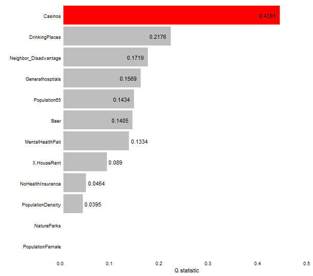

### Load data and package


``` r
library(sf)
library(tidyverse)
library(gdverse)

depression = system.file('extdata/Depression.csv',package = 'gdverse') %>%
  read_csv() %>%
  st_as_sf(coords = c('X','Y'), crs = 4326)
depression
## Simple feature collection with 1072 features and 11 fields
## Geometry type: POINT
## Dimension:     XY
## Bounding box:  xmin: -83.1795 ymin: 32.11464 xmax: -78.6023 ymax: 35.17354
## Geodetic CRS:  WGS 84
## # A tibble: 1,072 × 12
##    Depression_prevelence PopulationDensity Population65 NoHealthInsurance Neighbor_Disadvantage
##  *                 <dbl>             <dbl>        <dbl>             <dbl>                 <dbl>
##  1                  23.1              61.5         22.5              7.98               -0.0525
##  2                  22.8              58.3         16.8             11.0                -0.254 
##  3                  23.2              35.9         24.5              9.31               -0.0540
##  4                  21.8              76.1         21.8             13.2                 0.0731
##  5                  20.7              47.3         22.0             11                   0.763 
##  6                  21.3              32.5         19.2             13.0                 0.422 
##  7                  22                36.9         19.2             10.8                 0.113 
##  8                  21.2              61.5         15.9              8.57               -0.154 
##  9                  22.7              67.2         15.7             17.8                -0.320 
## 10                  20.6             254.          11.3             12.7                 0.457 
## # ℹ 1,062 more rows
## # ℹ 7 more variables: Beer <dbl>, MentalHealthPati <dbl>, NatureParks <dbl>, Casinos <dbl>,
## #   DrinkingPlaces <dbl>, X.HouseRent <dbl>, geometry <POINT [°]>
```

### Spatial Autocorrelation of Depression Prevelence


``` r
set.seed(123456789)

gmi = sdsfun::moran_test(depression)
gmi
## ***                 global moran test
```


-----------------------------------------------------------------------------------
       Variable             MoranI          EI         VarI       zI        pI     
----------------------- -------------- ------------ ----------- ------- -----------
 Depression_prevelence   0.339557***    -0.0009337   0.0003192   19.06   2.892e-81 

   PopulationDensity     0.365364***    -0.0009337   0.0003192   20.5    1.052e-93 

     Population65        0.180436***    -0.0009337   0.0003192   10.15   1.641e-24 

   NoHealthInsurance     0.0791199***   -0.0009337   0.0003192   4.48    3.724e-06 

 Neighbor_Disadvantage   0.113811***    -0.0009337   0.0003192   6.422   6.723e-11 

         Beer            0.0902263***   -0.0009337   0.0003192   5.102   1.68e-07  

   MentalHealthPati       0.19318***    -0.0009337   0.0003192   10.86   8.534e-28 

      NatureParks        0.0895589***   -0.0009337   0.0003192   5.065   2.045e-07 

        Casinos          0.243212***    -0.0009337   0.0003192   13.66   8.28e-43  

    DrinkingPlaces       0.239054***    -0.0009337   0.0003192   13.43   1.97e-41  

      X.HouseRent        0.141887***    -0.0009337   0.0003192   7.993   6.562e-16 
-----------------------------------------------------------------------------------


The global Moran'I Index of Depression Prevelence is `0.339557` and the P value is ` 2.892e-81`, which shows that Depression Prevelence has a moderate level of positive spatial autocorrelation in the global scale.

### OPGD modeling


``` r
depression_opgd = opgd(Depression_prevelence ~ .,
                       data = depression, cores = 12)
depression_opgd
## ***   Optimal Parameters-based Geographical Detector     
##                 Factor Detector            
## 
## |       variable        | Q-statistic |   P-value    |
## |:---------------------:|:-----------:|:------------:|
## | Neighbor_Disadvantage | 0.13979930  | 4.960000e-10 |
## |   PopulationDensity   | 0.09186679  | 2.328052e-01 |
## |     Population65      | 0.08956911  | 1.000000e+00 |
## |   NoHealthInsurance   | 0.06779068  | 6.479536e-01 |
## |      NatureParks      | 0.05963161  | 1.000000e+00 |
## |    DrinkingPlaces     | 0.05411512  | 1.000000e+00 |
## |      X.HouseRent      | 0.03439383  | 1.000000e+00 |
## |         Beer          | 0.01410217  | 1.000000e+00 |
## |   MentalHealthPati    | 0.01295799  | 1.000000e+00 |
## |        Casinos        | 0.01207694  | 1.000000e+00 |
```

**You can access the detailed q statistics by `depression_opgd$factor`**


``` r
depression_opgd$factor
## # A tibble: 10 × 3
##    variable              `Q-statistic` `P-value`
##    <chr>                         <dbl>     <dbl>
##  1 Neighbor_Disadvantage        0.140   4.96e-10
##  2 PopulationDensity            0.0919  2.33e- 1
##  3 Population65                 0.0896  1.00e+ 0
##  4 NoHealthInsurance            0.0678  6.48e- 1
##  5 NatureParks                  0.0596  1.00e+ 0
##  6 DrinkingPlaces               0.0541  1.00e+ 0
##  7 X.HouseRent                  0.0344  1.00e+ 0
##  8 Beer                         0.0141  1   e+ 0
##  9 MentalHealthPati             0.0130  1.00e+ 0
## 10 Casinos                      0.0121  1   e+ 0
```

### Spatial Weight Matrix

*SPADE* explicitly considers the spatial variance by assigning the weight of the influence based on spatial distribution and also minimizes the influence of the number of levels on PD values by using the multilevel discretization and considering information loss due to discretization.

When response variable has a strong spatial dependence, maybe *SPADE* is a best choice.

The biggest difference between SPADE and native GD and OPGD in actual modeling is that SPADE requires a spatial weight matrix to calculate spatial variance.

In `spade` function, when you not provide a spatial weight matrix, it will use **1st order inverse distance weight** by default, which can be created by `inverse_distance_weight()`.


``` r
coords = depression |>
  st_centroid() |>
  st_coordinates()

wt1 = inverse_distance_weight(coords[,1],coords[,2])
```

You can also use gravity model weight by assigning the `power` parameter in `inverse_distance_weight()` function.


``` r
wt2 = inverse_distance_weight(coords[,1],coords[,2],power = 2)
```

I have also developed the [sdsfun](https://stscl.github.io/sdsfun/) package to facilitate the construction of spatial weight matrices, which requires an input of an sf object.


``` r
wt3 = sdsfun::spdep_contiguity_swm(depression, k = 8)
```

Or using a spatial weight matrix based on distance kernel functions.


``` r
wt4 = sdsfun::spdep_distance_swm(depression, k = 6, kernel = 'gaussian')
```

The test of *SPADE* model significance in `gdverse` is achieved by randomization null hypothesis use a pseudo-p value, this calculation is very time-consuming. Default `gdverse` sets the `permutations` parameter to 0 and does not calculate the pseudo-p value. If you want to calculate the pseudo-p value, specify the `permutations` parameter to a number such as 99,999,9999, etc.

In the following section we will execute *SPADE* model using spatial weight matrix `wt1`.

### SPADE modeling


``` r
depression_spade = spade(Depression_prevelence ~ .,
                         data = depression,
                         wt = wt1, cores = 12)
depression_spade
## ***         Spatial Association Detector         
## 
## |       variable        | Q-statistic |      P-value      |
## |:---------------------:|:-----------:|:-----------------:|
## |   PopulationDensity   | 0.21375164  | No Pseudo-P Value |
## |    DrinkingPlaces     | 0.18592140  | No Pseudo-P Value |
## |        Casinos        | 0.17863165  | No Pseudo-P Value |
## | Neighbor_Disadvantage | 0.17400420  | No Pseudo-P Value |
## |      NatureParks      | 0.16727659  | No Pseudo-P Value |
## |     Population65      | 0.15645381  | No Pseudo-P Value |
## |         Beer          | 0.09619354  | No Pseudo-P Value |
## |   MentalHealthPati    | 0.08027631  | No Pseudo-P Value |
## |   NoHealthInsurance   | 0.07921831  | No Pseudo-P Value |
## |      X.HouseRent      | 0.05641436  | No Pseudo-P Value |
plot(depression_spade, slicenum = 6)
```



**You can also access the detailed q statistics by `depression_spade$factor`**


``` r
depression_spade$factor
## # A tibble: 10 × 3
##    variable              `Q-statistic` `P-value`        
##    <chr>                         <dbl> <chr>            
##  1 PopulationDensity            0.214  No Pseudo-P Value
##  2 DrinkingPlaces               0.186  No Pseudo-P Value
##  3 Casinos                      0.179  No Pseudo-P Value
##  4 Neighbor_Disadvantage        0.174  No Pseudo-P Value
##  5 NatureParks                  0.167  No Pseudo-P Value
##  6 Population65                 0.156  No Pseudo-P Value
##  7 Beer                         0.0962 No Pseudo-P Value
##  8 MentalHealthPati             0.0803 No Pseudo-P Value
##  9 NoHealthInsurance            0.0792 No Pseudo-P Value
## 10 X.HouseRent                  0.0564 No Pseudo-P Value
```
